# 0x01 初识 Python

大家好欢迎阅读由 `九章算法` 提供的这门微课 —— `Python 基础入门`，在这门课中，我们会对 Python 的方方面面进行讲解，通过对这些这些课程的学习，能使读者从对 Python 这门编程语言一无所知，成为能够使用 Python 开发一些有趣的小程序的工程师。

> **Python** is a [widely used](https://en.wikipedia.org/wiki/Measuring_programming_language_popularity) [high-level programming language](https://en.wikipedia.org/wiki/High-level_programming_language) for [general-purpose programming](https://en.wikipedia.org/wiki/General-purpose_programming_language), created by [Guido van Rossum](https://en.wikipedia.org/wiki/Guido_van_Rossum) and first released in 1991. An [interpreted language](https://en.wikipedia.org/wiki/Interpreted_language), Python has a design philosophy that emphasizes code [readability](https://en.wikipedia.org/wiki/Readability) (notably using [whitespace](https://en.wikipedia.org/wiki/Whitespace_character) indentation to delimit [code blocks](https://en.wikipedia.org/wiki/Code_block) rather than curly brackets or keywords), and a syntax that allows programmers to express concepts in fewer [lines of code](https://en.wikipedia.org/wiki/Source_lines_of_code) than might be used in languages such as [C++](https://en.wikipedia.org/wiki/C%2B%2B) or [Java](https://en.wikipedia.org/wiki/Java_(programming_language)).[[23\]](https://en.wikipedia.org/wiki/Python_(programming_language)#cite_note-Summerfield-23)[[24\]](https://en.wikipedia.org/wiki/Python_(programming_language)#cite_note-24) The language provides constructs intended to enable writing clear programs on both a small and large scale.[[25\]](https://en.wikipedia.org/wiki/Python_(programming_language)#cite_note-AutoNT-7-25)
>
> —— Wikipedia

正如 wiki 中所介绍的这样，Python 是一种高度抽象并且非常灵活的编程语言，由于这些特性 Python 在目前比较流行的数据分析、机器学习中都有广泛的使用。学习 Python 为了未来学习更为复杂的其他知识提供了一把钥匙，我们可以使用和分析这些由 Python 写成的类库去进行更为深入的学习。

关于这门课的内容和 Python 的重要性，想必大家都有一定的了解，我们就简单的说这么多。这门课的内容是 `Python 入门` ，但是所学到的东西对我们整个编程的生涯都会有所获益。

在这门微课之中我们使用的 Python 版本是 2.7.x ，读者最好在阅读之前就已经装好 Python 的环境，如果对如何配置 Python 使用环境的同学可以阅读附录中配置环境的文章或者在 Google 中找到更多和配置环境相关的内容。

## 从 Hello World 开始

在我们安装好环境之后，我们可以先来写我们的第一个 Python 程序 —— Hello World。

> Tips 关于 Hello World
>
> 学习每个编程语言的时候我们总会去习惯性的编写一个 Hello World，这是出于习惯的检视能否正常输出以便于判断程序能否正常使用，并不包含其他意义，其实学习一个新的语言第一个程序我们最好编写一些 `经典算法` 的算法逻辑，在这其中我们能使用到这门编程语言的很多的语法特性，并且我们应该尽可能的使用这门语言的 Code-Style 去编写程序。

但是这里面我们为了分析 Hello World 程序，我们还是从这个简单的输出程序开始。我们可以从两种方式去编写这个程序，一种是使用 Python 提供的 REPL，运行 Python ：

``` shell
$ python
```

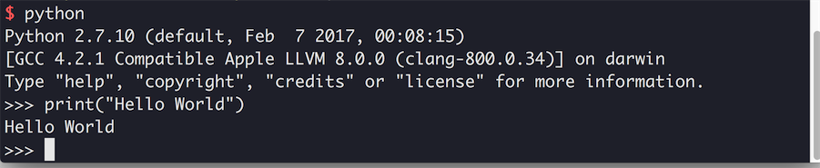

另一种我们可以直接在 `*.py` 后缀名的 Python 脚本中编写代码：

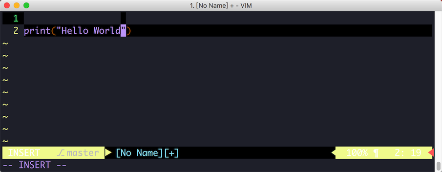

我们使用 `python <file-name>` 这条命令行去运行我们对应的 Python 脚本：

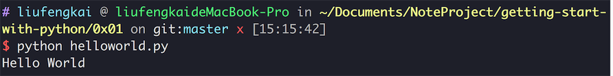

Python 的 REPL 和运行文件的模式是类似，都是将拿到的输入丢进自己的解释器中，通过对我们编写的代码进行解析，首先解释器会对整个程序的的代码进行分词，确定每个单词的含义（lexer 词法分析），而后会确定程序的语法语义（parser 语法分析阶段），比如这里我们会识别出 `print` 函数和中间的输入的 `字符串` ，解释器会把中间的字符串进行打印到屏幕中去。

编写程序中，我们也可以使用更为智能的 IDE 去编写程序，能够有更加便捷的软件项目管理和代码提示：

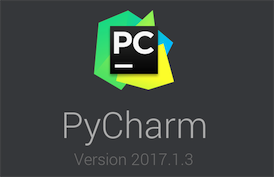

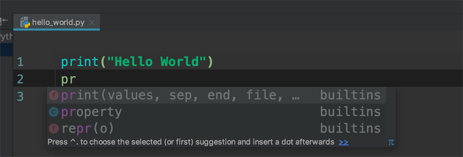


## 使用变量

我们试着在我们的程序中使用变量，Python 是一种 `动态类型` 的语言，因此我们不需要对很多类型进行显示声明：

``` python
show_message = 'Hello World'
print(show_message)
```

这里我们使用字符串字面量（'Hello World'）创建了一个变量 show_message ，然后我们调用了我们刚才使用过的 print 函数将内容打印出来。

### Pythonic 时间：使用变量

> 本微课中的 [CookBook 时间] 是指具体某个部分知识点在处理一些问题时候的 best-practice （最佳实践），在学习某门知识的最开始就应该了解这个部分的最佳实践，而不是自己野蛮生长之后再规范自己。

我们在 Python 中使用变量有一些规范，违反了这些规范可能会引发错误（不支持的变量名），但是更多的是会带来可读性上的问题，因此为了我们的代码容易阅读，我们应该遵循以下规则：

1. 变量名可以包含字母、数字下划线，但是不能由数字开头。
2. 不要试图使用关键字作为变量名，某些语言支持使用保留字作为变量名，但是相信我即使在那些语言里我也建议你不要这样做。
3. 变量名不能包含空格，需要分割单词请使用下划线，Python 推荐使用 _ 分割单词，而不是使用驼峰法命名，因此我们尽量不要在变量中使用大写字母。
4. 变量名应该兼具简短和可读性，现在是 2017 年了，我们不用担心过长的变量名会带来程序的异常，但是也请不要在变量名中写小说。


## 使用字符串

首先我们先来介绍刚才在 Demo 中已经使用过的一个数据类型—— string，在 Python 这种高度抽象的语言中，使用字符串非常方便，所有引号（无论单引号、双引号）中扩起来的内容都是字符串：

``` python
'lfkdsk'
"lfk'dsk"
'lfkdsk" '
```

这种互换能让我们方便的在程序中使用双引号和单引号，只要和外部的引号不同就不需要转义可以直接使用。下面我们来看一些 string 提供的 API （阅读的时候可以在 repl 里面写一写）：

### 合并字符串

合并、拼接字符串应该是我们在程序中使用的最多的操作，在 Python 中我们可以直接使用 `+` 号去链接字符串：

``` python
'lfkdsk' + 'lfkdsk'
> 'lfkdsklfkdsk'
```

这是使用字面量的方式，使用变量也是同样的：

``` python
word1 = ' word1 '
word2 = ' word2 '
word1 + word2

> ' word1  word2 '
```

### 格式化控制

程序中我们还会使用到很多对输出和控制字符串程序的部分，我们首先那可以从在字符串中插入转义字符的方式来做，这个是在各种语言中都通行的方法：

``` python
print('\n Python \t Hello \r World')
```

这里 `\n` 会切换下一行，`\t` 会插入一个制表符，而 `\r` 会使当前光标切换到本行开头，我们的效果如下：

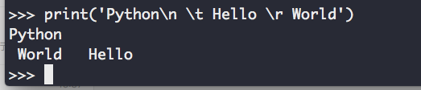

我们也可以在程序中使用一些 C-Style 的格式化输出的方法，比如使用 `%d %s %f` 等占位符：

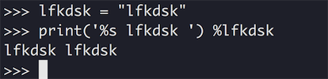

在格式控制中，还经常会有需要删除字符串前后空白的情况，这时候我们可以使用：

``` python
string.lstrip()
string.rstrip()
```

分别是删除字符串中左侧开头的空白和删除字符串中右侧开头的空白：

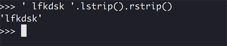

这样两侧的空格就都被清理了。

### 修改字符串的大小写

对某个指定的字符串进行大小写的修改可能是一个经常地操作，在 Python 中我们可以方便的使用字符串的库函数对字符串的大小写进行修改，修改字符串的大小可能有很多指定的方式比如我们可能对名字、标题、或者是其他一些名称的输出的时候需要让每个单词的首字母大写：

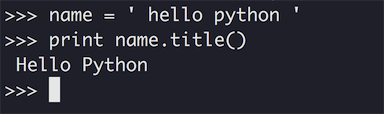

这里我们使用 `str.title()` 这个 API 就能将我们字符串中被当成单词的部分（空格断开的各个部分），还有更多的时候我们可能需要让整个字符串全部化为大写或者是小写：

``` python
str.upper()
str.lower()
```

输出结果：

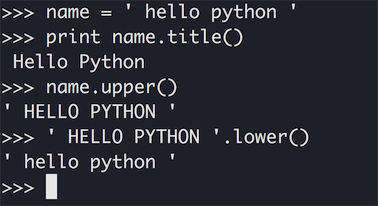

### Pythonic 时间：使用字符串

#### 删除不需要的字符

我们刚才在 `格式化控制` 一节中介绍过了 `lstrip` 和 `rstrip` 这两个 API，可惜它们只能处理字符串两端的空格，而对出现在字符串中间的空白无能为力：

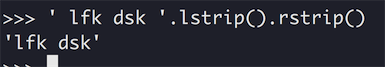

这时候我们就应该求助于别的方法了，比如我们如果想删除上面这个字符串 ` lfk dsk       ` 中间的空格，我们只能使用 `replace` 方法去替换所有的空白方法。

``` python
' lfk dsk '.replace(' ','')
```

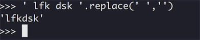

这就完美的解决了我们的问题，而且 `replace` 函数支持正则表达式，我们可以通过正则表达式去实现更多的对原始文本的控制方法。

// 正则表达式

#### 字符串的对齐

在 Shell 中使用 Python，我们经常会涉及到很多和打印相关的操作，如果想输出比较好看的字符串，我们需要做到的就是首先各行之间的打印要能对齐，如果相同部分字符串都不能对齐，各行之间的输出就会显得特别的丑，通常做好对齐的方法都是使用空白字符对短的字符进行填充：

``` python
text = 'lfkdsk'
text.ljust(20)
```

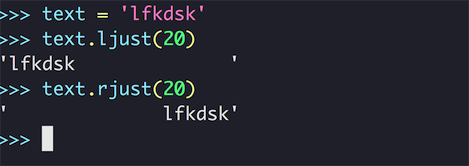

我们可以看到效果，我们使用 `ljust` 、`rjust` 方法，把我们的字符串填充到了 20 个字符宽，并且 r 和 l 的区别就是我们原字符串的在 “新字符串” 中的位置，这个方法虽然很简单但是控制的看起来太粗糙了，其实这组方法还有其他的重载方法，可以控制填充的符号：

``` python
str.ljust(20,'*')
str.rjust(20,'*')
str.center(20,'*')
```

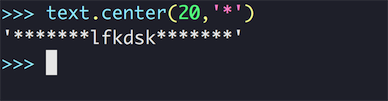

我们可以看到这个系列的 API 接受第二个参数作为填充空白的字符，比如图中所示，使用 * 号填充了字符串的空余部分。

除了这些函数，`format` 函数也能给我们提供很多这样的对字符串格式的控制，比如我们刚才实现的那三个功能就可以简单的通过 format 来实现：

``` python
format(text, '>20')
format(text, '<20')
format(text, '^20')
```

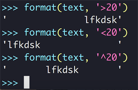

这里的实现也很形象吧，通过 `>` `<` `^` 控制字符串的填充位置。

## 使用数字

除了表示文字之外，我们平时在程序中用到最多的可能就是各类数字了，使用数字表示各类计算的结果，游戏中获得的分数等等，这里我们就在 REPL 的环境中使用一下 Python 中的数字。

### 数字变量

REPL 本身就是一个交互的解释环境，因此我们可以直接在其中输入数字和相应的表达式计算，并且正如我们在使用变量一节中说的，我们可以也可以创建一个变量表示数字：

``` python
lfkdsk = 1
```

这里我们给一个变量付了一个整数值，我们可以先介绍一下 Python 中的 **整数**。

### 使用整数

我们可以直接在 REPL 中进行整数的计算，比如：

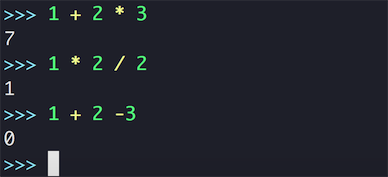

在 REPL 中可以直接使用这样的常值表达式进行计算，Python REPL 会直接对它们进行计算求值，注意到图中操作 （加减乘除）和数字、变量之间都有一个空格。但是表达式中的空格对我们的表达式的求值是没有影响的，这并不是语言的强制要求，但是写成这个样子会让我们的代码看起来更为清爽，相比于第三行中没有空格的表达式，明显前两行看起来更好看。

除了普通的四则运算之外 Python 也支持乘方操作：

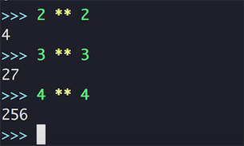

我们可以直接使用 `**` 计算符计算数字的乘方。

目前，我们对 Python 的 **整数** 简单的知道知道这些就可以了，除此之外，还有一个问题就是证书的除法问题，因为在 Python 中的两个整数相除的结果还是一个整数。因此我们就知道两个无法除开整数的结果只能包含结果的整数部分，比如：

``` python
3 / 2
```

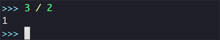

这里 `3/2` 的结果就只包含整数部分的 1，那么我们怎么才能正常的获得 `1.5` 这种小数结果呢？这我们就要介绍 Python 中的 **浮点数** 部分。

### 使用浮点数

标准的浮点数定义、存储方式和表示范围都是比较复杂的话题，但是作为刚刚涉及这个领域的初学者，我们可以简单地把 Python 系统中所有的 **带有小数点** 的数字当做浮点数：

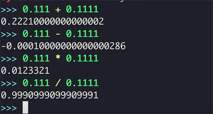

这里我们使用浮点数字和之前的之前使用整形数字没有区别，都可以直接在 REPL 里面使用，而且这里的浮点数除法因为结果也是一个浮点数所以，能够正确的表示计算的结果，因此这给我们一个启示，对于整数除法，我们只需要把其中一个数字换成浮点数，比如把 `5` 换成 `5.0` 这样计算的结果就能正确的表示出我们的计算结果。

> Tips 
>
> 从这张图片里我们又注意到了另一个问题，我们 **浮点数计算** 的结果是一个长度不确定的数字，这个是由于计算机对这种浮点数据的存取和计算方式做决定的。因此我们想要使用某种精度的数字，可以自己控制数据的位数和精度。

### Pythonic 时间：使用数字

#### 避免数据类型错误

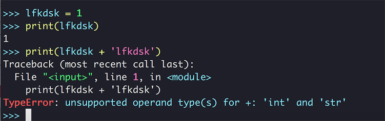

在学过 Python 中的字符串和数字的处理之后，我们可能会自然而然的使用类似这样的写法试图把字符串和数字进行连接起来打印出来，但是在 Python 中没有默认的对字符串和数字的连接进行类型转换，因此在遇到这样的情况之下，我们就应该手动的使用 `str()` 方法对非字符串进行类型转换：

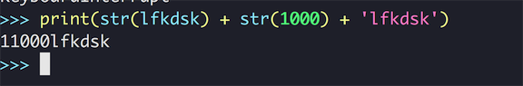

记得在拼接的时候自己做好类型转换，就能避免这样的类型错误。

#### 数字舍入

之前我们提到了，Python 计算出来的浮点类型类型长度是不确定的，这时我们要对数字进行一些舍入操作，简单的舍入操作，我们可以使用 Python 内置的 round 函数：

``` python
round: (number[, ndigits])                                   
round(number[, ndigits]) -> floating point number            
```

函数接受两个数字，分别是想要舍入的数字，和舍入的位数：

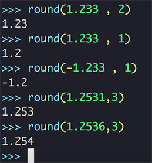

当一个值刚好在两个边界的中间的时候， round 函数返回离它最近的偶数。也就是说，对 1.5 或者 2.5 的舍入运算都会得到 2。传给 round() 函数的 ndigits 参数可以是负数，这种情况下，舍入运算会作用整数数位：

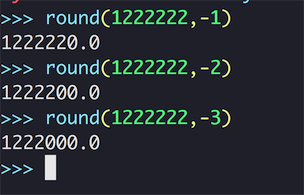

#### 数字格式化输出

数字的格式化输出和舍入是两个不同的概念，舍入是依赖某种原则对数据进行操作，进位或者舍去，而格式化输出则是通过指定精度进行输出。这里对数字的格式化输出，我们也可以使用 `format` 函数来做，比如说我们可以控制数字的位数：

``` python
>>> num = 123456.777777
>>> format(num, '0.2f')
'123456.78'
```

我们在这里规定了输出的精度是保留小数点后 2 位小数。

同样在这里我们也可以使用之前在 format 函数中的方式去控制整个输出的长度：

``` python
>>> num = 123456.777777
>>> format(num, '^20.2f')
'     123456.78      '
```

我们在这个表达式里面是用了 `^` 号，指定了格式化之后的输出中原字符串在中间，在 `^20.2f` 的小数点之前的 20 指定了格式化之后的长度。

## 使用注释

在 real-world 的编程之中，注释是非常高频使用的一种功能。所谓的注释，就是写在程序之中的记录，记录当前程序的功能和一些注意事项之类的，注释虽然写在代码里，但是并不作为程序的一部分出现，在解释过程中就被忽略掉了，只会对人起到一个提示的作用。

在 Python 中有两种注释可以使用，一种是 `单行注释` ：

``` python
# lfkdsk xxxx 
x = xxxxxx
```

单行注释使用 `#` 开头，这样整行的文本就会被解释器忽略不再处理，除此以外还有一种 `多行注释`：

``` python
'''
lfkdsk xxxx
'''

"""
lfkdsk xxxx
"""
```

可以使用连续的三个单引号，或者是连续的是三个双引号标志一个 `多行注释`，这样其中的文本就也会被当做注释看待，不会被解释器使用。

### Pythonic 时间：正确的使用注释

我们应该编写怎样的注释？“写必要的注释”。

我们在刚刚写下代码的时候对代码的各个部分都有非常完整的了解，但是一天后呢？一周后呢？一个月后呢？不会能一直保留着对我们之前代码的记忆，这时候我们就需要在事先编写注释来对我们进行一些提示了，在 **关键的**、

**不容易理解的** 部分给予我们必要的提示。这里着重的说必要的提示，也就是说我们应该在需要进行重点理解的关键点添加注释，而不是为了看起来严谨而每行都写注释。

##使用帮助：使用漂亮的 Python REPL

我们在这个教程的中使用了 REPL 环境去观察 Python 的使用和输出等相关的信息，如果要使用 Python 默认的环境，我们只需要在命令行中使用：

``` shell
python
```

但是这个 REPL 没有高亮和代码提示，使用起来不是特别的方便，我们在教程中使用的 REPL 环境是 **bpython** ，我们可以非常简单安装它，在安装 Python 的时候，我们已经被默认的安装了 `pip` 作为 Python 的 **包管理工具** ，简单说就是我们可以用这个命令行工具来获取相应的代码和程序，你应该习惯这个过程，因为很多其他的语言和框架，都有类似这样的机制，这里我们在命令行中输入：

``` sh
pip install bpython
```

之后我们会看到很多的下载和安装的输出：

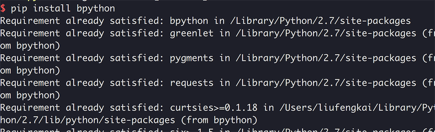

在成功安装之后我们就可以使用更为方便的 `bpython` ，只要在命令行中输入：

``` shell
bpython
```

就可以啦，这时候我们会看到这样的画面：

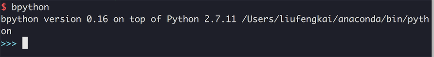

我们就能在这样的 Shell 交互界面中使用 bpython，我们这里来展示一下 bpython 的方便之处，首先教程中的图片都有易读高亮提示，另外就是我们在调用函数的时候可以看到提示和相关的文档：

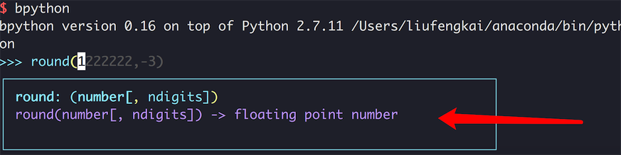

这里我们就能看到 `round` 这个函数都有怎样的输出了，并且提示了我们的参数分别都是干什么用的，非常的方便。API 的提示，代码的编写提示都非常的方便智能，更多的功能大家就去阅读使用说明或者在使用中发现吧~~

## 拓展阅读：关于语言类型的描述

在使用中文的编程领域，有很多因为翻译问题而产生的混淆概念。这些混淆概念混淆了很多人关于程序类型的认知，这里我们在学习的最开始就理清我们能看到的很多的对比概念：

* “解释型” vs “编译型”

解释型、编译型的语言分类来源于我们如何处理和运行我们的程序源代码，我们通常认为解释型的语言拥有更多的 Runtime （运行时）能力，简单的理解来说我们的源代码会被逐行的进行翻译运行，比如我们刚才提到过 Python 的解释器就是做了这样的一个工作，整个程序就像一个扫描纸带的机器一样，扫描到信息作出相应的处理：

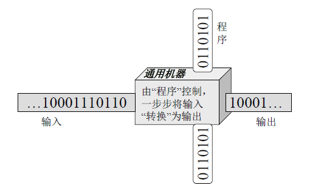

而编译型语言的目标代码一般是某平台（指操作系统平台）的汇编代码，相当于直接变成了机器语言，一般来讲拥有更好的程序效率。

这两者的区别主要在目标代码等级和运行方式，作为初学者只要了解这些就不会有概念的混淆。

* “动态语言” vs “静态语言”

这两个词也是非常容易让人产生混淆的词语，某些书使用这些词的语境中，一般是指 ”动态语言“ 能够程序编写、运行之后还能通过一些手段修改正在运行的程序，也就是我们刚才提到的 Runtime 能力，而 ”静态语言“ 一般是指编写、运行之后，我们不能对某些运行中的程序进行相关的修改。

在很多的语境之中这两个概念和上面两个概念是等同的。

* "动态类型" vs “静态类型‘

最混淆的概念来了，”动态类型“ 和 ”静态类型“ 这两个概念和上面的两个概念看起来非常的相像，但是讲的内容是不同的，动态类型的语言是指我们所定义的对象（变量）能否在运行的过程中修改自己的类型：

``` python
lfkdsk = 1000
lfkdsk = "lfkdsk"
```

比如我们所使用的 Python 就可以说是一种 ”动态类型“ 的语言，这里我们在把 *lfkdsk* 这个变量赋值为一个整形值之后，又向他赋了一个字符串值。而我们使用过的其他语言 C 、CPP、Java 等语言的变量是不能被重新修改类型的，这和语言的动态性无关，也就是说即使是一个所谓的 ”动态“ 语言也可能不支持对变量类型的修改。

>**Warning!!**
>
>对类型的动态修改对程序的设计上带来了一定的方便，但是产生了更多的弊端，比如 IDE 的静态分析会不太精准无法提供可靠的代码提示，还有我们在 Debug 的时候也有一些麻烦，可能不到运行时我们无法确定某个部分的某个变量的具体类型。
>
>所以不建议在从程序中对变量类型进行改变，我们在程序中也只考虑正确的类型处理，不符合处理结果则跑出异常。


> **Warning!!!**
>
> 以上的这些名词的使用很多对语言的某种特性的不完全的、模糊的表示，所以上面我们解释这些有问题的概念是为了让初学者能对这些概念有个基本的把握不至于晕头转向，**不建议使用这些词语描述一门语言**。
>
> 正确的描述方式应该是简单的解释出某个具体的特性，比如 ”Python 的变量支持动态的修改属性“ 而不是 ”动态类型一时爽，代码重构火葬场“ 这种易产生多种歧义表达。


