# 0x02-使用列表

在上一章了解了一些 Python 的基础的数据类型之后，我们对 Python 已经有了一个较为基本的了解了—— Python 是一门简洁易用的编程语言，内建的很多基础类型就提供了很多的高级功能。基础类型构成了语言基石中很重要的一部分，我们在任何程序中都会用到这些内容，比如我们要做一款游戏，我们可能需要记录人物的生命值，攻击力等等的信息，这些信息都是我们在程序中需要记录和表示的部分。

但是如果我们要制作一款有趣的小游戏为目标的话，记录的值不会只有简单的变量，因为对应现实生活中的无论是人物还是敌人，都不会是孤立的，很多时候我们都有对数据进行成组操作的需求，并且通过操作这些数据实现各种各样的功能，这里我们我们就来接触 Python 中的一个比较基础的内建数据结构——列表。

列表（ List ），是 Python 中一种最为基本的数据结构，是由一组顺序特定的元素组合形成的一种数据结构。在很多语言之中我们都能够使用类似的数据结构，而且在不少语言之中我们能使用的数据结构的类型是固定的。比如说，Cpp 中列表可以全部是字符串，，也可以全部放数字，但是是不能混合着使用。但是在 Python 之中，我们没有这种限制，我们可以在一个列表之中放字符串、放数字、可以放任何我们想放的东西，Python 使用 `[]` 方括号表示：

``` python
list = ['lfk', 'lfkdsk', 2333333, 123.000]
print(list)
```

这里我们看到了，这个被命名为 list 的列表中包含很多类型的数据，里面包括字符串、整型数据、还有浮点型数据，这里我们还对这个 list 进行了打印，我们可以看到 list 是能够正确的打印：

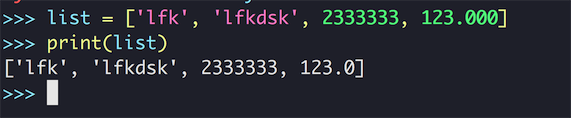

不过这里我们的打印也只不过是显示了我们的输入的内容，这个输出明显没办法满足我们想要的输出，毕竟我们对列表的期待是要能存储这些数据，再输出的时候应该是获取具体的某个 item，而不是获取全部的元素，这里我们就应该了解如何 **操作列表**。

## 初识列表

### 访问列表

刚才介绍了，列表本质上是有序元素的集合，因此我们对于列表的访问也应该是使用元素的顺序来访问，从语法上来说，我们先写下 **操作的列表名**，然后再在方括号内标明 **数组元素的索引** 值可以访问了数组元素了：

``` python
list[num] # 这样的格式
```

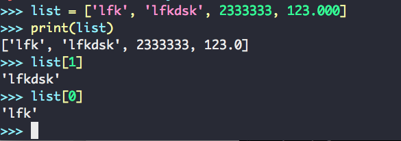

>  Tips
>
>  这里我们注意到了，我们对列表元素的访问是从 0 开始的，这可能会对刚刚开始学习编程的同学造成一定的困惑，但是其实这种问题是由于列表的一些底层实现造成的，而且我们在很多的编程语言中都有这样的设定，我们需要习惯这种设计。如果我们访问数字的下标是从 0 开始的，那列表的最后一个元素的访问下标应该是 **数组的长度 - 1**。

### 修改列表元素

我们不但能通过数字下标的方式去访问我们的列表元素，还可以通过访问数字来修改列表的元素：

``` python
list = ['lfk', 'lfkdsk', 2333333, 123.000]
print(list)
>>> ['lfk', 'lfkdsk', 2333333, 123.000]
list[3] = 'lfkdsk'
print(list)
>>> ['lfk', 'lfkdsk', 2333333, 'lfkdsk']
```

这里我们可以看到，在第二行中，通过修改第三个元素的内容，列表中对应的元素的内容也被修改了，从输出中我们也能看到，第三个元素被修改了，而其他的元素没有改变：

``` python
['lfk', 'lfkdsk', 2333333, 123.000]
['lfk', 'lfkdsk', 2333333, 'lfkdsk']
```

### 添加列表元素

Python 提供了多种方式去添加列表中的元素，比如我们可以通过 `append` 方法，将一个新的列表元素添加到列表元素的后面：

``` python
list.append('pop')
print(list)
>>> ['lfk', 'lfkdsk', 2333333, 'lfkdsk', 'pop']
```

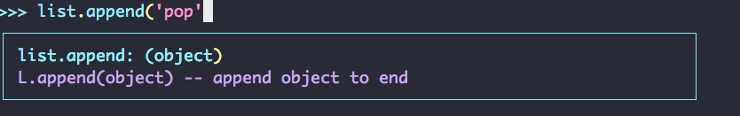

append 方法只能把元素添加到列表的末尾，但是我们所使用的列表是有序的列表，这样我们可能需要把某个元素插入到列表中对应的位置：

``` python
list.insert(index, item)
```

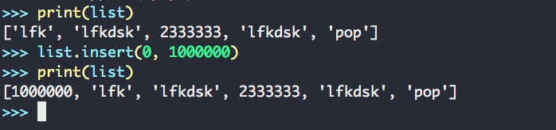

insert 函数接受两个参数，一个是插入的位置(index)，另一个是插入的内容(item)，这里我们可以看到我们后插入的 `1000000` 被插进了 `0` 号位置——就是列表的最前端的位置。

### 删除列表元素

在对列表元素进行过添加和修改之后，在很多情况下我们还会需要对列表元素进行删除，这里我们介绍几种方法，首先是使用 `del` 语句直接删除：

``` python
del list[0]
```

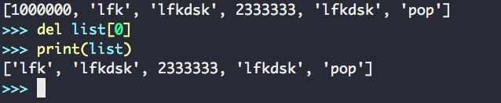

这里我们看到，del 可以删除列表中的任意元素，但是前提条件是知道元素所对应的索引，通过这些索引我们就能删除对应位置的元素，还是要提醒一句我们的索引是从 0 开始计算的。

除此之外，我们在现实中操纵这种成组的数据，可能会有操作我们最近添加进列表的元素（比较热点的数据会频繁擦写），根据我们刚才学的我们也可以直接把代码写成 `del list[length - 1]` ，但是这明显非常不方便，我们还需要预先计算出 list 的大小才行。好在 Python 的列表已经给我们提供好了使用这种操作的方式，我们可以使用 `pop` 这个 API：

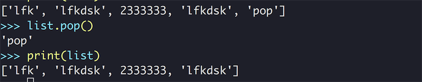

我们可以注意到了，这个 `pop` 的 API 完成了我们想要的操作，删除了列表中的最后添加的内容。如果 `pop` 这个方法只能删除列表中的最后一项，就未免显得太过鸡肋，事实上 pop 也可以删除列表中的任一项：

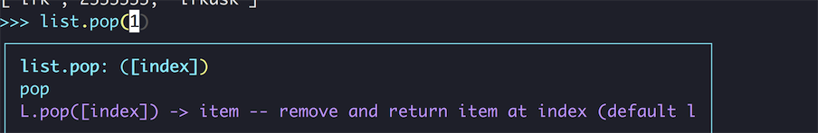

我们发现 pop 是可以接一个参数，这个参数就是列表元素的 index 值。所以这里我们也可以使用 pop 来删除任意的项目：

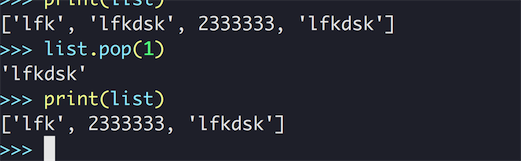

除了以上的功能，我们还看到这个函数是有返回值的，它返回了我们从 list 中删除的字符串 `lfkdsk` ，这就和 del 方法有很大的区别，del 删除过的元素我们是不能从返回值中拿到继续用的。所以这两个方法的取舍取决于我们是否打算继续使用刚刚删除的内容。

## 操作列表

和我们之前接触过的内部类型一样，我们可爱的 Python 也为我们的列表提供了很多有用内部方法去操作的列表。通过这些便捷的方法，能让我们在使用列表上更为便利和简洁。

### 计算列表的大小

我们在之前的操作中，有很多时候会使用到这个列表的长度（大小），比如我们获取列表中的最后一个元素 `list[length - 1]` ，我们可以轻松地用 `len(list)`  的方法，去直接获取整个列表的大小：

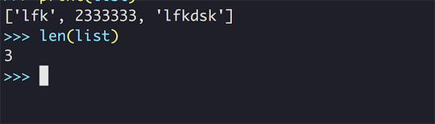

我们之前提过列表的 index 计算是从 0 开始的，那么这个长度 3 也是..... ? 

不，这个请不要担心，我们的 3 正如上面的列表确实有三个元素一样，这种大小的计算是从 1 开始计算的，这点请放心的使用。

获取列表的长度能帮到我们做很多的事情，比如还用之前我们所举的游戏的例子，我们可以计算剩余的敌人数量，以便于更新我们的某些属性，或者是画面上的某些表示敌人的信息。

###获得倒排列表

使用 `list.reverse()` 方法，可以获取我们当前列表的倒排列表，这个倒排是指元素顺序的倒排，比如原来在第一个位置的元素会变成最后一位的元素，而不是依靠某种方法进行排序：

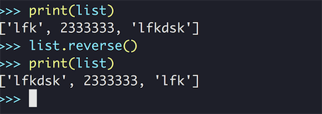

我们这里看到，在调用过 `reverse()` 方法之后我们的列表的元素顺序被永久性的修改了。如果我们想要把翻转过的列表再翻转回来，我们可以再次调用 `reverse()` 方法，这样我们就可以获得一个原顺序的列表。

### 对列表进行排序

我们还可以使用 `sort` 函数对列表进行排序，排序的规则是根据数字、字母的顺序进行的。

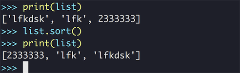

使用 `list.sort()` 我们的原数组变成了数字、字符串也按照顺序进行了升序的排序。如果我们想要降序的排序我们应该怎么办呢？我们用 bpython 看一下 sort 方法的定义：

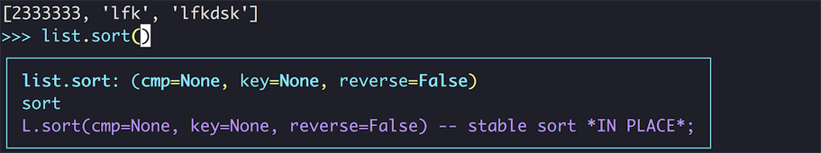

这里我们看到这个函数有个一个参数是 reverse ，这就是控制我们 sort 是升序还是降序的一个参数，默认是 False，这里我们把它设为 True ，调用结果就是降序的了：

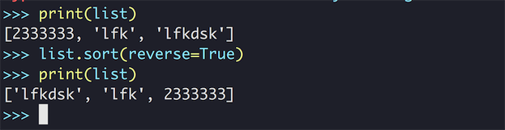

以上的方式，我们都会对原数据进行修改，那么有没有方法能让我们在不改变原来的列表的情况下生成一个新的排好序的列表呢？万能的 Python 的答案当然是 `yes` ，我们可以使用一个叫 `sorted` 的 API，来完成这样的一个操作：

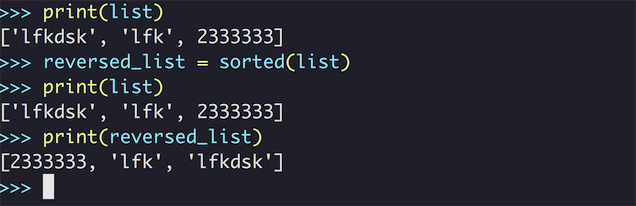

这里我们创建了一个新的列表变量 `reversed_list` 去接收这个已经排好序的列表，之后我们再打印这两个列表，我们发现，之前的列表并没有因为排序被改变，但是我们新的 `reversed_list` 列表已经是完全有顺序的了！

关于这两个 API 的取舍，我们也应该按照我们的需求来用，比如如果我们并不在在乎、或者就是想改变原列表，就使用 `list.sort()` ，如果我们不能改变原列表，只是想获得一份拷贝，那么我们就要使用 `sorted` API。

## CookBook 时间：使用列表

### 解压列表中的数据

跟据我们上面介绍的内容，我们已经可以将数据存储到列表中去了，但是有存储就有取出，当我们想将列表中的数据取出赋值给我们要用的变量的时候我们应该怎么做呢？根据刚才学到的知识，我们可以靠索引值取出对应的元素然后赋给变量，比如这样：

``` python
test_list = ['string1', 111111, 'string2']
str_1 = test_list[0]
str_2 = test_list[2]
...
```

唔，这个方法也不错，能完成我们所要的任务，而且从列表中取出就说明我们知道这个数据在列表中的索引值，这个方案当然可行，但是我们说了是 **CookBook** 就要提供别的方式，这里 Python 又提供给我们了一些语法糖，可供解压变量使用：

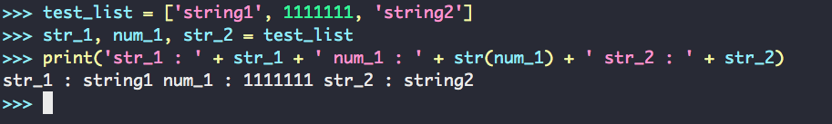

这里我们可以看到，在 Python 中我们可以用一个列表给多个变量进行赋值，这时列表里面对应位置元素就会被赋给对应的元素，我们之后把这三个变量也打印出来了，证明确实被赋值了（数字记得用 `str()` 转换数据类型）。但是这个用法有一个前提条件，就是变量的数量要和列表元素的数量要相同才能正常使用。

### 使用 * Operator 来接收剩余变量 [Python3 only]

我们提到了如果想直接使用解构赋值需要让我们列表中的元素和解构赋值的变量的属相是相等的：

``` python
some_list = ['a', 'b', 'c']
(a, b, c) = some_list
```

但是如果我们的数目无法对应的上我们的解构赋值可能就需要写成这个样子：

``` python
some_list = ['a', 'b', 'c', 'd', 'e']
(a, rest_list, c) = some_list[0], some_list[1:-1], some_list[-1]
```

使用这样的方式，我们虽然已经使用了 Python 支持的切片功能，但是这个写法和直接把列表中的元素拿出其实本质上没有什么区别，但是在 Python3 之中我们可以使用 `*operator` 当成左值来使用接受额外的参数：

``` python
some_list = ['a', 'b', 'c', 'd', 'e']
(a, *rest_list, e) = some_list
print('{}- rest {} - {}'.format(a, rest_list, e))
(a, b, *rest_list) = some_list
print('{} - {} - rest {}'.format(a, b, rest_list))
(*rest_list, d, e) = some_list
print('rest {} - {} - {}'.format(d, e, rest_list))
```

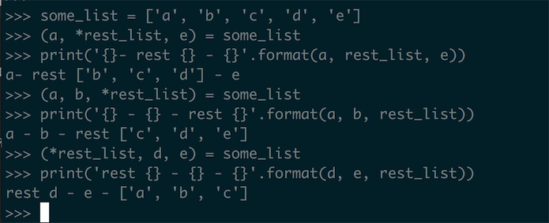


