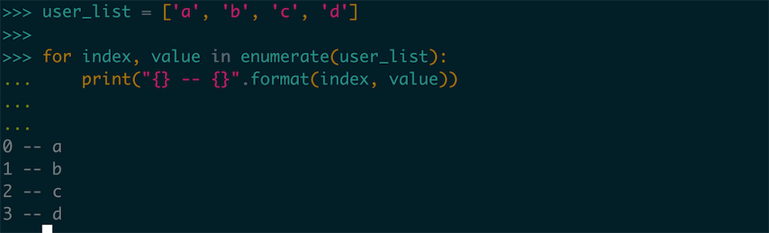

## 初探循环

在上面我们已经接触了很多和列表相关的知识，我们会发现列表在数据的整理和使用方面给我们带来很多的便捷，我们在操纵数据的抽象层次已经登上了一个新的维度，但是我们会发现直接只通过元素的索引去操作数据未免太过麻烦，我们要是想遍历整个列表还可能需要对每个 index 进行操作。

这里我们开始介绍介绍 Python 中的对流程控制的一些语法，比如我们可以先从一种比较简单的语法开始 —— `for` 循环。`for` 循环是很多程序语言中都包含的一种内建的语法，在最早期的时候 `for` 循环是作为 `while` 循环的一种条件语法糖出现的，在 C、Cpp、Java 中出现的循环通常是使用计数器形式的：

```java
for(int i = 0; i < length; i++) {
    // do some work
}
```

在近些年这些语言也添加了基于 `迭代器/ for-in` 的 `for` 循环语法（就这个例子可以简单理解成遍历数组中的每一项），Python 中我们要接触的这种循环就是一个 `for-in` 循环，叫 `for-in` 是因为循环中的每一项都是列表中的一项。

### 使用 `for-in` 循环

比如我们有一个列表，列表中的每一项都是一个朋友的名字，我们想在 Python 中把这个列表打印出来，我们应该这样使用：

```python
friends = ['tom', 'jerry', 'john', 'jason']
for friend in friends:
    print('my friend :' + friend)
```

这样就可以运行了，这里我们注意到 Python 在这部分的语法设计上并没有使用大括号作为分割，而是使用了 `:` 和缩进对程序流程进行控制。

> Tips 缩进：
>
> 在 Python 中缩进是非常重要的一种流程控制手段，和其他语言对缩进只作为一种推荐的代码编辑方式相比，Python 中缩进和程序的语义的正确性息息相关，比如我们刚才在 `for-in` 循环中使用了缩进，但是如果我么能去掉了这个缩进，程序就无法编译通过。
>
> 缩进可以使用一个  `Tab` 键或者是 `四个空格` 来控制，这里我们推荐使用 **四个空格** 来控制缩进，因为 Tab 按键在不同电脑上的长度的不确定的，在某些电脑上一个 Tab 键是八个空格，这样的话你的代码在别的电脑上打开就会看起来是这个样子的：
>
> ```python
> friends = ['tom', 'jerry', 'john', 'jason']
> for friend in friends:
>     	print('my friend :' + friend)
> ```
>
> 这样的程序如果短还可以长的话就真不愧 `游标卡尺代码` 的称呼了，所以四个空格可能按起来有些麻烦，但是我们还是应该这样来用。

我们程序的运行结果是这个样子的：


这里我们看到，程序打印出了我们列表中朋友的名字！

### for-in 循环到底做了什么？

记得在微课的第一节中，我们就讲过，可以把 Python 想象成一个逐行读取，然后运行的一个扫描解释器。这里我们也可以用这个思路去想像我们的 `for-in` 循环中都发生了什么，这里我们首先来解构我们的 `for-in` 的语法到底是什么：

```python
for <item> in <list>:
  	# 使用 item
```

我们注意到了，for 这个关键字的后面是一个 `<item>` ，这个东西是一个临时变量，表示集合中的一个当前的元素，我们可以给他一个任意的变量名，不过出于编写程序的便利性的角度来看，这里我们的命名还是要有尽量有意义，还能体现出是一个集合中的一个元素（比如 friends 这个集合的元素的 item 变量被命名为 friend ，非常好理解，更多关于变量命名的规则可以去阅读第一章使用变量的 CookBook 时间是）。

in 关键字后面的 `<list>` 代表一个集合，比如我们刚才使用的 friend 列表就是这样一个 **可迭代** 的集合，所谓的可迭代用白话来说就是这个东西里面的东西是可以一件一件拿出来的，比如我们使用的列表，就是这种可迭代的，里面的元素可以一个一个的取出来。

那我们的程序就是先读取了 `for-in` 这个循环，这时候知道了，我们要开始进行循环了，就从 friends 列表中拿出第一个元素 `tom` ，并且把这个元素赋值给了 `friend` ，好了，这时候我们的解释器进入了 `for` 循环的代码块，开始执行 `print` 函数，因为 friend 在 for 循环里面已经声明了，所以这里我们可以直接使用，所以我们打印出了第一行的内容：

```python
my friend tom
```

但是列表中的元素还没有被遍历完成，因此程序再回到了 `for` 那句，friend 被赋值为了 `jerry` 。这个循环就此不断地往复，知道这个列表中所有的元素都被遍历完成。

### 使用数值循环

在 `for-in` 循环那节我们中我们提到了一种数值循环，一般的是从 `0~len-1` 的数值进行循环。`for-in` 循环对于遍历列表这种集合元素非常方便，但是我们在实际的编程之中确实会有使用这种使用数值进行计次的循环，那么怎么办呢？Python 提供了一个内建函数 `range()` 能产生数值序列，这样我们就可以把代码写成这个样子了：

```python
for index in range(1, 10):
    print("index is" + str(index) + " now")
```

在 `bpython` 中运行这段代码，我们能看到这样的输出结果：


这里我们惊奇的发现这里只打印出来 `1~9`，不过我们应该已经熟悉这个问题了，在之前使用列表的 index 的时候我们就知道了，列表的索引计数是从 0 开始计算的，到 `len(list)-1` 为止，所以这个 `range` 函数的输出，我们也可以将想象成 **从 1 开始计数，计数到 10 停止**，所以我们这里就可以理解为什么 1-10 却只有九个打印了。

`range` 还可以修改步进的插值，也就是每次循环我们的 index 增长多少，比如还是刚才这个 `1 - 10` 我们刚才是让它每次 +1 运行的，但是我们通过使用 `range` 的另一个重载可以实现每次步进 2、3、、、等等。这里我们来看 `range` 这个函数的签名：


我们发现 `range` 还有一个 `step` 参数，就是用来控制步进的：

```python
for index in range(1, 10, 2):
  	print("index is " + str(index) + " now")
```


从这个打印我们能看出，每一个的步进都变成了 2，这时 `range` 这个函数的语义，可以被理解成为 **从 1 开始计数记到 10 停止，每次增长 2 ** 。

我们可以发现 Python 中没有针对数值循环形式的语法实现（就是说没有另一种 for 循环的形式），但是在这里我们使用了一个 `range` 函数来生成一个数字序列去作为可迭代的列表，仍然用一个 `for-in` 循环就实现了这个功能，这也从侧面体现出了 Python 的灵活性。

### 使用 List Comprehensions

之前我们对列表的创建都是新生成一个列表，我们要是想以一个列表生成一个新的列表的时候我们应该怎么办呢？比如说我们现在有一个存放数字的列表，想要生成一个新的列表，新的列表的元素是原本列表的平方，之前仔细学过的小伙伴很快就可以给出答案啦：

```python
old_list = [1, 3, 5, 7, 100]
new_list = []
for value in old_list:
    new_list.append(value ** 2)
print(new_list)
```

运行一下我们的程序看一下结果：


成功的打印出了我们想要的结果，但是在我们实际的开发之中，我们可能会经常地对某个 `原列表` 进行操作从而生成一个 `新的列表` ,如果我们都用这个步骤去写的话，程序中就会出现大量的模板代码，这不但会让程序不清晰还会显得特别冗长，Python 的设计就是为了使用便捷和轻松，这里我们针对这种 **从原列表产生新的列表** 的操作有一个方便的语法糖能帮助我们：

```python
old_list = [1, 3, 5, 7, 100]
new_list = [value ** 2 for value in old_list]
print(new_list)
```

我们来看一下运行结果：


我们惊奇的发现使用这种语法我们能方便的从一个列表创建出另一个列表，那现在让我们来看一下这个语法是怎么组成的吧（伪代码）：

```python
new_list = [ <value to new> for value in old_list]
```

要使用这个列表首先我们要有一个可以使用遍历的列表，我们没办法凭空使用这个语法。另外这两个列表的元素之间要有某种转换关系，比如这里我们的新的列表和旧列表的关系是平方的关系，我们就可以在一对中括号之中，先写出来对旧列表循环，然后再这个循环体结构之前增加对每个元素的修改，通过这样我们就构成了这个 *List Comprehensions* 语法，可以开心的使用这个语法糖啦 ~~

### CookBook 时间：关于迭代器

我们在上面的提到循环和迭代的部分提到了很多次迭代器这个东西，也做出了一些简单的解释，但是我想这个词本身包含的语义其实并不复杂，而且这种问题我们就应该趁早的解决清楚。

比如这个迭代器，首先我们知道支撑 `for-in` 循环的是一个对列表的迭代器，我们在讲解 `for-in` 循环那节提到了每次循环都会给某个变量进行赋值，其实这个赋值过程就是迭代器做的，我们可以把这个 **迭代器** 想成下图的东西：


我们把生成迭代器的列表包装起来了，迭代器内部有一个这样的箭头指向着当前读取的元素，这个看起来是不是很眼熟，这个就是我们在 `for-in` 循环中每次对数据元素的赋值，在图里我们还画了一个 `next()` 的方法，我们可以认为每次调用 next 的时候，这个箭头就会移到下一位然后把最新的值给我们，这看起来就对应了 `for-in` 循环为什么会不断地循环，因为 next 下一直有元素啊！最后 next 调用到没有元素了，我们的循环就停止了，这时候我们的循环结构就跳出来。

从这部分的讲解我们也能看出来其实背后是 `iterator` 在驱动着我们的循环的使用，其实我们的讲解还可以更为直观一点，Python 提供了 `iter()` 这个内建方法，能够自己构造一个迭代器去使用，我们可以在这里去使用一下：

```python
list_iterator = iter([1, 2, 3, 4, 5])
list_iterator.next()
list_iterator.next()
list_iterator.next()
list_iterator.next()
```

我们可以来看一下运行的结果：


我们看到了这个 `list_iterator` 对象可以不断地调用 `next` 方法就能获取到 list 中不断地东西，在这之后当我们 list 的东西都被遍历之后我们会发生什么呢？如果继续调用 `next` 会抛出一个错误：


因为我们列表里的所有的元素都被迭代过了，这里已经没办法再进行迭代了。


## Pythonic 时间：使用 enumerate 方法获得 index 支持

使用过其他编程语言的程序开发者，有的时候会觉得 `for-in` 循环感觉有些鸡肋，因为在一些其他的编程语言之中除了迭代器循环之外，还会支持一种使用 index 的循环方式，这种遍历方式在一些需要知道我们当前循环变量位置的时候非常有用：

``` java
for (int i = 0; i < size; i++) {
  // use index
}
```

通常我们在直接使用 `for-in` 循环的时候是获得 `index` 的时候，有的同学可能会写出这样的代码：

``` python
index = 0
user_list = ['a', 'b', 'c', 'd']
for value in user_list:
    # use value ; index
    index += 1
```

但是这样我们在代码段之间就会产生非常多余的 `index` 的临时变量，但是这种思路就是枉顾了 Python 万物皆对象的思想，我们在 `for-in` 循环之中只要使用的是一个 **可迭代对象** 就可以了，这里系统提供了一个 `enumerate` 方法：


输入是一个可迭代对象，返回值也是一个可迭代对象，但是包含了数字的 `index` ，我们可以这么使用：

``` python
user_list = ['a', 'b', 'c', 'd']
for index, value in enumerate(user_list):
    print("{} -- {}".formate(index, value))
```

这样我们就可以轻松、优雅的在 `for-in` 循环中使用带有 index 的循环：




