# 0x04 列表切片和元组

在上两章中我们分别学习了很多和列表和循环相关的知识，在比较靠前的位置去安排这样的知识和内容是有目的的，我们在学过了列表就了解了一种 Python 内建的数据结构，在学过了对循环和迭代器的知识之后，我们了解到了 Python 中控制流相关的很多知识，在接下来这一小节我们会了解如何使用列表切片和一种新的内建的数据结构——元组。

## 使用列表切片

在 `初识列表` 那一节之中我们简单的学习了列表的一些有趣的操作，我们使用 index （数组下标）的方式使用类似这样的语法：

``` python
item = list[index]
```

的方式对去访问列表中某个固定位置的内容。而且我们在 CookBook 时间的部分提到了我们如果想把列表解压到数量相等的变量里面去，可以使用 `变量解压` ：

``` python
item1, item2, item3 = list
```

但是现在我要问了如果我们想要的是某个具体范围的列表内容呢？比如我们的列表有 10 个元素，我们现在想要其中 2-8 的一份拷贝，我们应该怎么做呢？我们学过的循环了，还了解了列表删除（虽然我们还没有接触过条件分支语句），这个问题可以不假思索的写出答案：

``` python
old_list = range(1, 11) # 还记得吗 range 生成数值列表，并且要到 11 才能有 10 个元素
new_list = []
for value in old_list:
    new_list.append(value)
new_list.pop(0)    
new_list.pop()  
new_list.pop()    

print(new_list)
```

好吧，这个写法因为我们没有学过条件分支语句被弄得非常复杂，很难说的上不假思索，不过我想认真学过前面的同学们肯定能看懂的，我们首先用一个新的列表对原始的列表进行了一次复制，然后我们删掉了第一个元素和后两个元素，可能有人会说为什么不所有的 `pop` 删除都使用 index 的形式写呢？比如：

``` python
new_list.pop(0)
new_list.pop(8)
new_list.pop(9)
```

但是如果我们这么写的话肯定会遇到错误，因为当你删除第 0 个元素的时候，其实你的列表中的元素数量就已经不足时候了，这时候你再去删除对应位置元素，如果列表大的话，你确实能删除一些东西，但是早就不是你想删除的那些内容了，如果想这个例子一样我们没有足够的元素数量，我们则会直接的爆出错误。

即使我们使用了 `if` 分支条件来做这个问题，也会写成了模板代码，不是很好看，Python 为我们提供了一种方便的方式去创建原列表的一部分的内容，我们通常把这个方式成为 **切片**，我们使用切片的语法来做一下刚才的这个问题：

``` python
old_list = range(1, 11)
new_list = old_list[1:8]
```

我们来看一下输出的结果：

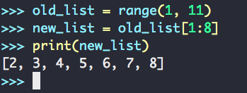

我们看到了截取 1-10 中的 2-8 段的列表的需求被轻松地解决了，当然这里我们还是遇到了 index 的问题，比如这里我们写的是 `[1:8]` ，其实说的是从第二个元素（第一个元素 index 是 0）开始，到 index 为 8 （其实就是数字 9 的位置）停止的所有的切片，不过我们之前已经在 list 的使用和 `range` 循环部分接触到了这个 index 从 0 开始计数，然后计数到某个数截止这种问题了，我想大家也应该习惯了这种方式了~

所以说所谓的切片功能就是这样的一种东西啦，我们使用类似这样的一种语法：

``` python
list[<start index> : <end index>]
```

我们在一个原列表后添加一对中括号，然后里面的冒号两侧分别写上起始位置和结束的位置，这里我们只要主意刚才提到两侧的 index 的范围就可以用好这个语法了！

如果 index 和内容都是数字，看起来有点混淆，我们可以使用充满字符串的列表去使用切片功能呢：

``` python
old_list = ['tom', 'jerry', 'jason', 'lfkdsk', 'means88', 'wph95']
new_list = old_list[3:]
```

我们这里使用了另一种 *切片* 的使用方式，我们刚才说要在两侧都写上范围，但是其实我们不一定要写上两侧 index ，比如我们写上 `[3:]` 就是指从 index 3 开始一直到列表的结尾的所有元素的切片内容。我们来看一下输出的结果：

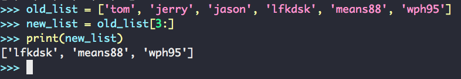

我们能看到了这里打印出来 index 3 之后的所有的内容。于此相类，如果我们省略前面的 index 而是保留后面的 index 的话就是保留从 index 0 开始直到某个 index 截止的所有的元素的切片，比如：

``` python
old_list = ['tom', 'jerry', 'jason', 'lfkdsk', 'means88', 'wph95']
new_list = old_list[:4]
```

我们来看输出的结果：

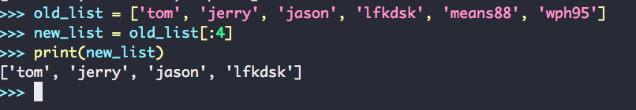

自此我们可以开心的使用切片去创建原列表的部分结果啦！

## 使用切片来循环遍历

我们切片的生成出来的结果是一个新的列表，既然生成了新的列表就意味着我们可以使用这个列表来进行循环遍历了！

``` python
old_list = ['tom', 'jerry', 'jason', 'lfkdsk', 'means88', 'wph95']
for name in old_list[3:]:
    print('name is ' + name)
```

我们来运行已一下这段程序，我们发现在这里程序并没有打印整个 `old_list` 原列表，而是直接在这里运用了我们 `old_list[3:] ` 这个切片的遍历结果：

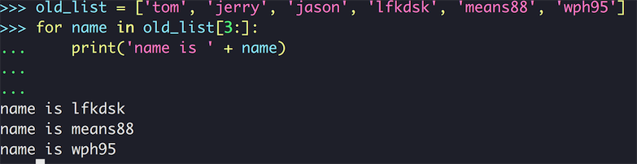

## 复制一份列表

我们之前已经在好几个知识点的地方，比如写列表的切片、使用 List Comprehensions 这种语法糖的地方写过列表的复制了，我们都说实现那几个功能的地方要写一边复制，是 `模板代码` 不利于程序的简便性。但是其实列表的复制使用 `for-in` 循环去复制也是一种 `模板代码` 哦。诶 ！我们刚才学到了使用 **列表切片** 的方法能够创建一个列表的某个切片，而且我们还可以省略某一侧的 index ，代表这一侧的范围到末尾。现在我们有这两个知识点了：

1. 切片可以创造一个新列表
2. 一侧切片为空代表范围是到这一次末尾（比如左侧为空就是从 0 开始，右侧为空就是到列表末尾结束）

那我们可以很自然的想出来，那么要是两侧都为空是不是会产生一个切片，但是这个切片是和原列表一样的。我们可以来实践一下这个想法：

``` python
old_list = ['tom', 'jerry', 'jason', 'lfkdsk', 'means88', 'wph95']
new_list = old_list[:]
print(new_list)
```

我们来看一下这样写的输出结果：

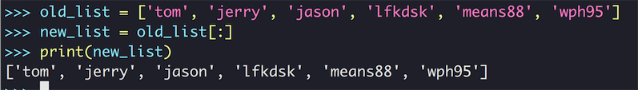

哇，我们居然成功了，在 Python 单纯的列表复制我们不再需要使用冗长的循环进行复制了，直接这么使用 Python 的切片的语法糖我们就能轻松的完成这项操作了，这里我们可以验证一下是不是真的成功的复制了这个列表而不是两个变量都指向同一个列表：

``` python
old_list.append('list_test')
print(old_list)
print(new_list)
```

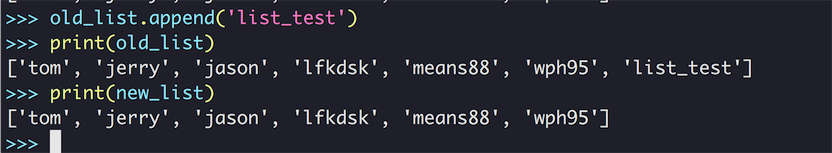

我们注意到了，给 `old_test` 添加了一个新的元素，但是只有 `old_list` 新增了这个新的元素，`new_list` 就没有更新这个新的元素。新接触 Python 的同学们可能会说既然可以直接使用切片的功能区复制，那为啥不直接用形如：

``` python
new_list = old_list
```

的方式去复制呢？这个就是我们刚才为啥要验证 `new_list` 和 `old_list` 为什么要是同一个值的原因了，切片能用是因为切片会返回一个用原列表复制出来的新列表，但是直接这么赋值，其实是给 `old_list` 起了一个别名，实际上 `new_list` 和 `old_list` 都指向同一个对象，我们可以看一下这个效果：

``` python
new_list = old_list
new_list.pop()
print(new_list)
print(old_list)
```

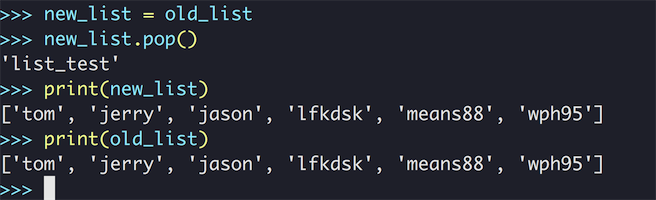

我们发现这时候 `new_list` 和 `old_list` 都指向了同一个变量，我们用 `pop` 方法删除了末尾的 'list_test' 但是 `old_list` 的末尾的变量也被删除了，这就是直接赋值 `new_list` 和 `old_list` 指向了同一个变量。

## CookBook 时间：可以命名的切片

有了切片之后，我们就可以对我们的有结构的列表、字符串进行 Parser 处理了，我们可以根据有结构固定的内容去编写使用切片的代码，比如可以这样：

``` python
user = ['lfkdsk', '2017-02-01', 100000, 'svip']
```

比如我们的用户的数据是固定的存储在这样的一个列表之中，那么我们要给用户一些提示，提示用户当前的一些信息，比如我们可以这样来用切片来截取：

``` python
user_alert = ' User : ' + user[0] + ', your message in our website : ' + str(user[1:4])
```

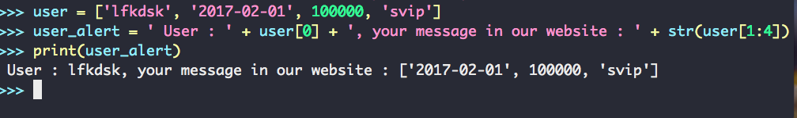

嗯嗯我们的代码轻松地写完了，也能够正常的使用去提示用户这些信息了，但是这里有一个问题，我们刚才写的程序的这个第一句 user 的定义在程序中一般不会这样写死在程序里，而是类似于这样：

``` python
user = Users.get_user_info()
```

从某个地方拿到的用户信息，这样我们在使用 `user_alert` 那句话进行打印的时候就会有一些困惑，时间一长我们真的就不记得了 `user[0]` ，`user[1:4]` 这些索引访问的元素到底放的是什么东西，这个打印的字符串里面有给我们一些提示信息。但是明显不够，尤其当我们习惯性的在程序中写出更多的这样 `HardCode` 的切片之后。

那我们有什么办法去解决这个问题呢？在使用变量那一节中我们学到了使用有意义的变量名能提升程序的可读性，那么我们能不能直接给我们使用的切片命名呢？不过这看起来似乎有一些问题，`[:]` 这样的一个语法我们似乎没有办法直接把它表示成一个变量，但是这里我们就要提到 Python 这种 'all of objects' 设计思路了，任何东西都可以表示成一个对象，比如这个问题，Python 提供了一个内建函数 `slice()` 能生成一个切片对象，只要把这个切片对象传到列表之中就好了：

``` python
USER_MESSAGE = slice(1, 4)
user_alert = ' User : ' + user[0] + ', your message in our website : ' + str(user[USER_MESSAGE])
```

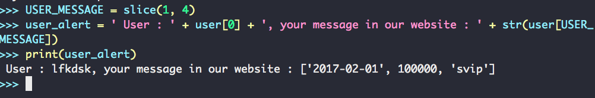

这样子我们就可以在程序中使用可以命名的切片功能，这样我们的切片在使用的时候也能很清楚的看出包含什么含义了！而且我们也可以把 `切片对象` 当做普通的的对象来传递，完成更多有趣的功能。

## 使用元组 Tuple

在这一节中我们会接触一个新的数据结构 —— 元组，元组是一种在使用起来和 `列表` 很类似的数据结构，但是他们的用途是不同的，正如我们之前的用例所见，列表是一种可以变动的数据结构，我们可以自由的想列表添加数据、删除数据、修改数据。相反我们要使用的元组是一种 `不可变(immutable)数据结构` ，元组的数据是无法修改的，一旦被定义确定了，就不会再修改了，关于 `immutable` 数据类型的设计和用途我们可以在这节的 CookBook 时间做一些科普。

我们首先来看如何定义一个元组：

``` python
date = (2017, 11, 9)
date[0]
date[1]
date[2]
```

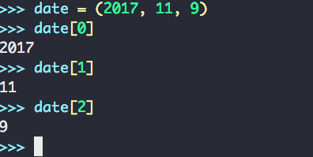

可以看出元组在使用的过程中没有任何的不同，在定义的时候就是从中括号变成了小括号，访问则没有什么区别，都是直接使用 index 的形式去访问对应位置的内容。既然说这个数据结构是不可变的，那我们就去尝试修改一下内容：

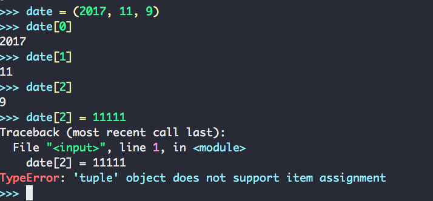

我们看到报错了，错误信息提示我们 Tuple 是不支持赋值的，看来元组确实是一种不支持修改的数据结构，除此之外别的方面的操作都和列表没什么区别，比如遍历列表：

``` python
user = ('lfkdsk', '2017-02-01', 100000, 'svip')
for msg in user:
    print(msg)
```

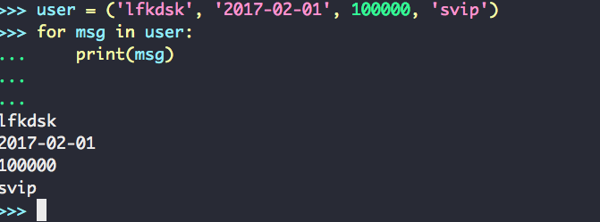

和列表一样可以直接使用 `for-in` 循环打印出对应的每一行的数据，我们虽然没办法改变元组内的内容，但是我们可以改变保存元组变量的内容：

``` python
user = ('lfkdsk', '2017-02-01', 100000, 'svip')
for msg in user:
   print(msg)
    
user = ('lfk', '2017-02-01', 100000, 'svip')
for msg in user:
   print(msg)
```

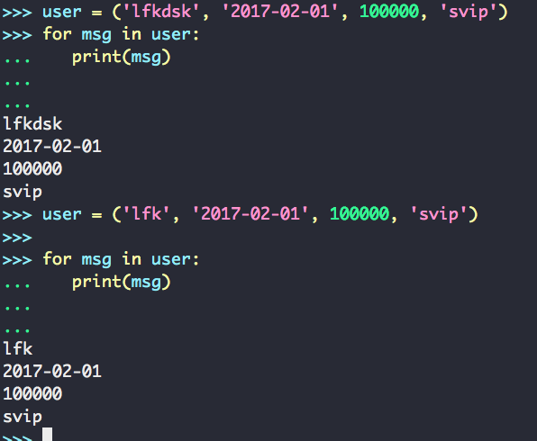

这里我们可以看到这里虽然不能修改元组的内容但是我们能够修改元组变量的内容。

## CookBook 时间：为什么使用不可变数据结构？

`元组 Tuple` 和列表一样是一种线性的内建数据结构，所以这里我们的介绍也比较省略，因为操作和列表一模一样。但是我们不禁要问为什么我们要用这种 `不可变数据` 呢？我们明明有很方便的能特别灵活的修改的数据结构，为什么还要用这种不可变的数据结构呢？

这是一个有些复杂的问题，我们在这里会引出几个使用不可变数据类型的原因。这会涉及一些有些深度的理论知识。我想一个优秀的教程就是不会因为内容简单而讲的粗略，也不会因为内容涉及高深的内容而不敢去涉及。这里我会尽量的用比较浅显的方式去讲解：

### 优化

首先使用不可变数据的一个原因是为了一些优化，这是我们可能会问为什么使用 `不可变` 的数据就能有一些优化呢？因为不可变数据在整个程序的运行过程中是不能被任何操作修改的（修改变量是创建了新的数据），这就意味着如果我们有很多地方对这些数据的一些操作的消耗会被大大的减小：

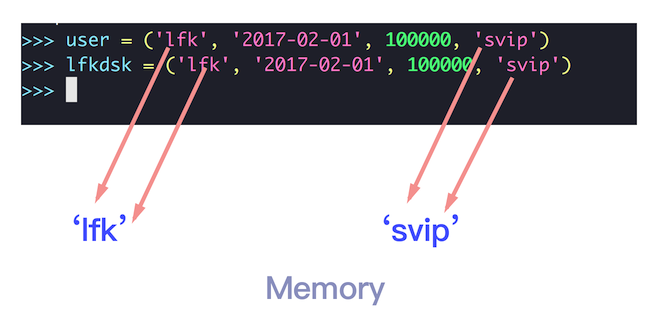

比如说这里面我们使用了两个不可变数据，因为这两个数据相同而且根本不可变，那么他们指向内存中的对象可能是同一个内存对象，我们之前知道在复制列表的时候我们不能够使用直接引用赋值的方式，比如这样：

``` python
lfkdsk = user
```

因为这样其实两个变量指向的同一个对象，一个数据修改另一个也会被不小心修改，这在我们的程序的行为性上会有一些问题。但是在使用 `不可变数据结构` 的时候我们就没有这个问题，因为我们数据不能被修改，这些对象大可以指向同一个内存中的对象。我们这里可以去试验一下，Python 为我们提供了一个内建函数：

``` python
id(<object>) 
```

这个过程可以传入一个对象返回一个整型数值，返回值就是对象的内存地址，我们可以用这个方法检测不可变对象的共享情况，这里我们来检测字符串的共享性（字符串也是一种不可变数据，我们对字符串的修改本质上是生成了新的字符串）：

``` python
a = 'lfkdsk'
b = 'lfkdsk'
id(a)
id(b)
```

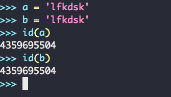

这里我们看到了，两个存储相同字符串的变量指向了同一个内存地址。这个优化过程不是我们自己所控制的，而是系统的一个实现，这无疑会减少非常多的各种方面的开销，当然这种不可变内存对象的缓存不只是能够实现这样的 `引用重用`，比如对对象之间的快速比较、快速拷贝都可以通过这种方式实现。事实证明对同样大小的列表和元组进行创建、遍历等操作时，操作元组的速度确实会更快。

### 同步性

除了开销之外，不可变数据的另一个好处就是在程序的同步上有一些优势，比如说系统中的同一段数据，可能有多个用户能访问到，但是如果某个数据被某个用户修改了之后，别的用户却不一定能被及时的通知，这就产生了一个数据的同步性的问题，这时候我们就可以把一些我们不需要进行变动的数据使用 `不可变数据结构` 进行包装，这样无论有多少用户在同时操作，数据只能访问而不能被修改这就能满足我们对数据一致性的需求。

### 副作用

> 在计算机科学中，**函数副作用**指当调用[函数](https://zh.wikipedia.org/wiki/%E5%87%BD%E6%95%B0)时，除了**返回函数值**之外，还**对主调用函数产生附加的影响**。例如修改全局变量（函数外的变量）或修改参数。
>
> 函数副作用会给程序设计带来不必要的麻烦，给程序带来十分难以查找的错误，并降低程序的可读性。严格的函数式语言要求函数必须无副作用。
>
> —— Wikipedia 

这里我们引述了 wiki 百科对函数副作用的一个描述，这里我们可以这样简单的去想一下，比如说我们调用了一个方法，这个方法不但完成自己的功能还对某些全局变量进行了一些修改：

``` python
# 伪代码
print_message = 'lfkdsk'
call_print(print_message) # 这个函数会把 print_message 的值改变掉
```

比如说这里我们有一个要打印的字符串 `print_message` 它的内容是 `lfkdsk` ，我们调用了这样一个函数 `call_print` 去打印这个字符串，但是这个函数不但会打印这个字符串，还会修改这个字符串的内容，比如修改成 `xxxxxx` ，这就是一副作用的例子，`print_message` 的结果被修改是个很不好的情况，因为可能会有一些其他的方法也依赖于这个字符串，这里被修改了会对我们程序的正确性产生影响。

如果我们的这个变量、数据结构是不可变的，我们就可以更容易写出无副作用的方法，但是我们不可能不使用这种被共享出来的变量，因为程序的各个方法之间共享某些变量是不可避免的，而使用不可变数据带来了很多的安全性、和稳定性。我们要记得 **共享的不可变，可变的不共享**。

这一节我们讲解了一些有些原理性的东西，可能对初学者会有一些的困难，但是让初学者接触这些知识并不是让他们一次性的把这个问题理解到什么高深的程度。而是我们要有这个东西的印象，当我们真的需要使用用这个东西的时候，然后当我们有更深的知识基础之后能有豁然开朗的感觉。好啦让我们继续前进。


## Pythonic 时间：在元组解压的时候使用 _ 作为占位符

在列表那一节我们介绍了 python 中提供的一种解压操作 (`unpack`) ，通过这种方式我们把列表中的元素解压出来赋值给变量，但是其实 python 在实现这个解压变量实际上是通过把列表中的元素绑定成一个元组 (`tuple`) ，所以我们平时在使用解构赋值也是这个实现方式。

之前我们提到了如何使用列表解压，还有在 Python 3 中支持的使用 *operator 的方式接收额外参数，但是在更多的情况之下之下我们会经常遇到只会需要列表之中某个、或者某几个参数的情况，这时候我们会忽略几个参数，这种情况之下经常会被处理成 temp 的方式：

``` python
some_list = ['a'. 'b', 'c']
(a, temp, c) = some_list
```

在这种情况下我们用一个 `temp` 作为临时变量来接受这个参数，但是我们会产生一个没有用处的变量，而且在多个地方使用之后就会产生很多额外的临时变量，这里我们可以使用 `_` 占位符代替临时变量，能让阅读代码的人轻松地知道这个变量是不用的：

``` python
some_list = ['a'. 'b', 'c']
(a, _, c) = some_list
```


