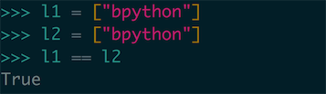

# 条件分支

在实际的编程过程中，我们通常需要检查很多不同的条件分支，然后根据不同的条件采取不同的处理方式。在前几章中我们学习了一些 Python 提供的内建的数据类型，我们在其中特地没有涉及和使用条件分支的部分内容。其实在处理这些数据结构中，条件分支占有很重要的地位。在本章中我们会接触到以 if 为主的处理语句，学习对于各种类型的条件测试和对各种数据结构的处理。

## 简单的条件处理

我们之前在 `使用列表切片` 的部分之中，提到了对列表的复制处理，但是因为我们当时没有介绍过条件分支，所以我们写出了非常奇诡的处理代码，实现了功能，但是非常的丑陋：

``` python
old_list = range(1, 11) # 还记得吗 range 生成数值列表，并且要到 11 才能有 10 个元素
new_list = []
for value in old_list:
    new_list.append(value)
new_list.pop(0)    
new_list.pop()  
new_list.pop()    

print(new_list)
```

但是我们现在介绍 `if` 语法，这部分生成部分序列的代码可以被重构，这里我们使用数值循环对我们的列表进行遍历，这里我们要创建一个新的列表，这个列表是原列表取出首项的结果（相当于切片 `[1:]`）：

``` python
old_list = ['a', 'b', 'c', 'd', 'e', 'f']
new_list = []
for index in range(len(old_list)):
    if index != 0:
       new_list.append(old_list[index])
        
print(new_list)
```


这里我们使用了 `if` 语句，判断了序列的 `index` ，这里我们注意到了代码中我们使用了 index 的方式去遍历整个列表，这也是个有趣的遍历方式，当我们需要使用列表元素的索引值的时候，我们就可以使用这种方式去遍历。我们先使用 `range` 方法生成大小到原列表长度的数值序列，然后我们对这个序列使用 `for-in` 循环。遍历每个列表元素的时候使用 `list[index]` 的方式去访问就可以了。

然后在这段程序中我们判断了一个值，当 `index` 值不等于 0 （即列表除了第一项元素之外的其他的元素），然后把符合条件的列表元素插入到新的列表 `new_list` 之中，最后我们打印出结果可以看到结果是排除了首项 `'a'` 的剩余结果。

`if` 表达式和 `for-in` 的循环语句一样都是包含内部过程的表达式，因此我们都要靠缩进的去控制结构，这里可以看到使用了 `:`  ，过程体前面空了四个空格。

## 条件表达式

Python 之中还有一种基本数据类型，叫布尔值（Bool）。布尔值只有两种值，一种是 `True` 代表是，另一种是 `False` 代表否，布尔值就是包含这两个值的一种真值类型。我们这里使用到的 `if` 的语句本身就依赖于这种真值，`if` 表达式的本质是一个求值为 True 和 False 的表达式，通过计算这个表达式的值来选择执行分支，如果求出来的值是 `True` 就执行 `if` 之后的代码，如果求出来的值是 `False` 就运行之后的代码。

### 比较数字的大小

我们可以对数字进行大小的比较、判断相等、不等，等多种情况。这些表达式计算出来的结果都是一个布尔值：

``` python
index = 100
index > 101
index <= 101
```

这里使用的 `>` ，`<` 符号比较的是大于、小于的情况，包含型如 `>=` ，`<=` 这样的情况比较的是大于等于、小于等于的情况：


除此之外我们还可以对相等、不等的条件进行判断，这里我们可以使用 `==` ，`!=` 的符号对我们的数字进行判断：

``` python
index = 100
index != 100
index == 100
```


### 比较字符串

在 Python 中字符串也是可以 *直接* 的进行比较的一种数据类型，首先是对字符串的相等或不等的比较，这个比较的过程也比较简单，对字符串进行逐位字符的进行比较，如果全部相等那么条件表达式的值就是 `True` ，只要有一个字符的对不上那么就会返回 `False`：

``` python
cat = 'lili'
cat == 'lili'
cat != 'llll'
```


和数字不同我们的字符串是区分大小写的，内容相同大小写不同的字符串是不能别视为相等的，不过如果我们为了判断两个字符串的内容相等的话也可以使用我们在第一章学到的 API `upper` ，`lower`：

``` python
upper_cat = 'LILI'
lower_cat = 'lili'
upper_cat.lower() == lower_cat
lower_cat.upper() == upper_cat
```


我们使用 `lower` 和 `upper` 可以把字符串的内容调整为全是小写字母或者是全都是大写字母，我们在比较的时候就可以根据我们所要比较的内容去调整和使用这些方法。

对字符串除了相等和不等的比较之外，其实我们还是能使用 `>` ，`<`，`<=`，`>=` 这些比较方法对我们的字符串进行相互的比较，字符串比较大小同样基于对每个字符的比较，每个字符的比较是基于字母顺序的比较，顺序靠后的大于顺序靠前的字符：

``` python
'a' > 'b'
'abc' > 'abb'
'a' >= 'a'
```


比如我们看第一行 `'a' > 'b'` 返回值是 False ，就是因为 `a` 在 `b` 的前面，第二行长的字符串进行比较也可以同理理解，逐个的去比较字符串中各个位置的字符，首先比较第一位 `a` 都是相等的，然后再比较第二位的值都是 `b` ，然后我们继续去比较第三位左侧的字符是 `c` 右侧的字符是 `b` 所以左侧的字符串比较大，返回值为 True。

> Tips ASCII 码编码
>
> **ASCII**（发音： [/ˈæski/](https://zh.wikipedia.org/wiki/Help:%E8%8B%B1%E8%AA%9E%E5%9C%8B%E9%9A%9B%E9%9F%B3%E6%A8%99) [**\*ass**-kee*](https://zh.wikipedia.org/wiki/Wikipedia:%E7%99%BC%E9%9F%B3%E9%87%8D%E6%8B%BC)[[1\]](https://zh.wikipedia.org/wiki/ASCII#cite_note-1)，**A**merican **S**tandard **C**ode for **I**nformation **I**nterchange，**美国信息交换标准代码**）是基于[拉丁字母](https://zh.wikipedia.org/wiki/%E6%8B%89%E4%B8%81%E5%AD%97%E6%AF%8D)的一套[电脑](https://zh.wikipedia.org/wiki/%E7%94%B5%E8%84%91)[编码](https://zh.wikipedia.org/wiki/%E7%BC%96%E7%A0%81)系统。它主要用于显示[现代英语](https://zh.wikipedia.org/wiki/%E7%8F%BE%E4%BB%A3%E8%8B%B1%E8%AA%9E)，而其扩展版本[EASCII](https://zh.wikipedia.org/wiki/EASCII)则可以部分支持其他[西欧](https://zh.wikipedia.org/wiki/%E8%A5%BF%E6%AC%A7)[语言](https://zh.wikipedia.org/wiki/%E8%AF%AD%E8%A8%80)，并等同于国际标准**ISO/IEC 646**。
>
> —— Wikipedia [ASCII](https://zh.wikipedia.org/wiki/ASCII)
>
> 我们刚才提到了对字符的比较依赖于字符的顺序，这种说法其实并不严谨，因为如果只是小写字母的顺序还很好比较，但是大小写比较呢？如果出现符号我们应该按照什么顺序比较呢？所以说我们用来比较顺序的其实是这个 ASCII 码编码的顺序，想知道这些字符的编码顺序，可以看链接里的 ASCII 的维基百科页面。

### 跳出循环

我们在前几章中接触到了 `for-in` 循环，但是当时我们没有谈怎么跳出循环，想必有细心的同学应该已经发现了，但是我们当时并没有了解和条件表达式相关的内容，所以有跳出循环的方式也没有用武之地。我们可以使用 `break` 关键字从外层的循环体中跳出，比如我们使用一个数值循环遍历打印 1 - 11，在数字为 7 的时候跳出：

``` python
for value in range(1, 11):
  if value == 7:
    break
  print(value)
```


这里我们看到循环就从 `value == 7` 的时候进行了跳出，只打印了 `1 - 6`。

## 条件表达式的连接

条件表达式本身已经能表达能多功能了，但是我们在实际的编程之中经常使用超过单一条件的判断，在这些情况之下，我们就需要一些方法能连接几个条件表达式进行顺序的条件判断。

### 使用 `and` 判断多个条件

Python 在关键字的设计方面比较崇尚语义化，在这里我们可以使用关键字 `and` 去连接判断多个条件，`and` 的意思是 **与** 。指的是连接的条件表达式的结果必须都为 True ，整个表达式的计算结果才是 True，只要有一个表达式的结果是 False 整个表达式的结果就是 False：

``` python
index = 1000
name = 'linux'
index >= 1000 and name == 'linux'
index < 1000 and name == 'linux'
index < 1000 and name != 'linux'
```


我们可以通过观察我们这段代码的结果来验证我们刚才获得的知识。

* 首先 `index`大于等于 1000 并且 `name`  趋势等于 linux 两个表达式都正确所以总的结果是正确的。
* `index` 不小于 1000 所以这个条件是 False 的，总结果是 False。
* `index` 不小于 1000 ，并且 `name` 不等于 linux，两个条件都是错误的，总结果是 False 的。

### 使用 `or` 判断多个条件

和 `and` 一样，`or` 也是用来连接判断多个表达式的条件的关键字，但是行为上是不同的。`or` 关键字代表的语义是 **或**。指的是连接的表达式只要有一个的结果为 True，那么总的结果就是 False，但是必须两个都是 False 总的结果才是 False：

``` python
index = 1000
name = 'linux'
index != 1000 or name != 'linux'
index != 1000 or name == 'linux'
index >= 1000 or name == 'linux'
```


* `index` 不等于 1000 并且 `name` 不等于 linux 的时候结果是 False
* `name` 等于 linux 所以总得结果是 True
* `index` 大于等于 1000 并且 `name` 也等于 linux 所以总的结果是 True

### 使用 `not` 对条件取反

有的时候我们还需要对条件表达式进行 **取反** 操作，所谓取反操作就是如果条件表达式的值是 False 那么返回 True，如果条件表达式的值是 True ，那么返回结果就是 False：

``` python
not True
not False
index = 100
not index == 100
```


这里我们看到了原来应该是 True 的表达式结果返回了 False，原来是 False 的表达式返回了 True。

### 短路判断

我们在上面的三小节中学到了使用各种条件连接词对条件表达式进行连接判断的操作。但是再实际练习中不知道细心的读者有没有发现，使用 `and` 和 `or` 的时候，Python 其实是在使用一种短路判断的方式去优化表达式求值。比如使用 `and` 需要两个结果都是 True 才能返回 True，那么如果第一项就是 False 那么根本就不需要判断第二项了，就可以直接返回 False 了：

``` python
index = 100
index != 100 and ffff # 这里这个 ffff 变量并不存在
```


这里我们验证这个程序的短路判断，我们在 and 后面使用了一个并不存在的变量，如果两个条件都被判断了的话，那么程序肯定会跑出错误，但是这里面我们因为第一个条件 `index != 100` 的结果是 False，所以说整个程序的返回结果就直接返回了 False，没有发现后面的错误，说明确实存在短路求值。

还有 `or` 操作符表达式两侧的操作符只要有一个 True 那么结果就是 True 的，我们可以继续通过上面的例子来验证：

```  python
index = 100
index == 100 or ffff # 这里这个 ffff 变量并不存在
```


与上面同样，因为 `index == 100` 的记过已经是 True 了，所以程序没有检测后面那个表达式的求值结果（否则会报错）。

短路求值是一种优化的特性，我们也发现了如果求值被前一个表达式短路就不会再继续运行下去，因此我们不要在条件表达式里面对变量做出一些修改，因为程序可能短路可能根本无法完成到这个动作，因此我们也不要利用这种特性去完成我们正确的程序表达。

## CookBook 时间：列表与条件表达式

我们如何判断一个元素在一个具体的列表中呢？

在这个微课的学习中我们一直在强调一个举一反三的能力就是我们如何依凭我们现在已有的知识去实现我们所需要实现的功能，比如现在我们学过了循环体结构、学过了简单的表达式的写法，其实想完成 `判断一个元素在一个具体的列表中呢` 这个任务其实就非常的简单：

``` python
item = 'item'
test_list = [' lfkdsk ', ' item ', 11111111, 'item' , 'lfk']
for value in test_list:
  if value == item:
    print(True)
    break
```


这段代码非常简单，我们遍历了列表，对每个 value 进行逐个比较，当我们找到相等的 item 的时候我们打印 True 然后跳出循环，但是这明显也是一个多余的 `模板代码` ，我们无论对什么东西的处理都是这样的会写出很多的辣鸡代码，为此 Python 给我们提供了一个特殊的语法糖去 *判断一个元素是否存在于某个列表之中* 这个行为：

``` python
item = 'item'
test_list = [' lfkdsk ', ' item ', 11111111, 'item' , 'lfk']
item in test_list
```


简单的说我们就可以使用 `<item> in <list>` 这种 item 是否在某个 list 的语法。这个语法的结构非常的简单而且非常的符合自然的语序，我们从这里也可以看出 Python 在语法设计上的语义化的特点。

`in` 操作符也可以和我们的 [not操作符](### 使用 `not` 对条件取反) 进行相结合，可以直接使用 `not in` 去表示 *某个 item 不在某个 list 之中*（这就比把 not 放在最前面方便了很多）：

``` python
item not in test_list
```


## 另一条分支  else

### 使用 `if-else`

我们之前的对 `if` 语句的使用，都是简单的使用了这个单独的语句去判断当条件通过的时候我们执行哪一个分支，我们还需要能够执行不通过这个条件的另一条执行的路径，我们可以在 Python 中使用 `if-else` 这个语法，`if-else` 和 `if` 语句类似，其中的 `else` 语句能够指定一条分支当条件不通过的时候运行：

``` python
item = 'value'
if item != 'value':
  print(True)
else:
  print(False)
```


和普通的 `if` 的语法结构类似，我们使用 `else:` 标记开始条件表达式测试不通过的情况，这里的截图我们可以看到，条件表达式返回值为 True 的时候程序走了 `if` 后面的分支，而当我们的条件表达式的结果是 False 的时候程序走了 `else` 之后的分支。

### 使用 `if-elif-else` 

`if-else` 已经为我们提供了能让程序根据条件表达式的计算结果是 True 或者 False 来决定调用什么分支，但是这个结构也只能检测一个条件，如果我们要是想要检测多个条件的情况的时候可能会写出非常多嵌套的代码：

``` python
item = 'value'
if item == 'value':
  print(True)
else:
  if item != 'value':
    print("yep!")
  else:
    print("no~")
```


比如我们想要检测这两个条件，可能就要在 `else` 之下再接着跟另一套 `if-else` 的代码，尤其在 Python 这种依赖格式（缩进）的编程语言里，会把代码写出非常多的嵌套，导致横向长度非常的长。这里 Python 提供了 `if-elif-else` 这种多层的条件结构，能让我们能进行多种条件的判断：

``` python
item = 'Value'
if item == 'value1':
  print('value1')
elif item == 'value2':
  print('value2')
else:
  print('else')
```


我们可以看到这个流程可以处理更多的条件判断，在这个程序的运行过程中：

1. 首先会判断 item 的内容是不是 `'value1'` ，发现不是，跳过下面的过程体。
2. 然后会判断 `elif` 所跟着的分支，判断是不是和 `value2` 相等，发现不是，跳过下面的过程体。

……(多个 elif 的过程体)

 n. 当所有的 `elif` 的条件的条件都无法通过，就会走入最后的 `else` 的分支中，比如在截图之中我们走到了这个过程体打印出了 else。

这里我们的 `elif` 的数目可以无限的叠加以便于判断是不是符合这些条件了：

``` python
test_list = ['lfk', 'lfkdsk', 'test', 'llll', 'means98']
if 'lfk1' in test_list:
  print('lfk1 in list')
elif 'lfkdsk1' in test_list:
  print('lfkdsk1 in list')
elif 'test1' in test_list:
  print('test1 in list')
elif 'means98' in test_list:
  print('means98 in list')
else:
  print('nobody in list')
```


`elif` 可以判断多个条件，比如这里我们依次而是不同的 string 是不是在这个 list 之中，当 `means98` 在这个 list 之中，我们走到了这个分支，打印了 `means98 in list` 。

在整个流程之中 `else` 代表的是当所有的条件都不能确定的时候运行的过程体，但是这个并不是必须的流程，并不是所有的流程都必须要有 *所有都不符合的结果* 的运行分支：

``` python
test_list = ['lfk', 'lfkdsk', 'test', 'llll', 'means98']
if 'lfk1' in test_list:
  print('lfk1 in list')
elif 'lfkdsk1' in test_list:
  print('lfkdsk1 in list')
elif 'test1' in test_list:
  print('test1 in list')
elif 'means981' in test_list:
  print('means98 in list')
```


这里我们看到了代码修改了 `means98` 那条的条件，并且删除了 `else` 最后的分支，这段代码成功的运行了，但是由于没有任何一个条件被测试通过，并且没有 `else` 这个分支，所以没有任何的数据被输出。

### 多个 `if` 判断多个条件

使用 `if-elif-else` 会比使用多个 `if` 的条件进行判断好上很多。但是其实多个 `if-elif-else` 的组合其实判断的是一个组合，因为你可以看到了，我们判断了很多次，其实是在判断一个条件，因为只要有一个条件能够通过（无论是 if 、else 还是 elif 通过）就会走对应的分支的代码，然后就跳出这个 *条件判断体* 的部分了。

所以对于我们有多个判断条件需要判断的时候我们还要借助编写多个 `if` 的过程，比如说我们租房子，需要判断这个房间里都包含那些条件（比如家具、房间、网络之类的），这时我们不能用 `if-elif-else` 去判断，因为只要包含其中一个条件可能就处理结束了，这里我们这么去写：

``` python
house = ['washroom', 'wi-fi', 'water heater', 'bedroom']
if 'wi-fi' in house:
    print('wi-fi in house')
if 'washroom' in house:
    print('washroom in house')
if 'water heater' in house:
    print('water heater in house')
if 'bedroom' in house:
    print('bedroom in house')
```


（在 REPL 写这么长有点麻烦就写在文件里了）

这里我们对每个条件都进行判断，分别打印了这个房间所需要的不同的内容的检查结果，这就实现了我们对多个条件的检查，这里的多个 `if-if-if` 的实现方式是不可避免的，因为我们就是要对多个条件进行检测。

## Pythonic 时间：避免直接使用 True、False、None 的判断

在这之前我们已经写过了很多的 `if` 的语句了，但是在如何让我们的代码更加的 Pythonic 化上面，我们还有很多需要注意的内容，比如说我们在写 `if` 的相关语句之中，我们要注意要尽量减少使用 `True,False,None` 的直接判断，这里所说的 “直接判断” 是指直接使用 `==` 的判断符号进行判断。

事实上无论是 Python 的内建类型、对象还是由用户进行自定义的对象、类型，都有自带的对这个实体进行 `真值判断（truthiness）` 的方法，If 判断真值为 False 的情况大概有这几种：

* None
* False
* 数字类型值为 0
* 空的列表
* 空的字典
* 一个对象的 `__len__` 或者 `__nonzero__` 返回值为 0 ，或者是 False 的时候


这也就是说，我们不应该直接的写出：

``` python
if lfkdsk == True:
    # ....
if lfkdsk == False:    
    # ....
```

诸如此类的的代码，因为这样的代码的结果其实和这样写没有区别，选择下面的写法明显可读性会上升：

``` python
if lfkdsk:
    # ....
if not lfkdsk:
    # ....
```

另外 Python 中有两种对同一性的判断的方式，比较符号 `==` 和语法 `is` ，那我们其实深究一下这两种写法的区别在就能自己悟出了这两种方法应该怎么选择了。

`==` 的判断方式是用来判断两个比较内容的 **值** 相等，值相等代表内容相等，所以只要内容一样那我们判断的返回值就是 True，这里我们可以用列表来举例，我们创建两个内容相同的列表：

``` python
list1 = ["bpython"]
list2 = ["bpython"]
>>> list1 == list2
```

我们来看一下结果：



我们从之前的知识能够了解，List 这种引用对象，即使是字面量相同两个东西对应的变量也是不同的，但是我们使用 `==` 进行直接判断，返回的结果却是 True，这也验证了 `==` 判断的是值相等。

`is` 的判断是判断两个变量是不是 **同一个变量** ，这就是说必须检测出两个变量是同一个变量返回值才是 True：


我们这里使用 `l1 is l2` 对两个变量进行判断同一性进行判断，返回值就是 False ，这就说明了这两个变量不是同一个变量。

**这里我们可以得出一个结论，无特殊需要的情况之下，== 一般用在对基本类型的判断之上（字符串、数字…），而 is 被用在对象的比较之中 。**


## Pythonic 时间：怎么进行判断对象是否为空？

我们在上一节之中提到了如何简化我们的 `if` 子句，以便于让我们的代码更加有 Python 的代码风格，还能增长我们对 Python 的理解。从上一章中我们知道了我们应该使用 `is` 语句对对象进行判断，但是我们应该怎么对我们的对象操作进行判空呢？很多人都会写成这样：

``` python
# lfkdsk's type is object 
if lfkdsk:
    # if lfkdsk is exist
if not lfkdsk:
    # if lfkdsk isn't exist
```

这样在单独进行判断的时候自然是可以用的，但是 Python 的类型是动态的，这在某些情况之下就会产生问题。因为我们在很多的时候对于判断变量的类型是有可能没有保证的，这时我们就应该从代码编写的时候就拿我们的代码当成一个对象来判断，另外有的时候我们还会有对于函数的默认值方面使用默认值 None ：

``` python
def new_function(param=None):
    pass
```

这时我们对它的判断就要这样来进行，手动判断不是 None 才能继续向下进行：

``` python
def new_function(param=None):
    if param is not None:
        # ... 如果参数不是 None
```

这里我们还要再三的解释我们为什么要针对这种情况进项特别的判断，比如我们这个函数传入的参数有可能是一个空列表

( `[ ]`) 、可能是一个布尔值（`False`） 、还可能是一个数字（`0`），但是我们要是能直接使用普通的简化的方式的 if 判断的时候：

``` python
def new_function(param=None):
    if param:
       # ... 判断正确

new_function([])
```

但是这样的情况之下，我们在 `if` 下的条件分支，就不会被正确的应用，因此我们要在有可能出现 None 的情况之下做出这样子的判断。

这里我们也可以举出另一个有趣的奇怪例子，我们可以先说一个知识点，就是 Python 中可以通过 magical method （魔术方法）对 Python 系统之中一些行为进行定义（指的是双下滑线开头和结尾的方法），比如我们可以通过这样的方法对我们自己创建的 class 的生成对象进行定制一下大小比较的操作符的行为（就是说如何对两个对象直接进行比较）。

但是同时我们也可以注意到，未定义这些 magic method 的方式的对象其实是不可以比较的，但是再 Python 2.7 的版本之中不会报错所以会导致一些奇怪的问题：

``` python
class lfkdsk(object):
    pass
l1 = lfkdsk()
l2 = lfkdsk()
l1 < l2
```


我们会发现两个对象无法比较但是返回值还是 True，其实是因为未实现类型的返回值不是 None 是一个特殊的未实现类型 NotImplement 这个类型的 `__bool__` 的返回值是 True。接触过这个例子，我们或许会对甄别类型和判断 None 值有更多的思考。


## Pythonic 时间： 如何对多种可能进行判断？

我们写代码的时候经常会遇到这样的情景，我们传入了一个参数，这个参数可能是 `"xxxxx"` ，可能是 `"mmmmm"` 等多个参数，我们输入的参数只要是这几个参数的其中之一，我们就运行这个分支，这样的代码应该怎么写呢？我们之前学过了 `if` 和条件表达式的连接 `or` 我们可能会写出这样的代码：

``` python
input_param = 'xxx'
if input_param == 'xxx' or input_param == 'mmm' or input_param == 'fff':
    # 运行当前分支
```

唔，这成功的应用了我们之前学过的条件分支和条件表达式的连接的方法，但是如果我们需要判断的备选项增加了呢？比如我们再增加几个相应的判断呢？这个方法可能会被写的非常的长，看起来非常的麻烦，这时候我们就应该好好应用一下我们学过的 `in` 操作符，我们可以直接把判断的选项组成一个元祖对他们进行判断：

``` python
input_param = 'xxx'
params_list = ('xxx', 'mmm', 'fff')
if input_param in params_list:
    # 运行当前分支
```

在这里我们对参数的判断就能正常使用了，并且这样我们还能有一个好处，我们判断的参数列表 `params_list` 还可以在多个判断位置进行共用，成功的减少了一部分在判断参数上的开销。


