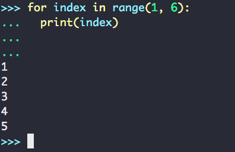
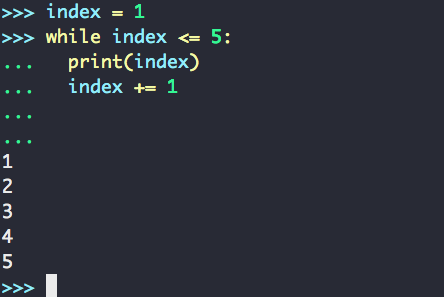
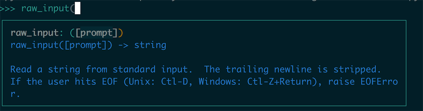
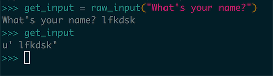
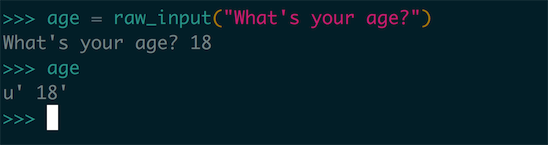
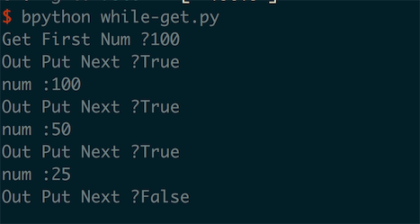
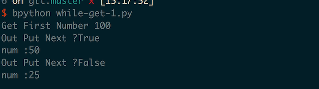
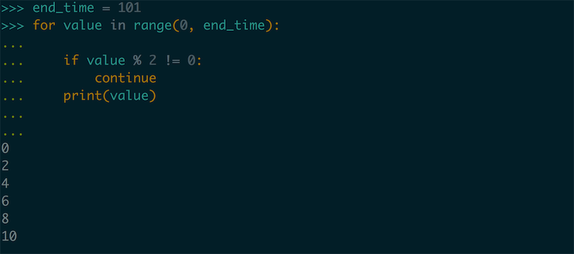
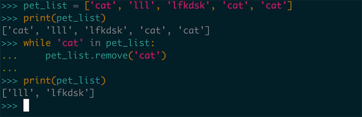
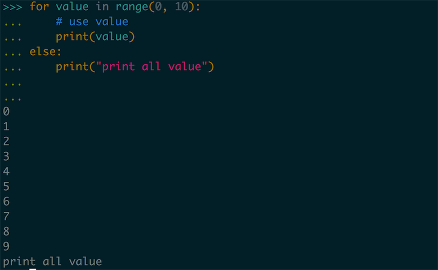

# 0x06-另一种循环和数据结构

之前我们接触了 `for-in` 这种循环体，主要被用在我们学过的 `list` 这种数据结构之中，对这种元素可以被逐个取出遍历的数据结构有奇效。在这一章中我们会学习另一种循环和另一种数据结构，由用户自定的结束循环的方式—— `while` 循环，为我们对条件的判断和针对用户输入的进行提供了更为方便的处理模式。另一种数据结构是一种 map 类型的数据结构 —— `Dictionary` 提供了一种 `键值对(key-value)` 类型的数据结构，对存储和查找都可以针对 `k-v` 的方式进行。

## 初探 while 循环

不同于 `for-in` 循环只包含了一个 `block` 的代码段的方式，循环的结束只能把列表完全遍历一遍或者在对应的条件之下使用 `break` 语句跳出这层循环，但是 while 为我们提供了更多的方式对循环处理进行判断。比如我们和之前的 `for-in` 循环进行对比，一个 `range` 技术的循环：

``` python
for index in range(1, 6):
  print(index)
```



这个循环是我们非常熟悉的一个循环方式，这里我们来把这个循环改成 `while` 循环类型的：

``` python
index = 1
while index <= 5:
  print(index)
  index += 1
```



相比于 `for-in` 循环使用的临时变量和遍历的方式都是由这种语法所自己决定的，但是在 while 循环之中，所能控制循环的条件被放大了，while 循环跳出的条件是要判断一个条件表达式（我们之前已经学过了），当表达式的计算值是 True 的时候 while 循环就会继续运行，如果表达式计算的值是 False 的时候，程序就会退出循环继续运行下面的内容。

``` python
# 伪代码
while <bool expr>:
  <code block>
```

这里面我们也注意到了 `while` 循环在提供了更大的可操作的性的同时也带来了一些隐患，比如我们这里的 index 作为一个临时的索引变量来使用，但是还得自己在下面的代码段之中手动的管理 index 的步进值，如果我们忘记这个过程就可能会造成死循环。

## 用户输入 raw_input 

刚才我们提到了 `for-in` 循环适合对列表这种有序的数据结构进行遍历，`while` 更倾向于是针对用户输入的处理，这里我们应该事先了解如何处理用户的输入，有了能对用户输入的接收和处理的方法，我们就可以编写出能够和用户进行交互的应用程序了，首先我们来看这个 `raw_input()` 函数如何使用：



这里我们可以看到，这个函数的返回值是一个字符串，这个字符串的返回值是从标准输出中获取的，`raw_input` 里面还可以接受一个参数，这个参数的作用就是显示一个对用户的 **提示的信息**。



这里我们在 `raw_input` 里面填写了 `What's your name` 的提示信息，这里我们输入自己的名字。这个字符串就作为返回值赋给了变量，就像这个截图中的一样，我们接收到了用户输入的值和用户完成了一次交互。

但是我们输入的类型不可能都是字符串的类型：



比如我们试图问用户的年龄，但是直接这么使用 `raw_input` 返回的类型还是一个字符串，在这种情况下，我们要记得使用类型转换函数：

``` python
age = int(raw_input("What's your age ?"))
```

>Tips ：raw_input in python3: 
>
>`raw_input` 这个输入函数是 Python 2 版本的。在 Python 3 中的我们直接使用 `input()` 函数就可以了，用法和 `raw_input()` 在 Python 2 中的版本一样。
>
>在 Python 2 中 `input()` 函数也存在，但是这个函数的作用是接受字符串，并且当成 Python 代码去运行，大家不要用错了。

## While 结合输入

我们学过了如何控制用户输入了，这里我们举一个例子，比如有这样一个需求：

>  这里我们每次程序运行开始都会让用户输入一个数字，之后进入一个循环体，每次都会问用户是否继续获得下一个数字，如果需要我们打印原数字的一般，如果不需要就退出程序，运行这个循环直到循环体结束。



``` python
get_input_num = int(raw_input("Get First Number"))
while get_input_num > 0:
    out_put = raw_input("Out Put Next ?")
    if out_put == "False":
        break
    print("num :" + str(get_input_num))
    get_input_num /= 2
```

这个程序写的很直观我们在循环内部也接受一个新的用户参数，然后根据用户参数对程序的状态进行一个判断。当我们对 ` Out Put Next ? ` 这个问句的返回结果是 False 的时候我们就可以使用 break 子句跳出我们的循环体。

这里我们没有直接使用 `bool()` 对 string 类型进行类型转换，然后直接使用布尔值类型进行判断，这是因为内建方法 `__bool__` 对字符串的处理逻辑是，如果字符串是空的话，返回结果是 False ，但是只要字符串有内容返回结果就都是 True，这样就达不到我们所想要的效果了。

除此以外我们除了直接使用某种条件进行判断之外，还可以使用 *设置标记位* 的方式对程序进行控制，比如在程序之中可能有多种条件会导致我们的循环退出，这里使用单一变量的条件对程序进行管控的方式就不太科学，这里我们可以把这个程序改写成这样：

``` python
get_input_num = int(raw_input("Get First Number"))
while_flag = True
while while_flag:
    out_put = raw_input("Out Put Next ?")
    if out_put == "False":
    	while_flag= False
    get_input_num /= 2
    if get_input_num <= 0:
        while_flag= False
    else:
        print("num :" + str(get_input_num))
```

这样我们在 OutPut 这个询问的时候选择不在输出的时候能直接设定 `while_flag` 的值，然后直接通过这个 Flag 跳出循环就可以了，另外当我们的 `get_input_num` 这个变量在小于等于 0 的时候也会让 Flag 设置为 False，这样通过这两个条件都能让循环停止了：




## 使用 continue 跳过当次循环

我们之前学到过使用 `break` 子句从当前的循环中跳出，这里我们介绍另一中循环当中使用的子句 `contintue`，和 `break` 不同的是，`break` 是从当前的循环当中跳出的 Python 子句，而 `continue` 直接结束当前的这次循环，然后继续进行下一次的循环。

这种对流程控制的方式，提供了一个新的 “语法糖” 让我们能够对流程进行更为精细的控制，在这里我们举一个例子，比如我们设定一个初识的数字，然后输出从 0 到这个数字之间的全部的偶数，这时我们对程序的控制就不能粗暴的对循环结构进行跳出操作。这里我们应该这样处理：

``` python
end_time = 101
for value in range(0, end_time):
    if value % 2 != 0:
        continue
    print(value)
```




##  使用 While 循环来操作数据结构

之前我们在使用 `for` 循环的方式操作过列表，我们可以从列表中一个一个的取出内容然后进行操作，但是用 `while` 操作列表明显是针对另一种需求的，也就是说通常的使用情况不是在遍历的语境下进行的。`while` 循环处理的问题更经常地用在处理有额外的判断的情况下的判断，比如这里我们要删除这个列表中的所有的 `"cat"` 字符串，这种时候我们使用 `while` 循环来进行处理：

``` python
pet_list = ['cat', 'lll', 'lfkdsk', 'cat', 'cat']
print(pet_list)
while 'cat' in pet_list:
    pet_list.remove('cat')

print(pet_list)
```



在这里我们创建了一个列表，这个列表中包含了多个 `cat` 字符串的列表，我们使用 `while` 循环不断地检查当前列表之中是否还有 `"cat"` 的字符串，如果发现有我们就会使用 `remove` api 不断地删除这个列表中的第一个元素，然后我们就会不断的删除，然后之后我们就会获得一个去掉了 `"cat"` 的列表。

除此之外，使用 `while` 循环也经常被用在处理输入字典之中，比如我们想要搜集多个用户的名字和年龄的序对：

``` python
while_flag = True
result = {}
while while_flag:
    name = raw_input("\n What's your name ?")
    age = int(raw_input("\n How old are you?"))
    
    result[name] = age
    another = raw_input("\n Another Person ?")
    if another == "no":
        while_flag = False
       
for name, age in result:
    print("name : {} age: {}".format(name, age))
```

这里我们使用了之前我们学过的一个 `while` 的方式，我们使用一个 flag 变量来控制何时跳出这个循环，在输入之中我们不断的使用使用 `raw_input` 接受参数，然后把参数添加到对应的字典中去，然后我们把所有的结果使用 `for` 循环打印出来。


## Pythonic 时间：另一种 else 的奇妙用法

在之前的学习之中我们已经学到了使用 `for-in` 循环和 `if-elif-else` 的条件分支语句，我们知道 `else` 子句是用在 `for-elif-else` 的末尾，代表的是整个条件分支体的剩余情况的。但是在 Python 之中我们还能在另一个位置使用 `else` 语句，来达成一些特殊的功能：

``` python
for value in range(0, 10):
    # use value 
    print(value)
else:
    print("print all value")
```



对，我们可以在 `for-in` 语句之后添加 `else` 子句，这个 else 分支和 `if-else` 中的触发条件是不同的，在这种用法的触发条件是 **当遍历的集合的所有元素都被遍历一遍的时候触发 **。

这个触发条件比较特殊，但是当我们需要确认、记录整个集合被完成的处理、便利过，在这种情况下我们就不再需要另开一个列表记录这个处理情况的结果，也算是一个不错的语法糖从语法层面上处理了这个需求。


