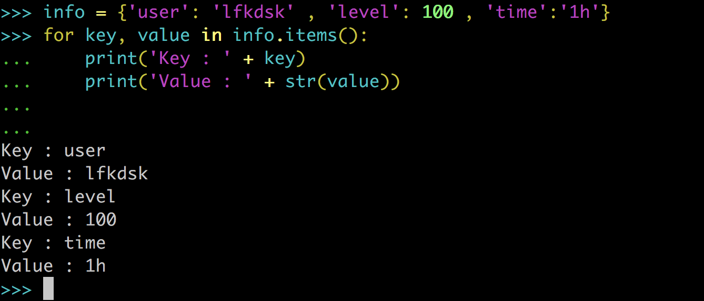
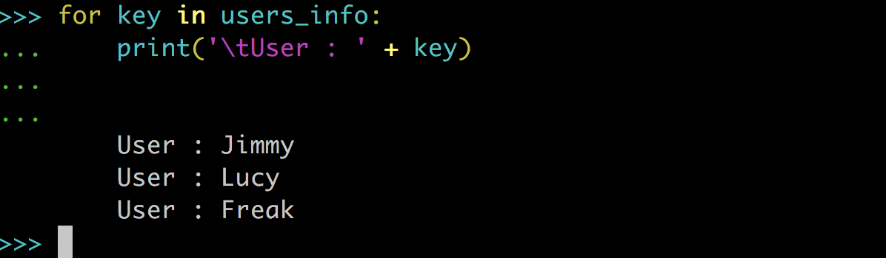
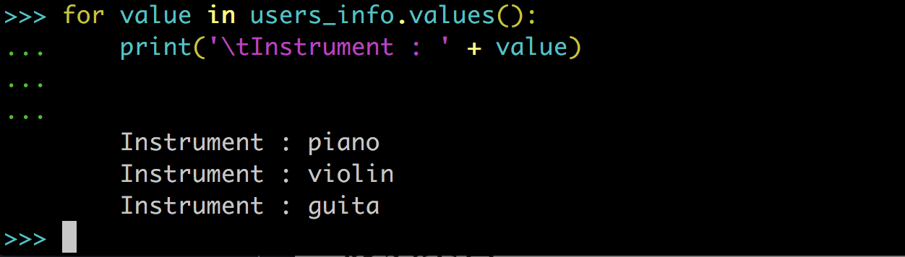
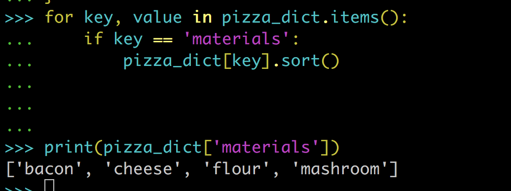

# 使用字典和集合

在之前的课程之中我们接触过几种 Python 内建的数据结构了，包括线性的可变数据结构的 List 和线性的不可变数据结构 Tuple。在这一章中我们会接触两种数据结构，这两种数据结构和之前我们接触过的都不同。首先是 `字典`，字典不是一种线性的数据结构，字典存储的是一系列的 `键-值对` ，也就是说我们存入字典的一条数据其实包含一个 `key` 正如名字一样是一个存取使用的钥匙，还包含一个 `value` 就是我们真正存储的值，这样子我们就可以使用我们的 key 找到我们存储的值：


字典就可以简单的理解成这种类似于表状的数据结构，里面存储的数据就是这种 `key-value` 的数据对，与 `key` 相关联的值可能是数字、字符串、列表乃至字典。事实上，可将任何 Python 对象用作字典中的值。Python中使用`{}`花括号表示一个字典，字典中的 key 和 value 用冒号关联：

```python
dict = {'lfk':123, 'lfkdsk':'23333', 'list':[123.0 , 'lfk'], 'dictionary':{}}
print(dict)
```

这里我们看到了被命名为 dict 的字典中包含有很多种`value`类型的`key-value`数据对，比如说数字、字符串、列表以及字典，我们还对这个 dict 进行了打印，我们可以看到 dict 打印出来的每个`key-value`数据对的信息：


我们日常查字典时，往往是通过汉字的索引表找到对应页码，从而得到我们要检索的具体内容，操作字典这种数据类型的原理和查字典十分类似。下面我们需要了解一下具体应如何 **操作字典**。

## 初识字典

### 访问字典中的值

**字典** `dict` 在其他语言里又称map，使用 key-value 存储，本质上是哈希表，它通过将 key 和 value 一一映射来提高对值的访问速度。譬如，在一个列表里访问某数据，首先需要确定数据在列表里的位置，才能进行访问，一般来说列表越长，耗时越长，而我们的字典的访问是不受字典大小的影响的，以 key 访问 value 的时间复杂的是 $$O(1)$$。(刚刚我们说到，字典这种表状的数据结构是由一个个 key-value 组成的， key 在这里只充当索引的作用。所以对字典的访问应当是根据 key 来访问它相应的 value。从语法上来看，我们先写下 **操作的字典名**，然后再在 **方括号** 内标明字典中的 **key** ，就可以访问到`key `相关联的`value`了：

```python
dict[key] #这样的格式
```


> Tips
>
> 我们应该注意的是，字典中的 key 和 value 应该是一一对应的关系，同一个 key 对应的 value 应该是**唯一的**，否则访问的时候就不能找到一个确定的 value 。另外，字典中的 key 必须为Python 中的**不可变对象**，如整数、字符串，因为字典是根据 key 来确定 value 的，如果 key 可变，那么每次访问的 value 可能不唯一。

除此之外，我们还可以通过 Python 提供的 `get` 方法来快速获取 key 所对应的 value：

```python
dict.get(key)
```


这里我们可以看到，通过 get 方法我们可以获取到原本存在的 key 对应的 value，但如果 key 不存在时，它会返回一个 `None` ，但是在Python交互环境下并不显示，我们注意到，还可以在 get 方法中指定当 key 不存在时的返回值。

使用 `get` 获取值和使用 `[]` 索引获取在使用结果上是等效的，但是使用 `get` 能够避免找不到对应的 Key 产生的 KeyError ，并且包含 default value 的设计能够让我们更方便的对数据进行操作。

### 添加键值对

前面我们知道了怎样简单地创建一个字典。实际上，我们在使用字典这种数据结构时，往往先创建一个空字典，再往里添加键值对。Python 中添加键值对的方法相当于指定一个新的 key ，并给与其相关的 value 赋值。首先写出 **操作的字典名**，然后在方括号内写下**新的 key** ，并给它赋值：

```python
dict[new_key] = value
```

在这里我们可以看到原本为空的字典添加了一些键值对，并可以正确的打印出来：


> Tips
>
> 打印字典时，我们可能会发现添加的键值对的打印顺序可能和添加顺序不一样，这是由于字典这种数据结构并不关心键值对顺序，而是强调 key 和 value 的对应关系。

### 修改键值对

对键值对的修改建立在已存在于字典的键值对上，Python 中修改键值对的操作与添加键值对的操作看上去很相似。首先写出 **操作的字典名** ，然后在方括号里写下 **一个 旧的 key** ，然后用等号将 **新的 value** 与方括号里的 key 绑定：

```python
dict[old_key] = new_value
```


这里我们可以看到字典中 key 为 `'lfk'` 的键值对被修改成功了 。

### 删除键值对

对于字典中不需要的键值对，我们需要进行删除操作，Python 中提供的 `del` 语句可以对键值对进行删除操作：

```python
del dict[key]
```


这里我们可以看到，del 可以删除字典中存在的任意键值对，我们只需提供字典名和键值对所对应的 key ，通过 key 可以直接找到我们要删除的键值对。

另外，Python 中的`pop` 方法也能根据字典中的 key 删除对应键值对：

```python
dict.pop(key)
```


我们可以看到，key 为 `'lfk'` 的键值对被成功删除了，并且被删除键值对里的 value `123`作为返回值返回以便我们继续使用。我们可以根据这个特性决定使用 del 还是 pop 。

在现实中，我们可能会需要频繁操作最近加进字典里的键值对，这时我们还可以通过 `popitem`方法快速删除加入字典的最后一个键值对：

```python
dict.popitem()
```


这里我们可以看到 popitem 确实将最近加入的那个键值对彻底删除了。但是，还是要强调一下，字典这种数据结构并不关心各个元素的顺序，所以一般操作往往通过 key 来执行各种操作。popitem 方法由于使用的特殊性能够操作最后加入的 item ，但是也仅能对最后加入字典的元素进行操作。

## 遍历字典

现实中翻阅一本字典的频率可能不会太高，常人中像看书一样一页一页翻看字典的也是屈指可数。但是，对于字典这种数据类型，我们往往是需要频繁地接连访问的^_^

### 遍历键值对

当需要获取并提取字典里的所有信息时，我们需要对字典里的所有键值对做一个简单的遍历操作，我们使用 `items` 方法来获取字典的所有键值对，然后遍历：

```python
for key, value in dict.items():
    print(key)
    print(value)
```



这里我们可以看到，字典里的所有信息，包括每一个 key 和 value 都被成功提取到了。

### 遍历键

我们在一些特殊情况下只需要获取字典里所有的 key ，如果采用 item 方法获取所有键值对，再将键值对中的 key 提取出来，难免会有冗余之嫌。这时候 `keys` 方法就能够给我们带来很大方便：

```python
for key in dict.keys():
```


值得注意的是，keys 方法也可以省略，这是因为遍历字典时，默认的遍历对象就是所有 key 。以上操作也可以写为：

```python
for key in users_info:
    print('\tUser : ' + key)
```



这里我们可以看到，省略 keys 方法以后的结果确实是把字典里的所有 key 遍历了一遍。

另外，我们可以通过我们之前学过的 `sorted`语句对字典里的 key 进行排序，从而使遍历顺序有序：

```python
for key in sorted(dict.keys()):
```

 

这里我们可以看到，遍历 key 时是按照字母表升序遍历。

### 遍历值

与遍历所有键的情形类似，有时候我们不需关心 key 值，而是需要获取字典里的所有 value ，这时我们就需要用到 `values` 方法：

```python
for value in dict.values:
```



我们可以看到，values 方法同样也很奏效。

## 字典的嵌套

### 字典列表

有时候我们经常需要在列表里包含大量字典，每个字典里都包含特点对象的众多信息，比如存储某个网站的用户信息，每个用户的信息用 **字典** 来存储，而许许多多的用户用一个列表来存储，形成一个个并行的字典列表：

```python
users = []
for user_num in range(0, 5):
    user = {'username': 'user_' + str(user_num),
           'hobby': 'None',
           'age': 0}
    users.append(user)
```

像这样，我们就在长度为5的列表里初始化了5个用户的基本信息，并以字典形式保存。


当我们需要在这样的一个字典列表里面对我们的用户信息进行修改时，只需遍历列表找寻到我们的目标用户，然后通过修改字典的值的方法修改用户的信息：

```python
for user in users:
    if user['username'] == 'user_1':
        user['hobby'] = code
```

修改之后，我们可以通过打印用户名为 `user_1` 的基本信息来查看我们对用户信息修改之后的结果：


这里我们可以看到，用户名为 `user_1` 的用户的 `hobby` 确实被修改成了 `code` 。

### 列表字典

除了嵌套在列表里的字典以外，我们有时还需要将列表嵌套在字典里面使用，比如在存储一道菜肴的信息的时候，我们可以用数字类型描述它的热量，用字符串描述它的名称和味道，但是一道菜肴总是包含很多原料，这样的话我们最好用一个列表来描述它的原料：

```python
pizza_dict = {
    'name' : 'pizza',
    'taste' : 'salty',
    'calories' : 2100,
    'materials' : ['flour', 'cheese', 'bacon', 'mashroom']
}
```


这样我们就初始化了一个描述披萨的字典。与字典列表类似地，如果我们需要访问字典里的列表时，我们只需通过列表所对应的 key 找到列表，然后根据实际需求用我们之前学过的对列表的操作来进行处理。例如，这里我们对披萨的原材料进行升序排序：

```python
for key, value in pizza_dict.items():
    if key == 'materials':
        pizza_dict[key].sort()
```



我们可以看到，输出结果里 pizza_dict 里的原料经过了排序处理。

### 嵌套字典

我们已经知道，字典可以和列表相互嵌套，列表里可以嵌套列表，那么字典里当然也是可以嵌套字典的，并且这种用法常常会被使用到一些比较常见的情景里。例如，存储一系列好友信息的字典，每个好友的信息单独用一个字典来存储：

```python
friends = {
    'Tom' : {'gender': 'male', 'age': 18} ,
    'Lucy' : {'gender': 'female', 'age': 19} ,
    'Jimmy' : {'gender': 'male', 'age': 21} ,
}
```


这样我们就将好友信息用字典存储了下来，每个好友形成好友列表里的一对键值对，每个值对应着一个字典。对于嵌套在字典中的字典，我们只需通过 key 在外层字典里找到对应的内层字典，用操作字典的方法进行处理即可。举个例子，我们现在要将所有好友的年龄增加一岁：

```python
for friend in friends.values():
    for key in friend:
        if key == 'age':
            friend[key] = friend[key] + 1
```


这里我们可以看到，所有好友都成功地长大了一岁。我们可以发现，字典的嵌套为信息的存储和访问提供了更多的方式，而且操作上也十分简单便捷。

## 初识集合

下面我们将介绍另外一种数据类型 `集合` 。与字典一样，集合也不是一种线性的数据结构。集合是一系列离散的数据，集合存储的是一系列无序的、彼此不相同的元素，我们可以将集合看作是只有 key 的一种残缺的字典。只要满足集合的不重复特性，我们可以在集合中放置任何我们想放的元素，Python 中的集合用`{}`花括号表示：

```python
a_set = {'lfk', 23333, 'lfkdsk'}
```


这里我们看到集合 `a_set` 被创建并打印出来，并且如我们所说，集合确实是没有顺序。

实际上，集合的创建还可以借助我们之前接触过的一下数据结构，比如 `list` ，此时我们只需要使用 `set` 语句进行加工处理：

```python
a_set = set(['lfk' , 'lfkdsk' , 123 , 123])
```


我们可以看到，经过 set 语句加工后的数据结构是一个集合，并且 set 语句能够自动实现集合的无序以及不重复的性质。

除了列表之外，set 语句还能对字典的 keys 或者 values 进行加工，形成一个新的集合：

```python
a_set = set(dict.values())
```

 

这里我们可以看到，字典里的 value 形成了一组集合。

### 添加元素

前面我们介绍了几种创建集合的方法，在集合初始化以后，我们需要按需求不断给我们的集合扩充内容，这时候在集合中添加元素的方法就要被经常用到。添加元素时，我们需要用到 `add` 方法：

```python
a_set.add(item)
```


这里我们可以看到添加元素后的结果。

### 删除元素

对于集合当中我们不需要的元素，我们需要进行删除操作，对集合元素进行删除我们用的是 `remove` 方法：

```python
a_set.remove(item)
```


这里我们可以看到，集合中元素 `'add'` 确实被删除了。