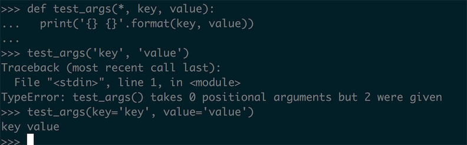

# Pythonic 时间：只接受关键字参数

在 Python3 之中我们可以让一个方法只接受关键字参数，只要把我们想要强制约束必须使用关键字调用的参数放在 `*` 之后或者是 `*args` 参数的后面：

``` python
def test_args(*, key, value):
  print('{} {}'.format(key, value))
```



这里面我们可以看到这里直接使用 `key value` 两个参数去调用这个函数，会抛出 TypeError 的错误，而我们在下面使用关键字参数的方式的调用结果就能正常的被使用。

使用 **只接受关键字参数的方法** 有什么好处呢？强制使用关键字参数调用的方法在调用的时候会被使用位置参数表意更加的清晰，程序也会有更好的可读性。