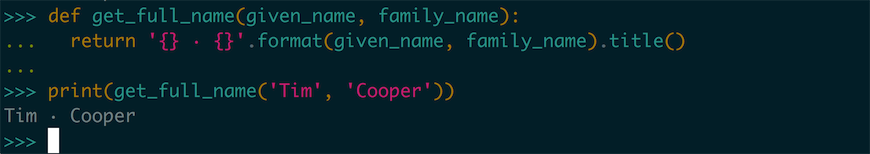
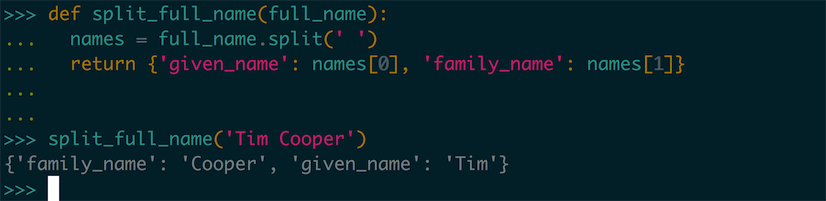
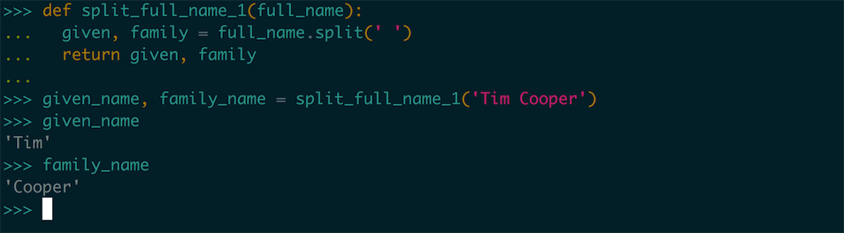
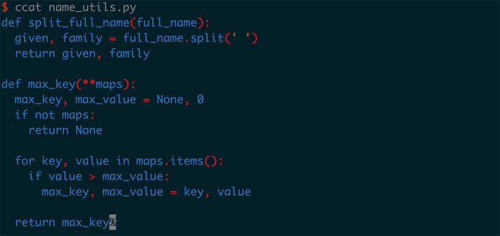
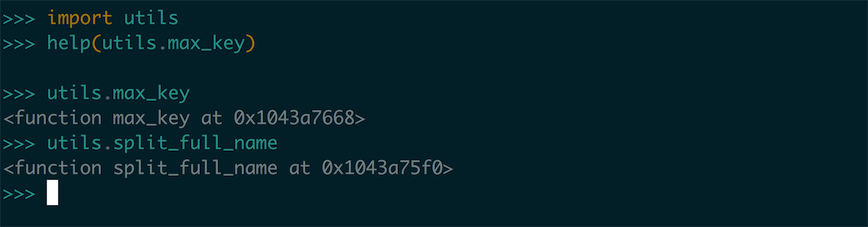
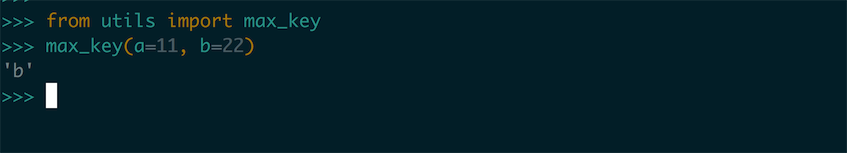
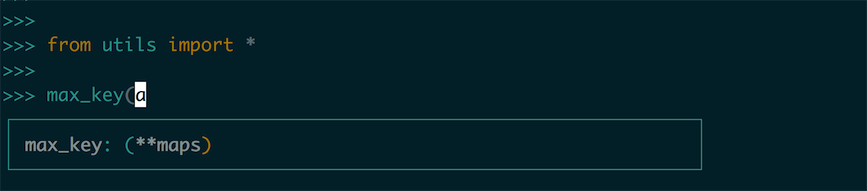
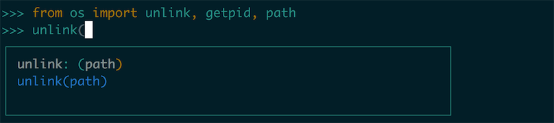
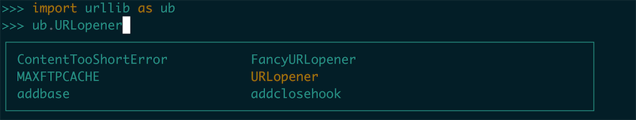
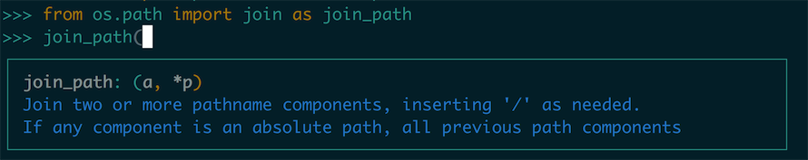

# 0x08 使用函数

在这章之中我们会学习编写和使用函数，其实在之前对 Python 学习之中我们对函数并不陌生。比如在对 `List` 的学习之中，我们会使用 `List` 的一些 build-in 函数对 `List` 进行一些操作：


那这其中的 `reverse()` 就是一个我们对函数的调用。那我们怎么来描述 Python 之中的函数呢？

我们可以简单的把 `函数` 描述成带有名字的代码块，用来完成具体的工作。而我们要满足函数所定义的特定功能，可调用这个函数。需要在程序中多次执行这个任务时，我们不需要重复编写代码来实现这个任务，只需要调用这个函数，让 Python 运行定义好的代码就行了。通过使用函数你会发现，函数会使你的代码的调试、测试、使用、功能拆分等方面更为的方便。

在本章之中，我们会学习如何编写、实现函数的相应功能，学会向函数传递数据，使用函数处理数据，返回我们产生的一个值或者一组值，最后我们会学习如何使用 **模块** 来对我们的程序根据功能进行拆分，让程序文件的安排更为有序。

## 定义函数

遥想这个课程的第一课我们刚刚在 Python 写下来一行 Hello World 的时候已经过了很长一段时间呢，这里面我们学过很多相关的知识了，使用过很多的 API 了，这里面我们终于要自己开始学习如何定义和使用函数了，这里我们仍然从这个简单的例子开始：

``` python
# 函数定义
def print_hello_world():
    """ 注释 """
    print('Hello World')

# 调用
print_hello_world()
```

这个例子向我们展示了一个函数定义的基本结构，我们在这里使用 `def` 表明这是一个要定义的函数，这就是我们所进行的函数定义，之后跟着的信息表明了函数的名字，括号内还会跟着这个函数所需要的一些信息（参数）。这里我们定义的这个函数的名字是 `print_hello_world` ，它不需要传递任何参数就可以运行。函数定义中的 `:` 之后的缩进代码段是构成函数的函数体，在函数体中的第一行中的 ``""" """`` 形式的注释是 Python 之中 docstring ，Python 使用这个来生成函数文档。

函数体中的内容比较简单，这里我们只是使用了 `print()` 函数打印了一行 Hello World 的信息，使用这个函数我们需要对这个函数使用调用功能，就想我们之前调用的 API 一样是调用这个函数 `print_hello_world()` 。

## 向函数传递参数

在 **定义函数** 这节里我们举的例子，没有定义函数的参数列表，但是如果我们想要向函数传递参数就要定义参数列表。比如这里面我们需要打印用户的输入的用户名，我们要为这个函数设定一个 `username` 的参数：

``` python
def print_hello(username):
    """ 注释 """
    print('Hello ' + username)

print_hello('=。=')
```


这里面的 `'=。='` 是一个 **实际参数**，而在函数之中的 `username` 是一个 **形式参数** ，所以说想函数传递参数的过程实际上就是将实际参数装换成形式参数的过程（其实是一个赋值的过程）。不过这个概念我们暂时也可以不做天多的关注，短时间内我们不会对这个话题做过多的讨论。这里我们有两种方式去传递函数的参数：

首先第一种是使用固定位置的参数 —— **位置参数**，这就是很多其他的编程语言都支持的参数传递方式：

``` python
def print_hello(first, second):
    print('Hello ' + first)
    print('Hello ' + second)

print_hello('=。=', '=、=')
```


使用位置参数的时候调用参数的顺序就很重要了，比如这个 `print_hello(first, second)` 函数的两个参数，一个是 `first` 另一个是 `second` ，不同的参数在函数之中被用在函数不同的地方，因此我们要按照函数参数的位置来传递参数，如果顺序传递错了，就会引发一些程序需运行上的问题。

另一种传递参数的方式是使用名 **关键字参数**，在一些现代的编程语言之中这是一种比较流行的方式，在这里我们不需要修改函数的定义，只需要在调用的时候指定参数就可以了：


在这种使用方法之中我们使用类似 `first='=.='` 手动的指定了把某个固定的参数，绑定到某个具体的变量名上面去，因为我们指定了变量的传递名字，因此顺序就不再重要了，在这张图片之中我们使用不同的顺序去调用了同一个函数，但是结果都是相同的。

### 默认值

我们在编写函数之时，我们也可以为一些参数指定默认值。当调用函数的时候提供了实参值的时候，函数想使用传递的参数值，否则就会使用函数描述中提供的默认值。所以说当我们给定了一个形式参数的默认值的时候，就可以在函数调用中省略相应的实参值。

比如说有一个打印出名字的函数，可以定义为如下的样子：

``` python
def hello_somebody(given_name, family_name='Cooper'):
  print('Hello {} {}'.format(given_name, family_name))
```


我们在调用这个函数的时候，比如都是向 `Cooper` 家的人打招呼，那么我们就可以将 `family_name` 的默认值设置为 `Copper` ，这样我们再调用这个方法的时候就可以不提供这个信息：


这里面我们没有没有使用关键字参数的调用方式，并且调整了一下形式参数的顺序。我们在使用默认值的时候，在形参列表中必须先列出没有默认值的形参，再列出有默认值的形参。Python 这样才能正确的解读位置的实参。

### 动态参数

除了以上使用位置进行参数调用，或者是使用关键字进行位置调用之外，我们还可以只用动态参数来接受任意数量的参数，比如说系统中有一个 sum 方法可以接受一个 list 的参数返回整个 list 求和的结果：


我们也可以使用动态参数完成一个 sum 的版本，在 Python 之中我们使用 `*` 参数来接受任意数量的 **位置参数**，那么 sum 我们就可以这样实现：

``` python
def sum(*rest):
  sum_num = 0
  if not rest:
    return sum_num
  for item in rest:
    sum_num += item
  return sum_num
```


这是一个很简单的实现，这里我们没有对类型进行一些判定，只是进行了一些基础的判空。`*rest` 就是这样一个动态的参数，这个参数会被 Python 程序理解成一个元组，这里我们可以编写一个方法去测试：

``` python
def type_of_args(*args):
  print(type(args))
```


这里面我们打印出了 args 的类型我们看到这个参数的类型是一个 Tuple。

> Tips 实现可变参数的方法 avg
>
> 上面我们使用了动态参数实现了方法 `sum` ，大家可以遵循着这个思路去实现一下方法 `avg` （求多个参数的平均值）

上面我们使用 `*args` 的方式是接受多个的位置参数，我们还可以使用类似 `**kwargs` 两个 `*` 参数的方式引入一个关键字形式的动态参数，我们也可以写出这样的一个 Demo 求出一系列参数中最大的一个数值的 Key —— max_key：

``` python
def max_key(**maps):
  max_key, max_value = None, 0
  if not maps:
    return None
  
  for key, value in maps.items():
    if value > max_value:
      max_key, max_value = key, value
  
  return max_key
```


这里的一个实现非常简单，我们仅仅是使用了遍历的方式去求出其中最大的值，我们就能在调用 `max_key` 的方法中使用关键字参数的方式去调用这个方法，并且求出参数之中的最大的 key 值。

这个 `**maps` 参数会被 Python 程序识别为一个 dict 类型，我们这类也可以编写一个方法去测试一下：


 `*args` 和 `**kwargs` 这两个动态参数方法是可以同时使用的，当我们一个方法是可以接受位置动态参数，也可以接受关键字动态参数的方式：

``` python
def anyargs(*args, **kwargs):
  print(args)
  print(kwargs)
```


> Tips `**kwargs`:
>
> `**kwargs` 这种参数只能出现在函数参数列表之中的最后一个参数的位置，而 `*args` 这种参数之后还可以再放置参数。


## 使用返回值

使用函数的目的并不是只简单的处理完数据就完事了，也不能只是简单对数据进行打印。而我们的程序更重要的作用是处理数据，返回一个或一组的返回值，再将这些返回值进行进一步的处理。函数处理之后的返回结果被称作 **返回值**。使用函数对程序结构进行拆分能让我们增加程序的可读性。

还是使用我们之前的那个处理名字和姓氏的方法来举例，这回我们整理好这两个部分并且返回全名：

``` python
def get_full_name(given_name, family_name):
  return '{} · {}'.format(given_name, family_name).title()

print(get_full_name('Tim', 'Cooper'))
```



我们要是想要拓展这个方法还可以在方法之中增加一个 `middle_name` 参数来接受中间名，再给这个 middle_name 设置一个默认值，如果没有就使用默认值。但是这个默认值，最好使用 None 而非 `''` 空字符串。

> Tips 
>
> 提出这样的代码组织逻辑是因为如果默认值使用 `''` 空字符串，我们在对参数进行一些判空操作的时候就会产生一些问题，但是如果我们使用 None 错误的判空条件就会产生运行错误，能帮助我们矫正程序错误。
>
> 同样的还有尽量不要使用 `[]`，`{}` 之类的空集合作为默认参数。

程序的返回值还可以是一个列表、一个元组或者是一个字典，比如我们可以定义这样一个方法，接受一个人的全名然后拆分成 Given Name 和 Family Name 返回，我们可以返回一个字典来实现这个功能：

``` python
@ split like 'Tim Cooper'
def split_full_name(full_name):
  names = full_name.split(' ')
  return {'given_name': names[0], 'family_name': names[1]}
```



我们可以看到通过这个方法返回了固定样式的一个字典，包含 `'given_name'` 和 `'family_name'` 。

但是更为方便的是直接返回多个参数，我们之前介绍过两个参数直接交换的写法：

``` python
a, b = b, a
```

而我们在函数之中也可以写出类似这样的代码直接返回两个变量：

``` python
def split_full_name_1(full_name):
  given, family = full_name.split(' ')
  return given, family

given_name, family_name = split_full_name_1('Tim Cooper')
```



这里面我们看这个 return 语句会感觉有点怪异，但是这其实非常好理解，Python 并没有为函数的返回值拓展出支持多个返回值的功能，而是在返回之前，多个返回值会被打包成一个 `元组（tuple）` ，真实的返回值其实是打包的之后的元组值，返回的元组值再通过元组解压赋值给多个变量来使用。


## 引入模块

使用函数的过程中，我们体会到了程序设计上抽象的魅力，我们把用做具体细节代码抽成函数，以便于能和主函数进行分离。在这个抽象的过程之外，我们还可以将 *函数* 进一步抽象将函数存储在被称为 *模块* 的独立文件之中，在主程序之中我们可以使用 `import` 语句来导入我们所需的模块。

在此之中我们可以创建一个独立文件 `utils` ，再将我们之前使用的几个处理名字的函数放进这个模块之中：

``` python
# utils.py
def split_full_name(full_name):
  given, family = full_name.split(' ')
  return given, family

def max_key(**maps):
  max_key, max_value = None, 0
  if not maps:
    return None
  
  for key, value in maps.items():
    if value > max_value:
      max_key, max_value = key, value
  
  return max_key
```



在创建了模块之后我们就可以在 Python 程序之中导入这个模块，这时候如果我们想要导入这个模块中的全部函数，我们可以直接使用 `import` 命令：

``` python
import utils
```



这里我们就可以使用 `utils.max_key()` 来调用这个模块中的函数。

如果你只想使用这个模块之中的某个具体的函数，你还可以导入模块之中的特定函数：

``` python
from utils import max_key
# use max_key
```



在这种实际的使用场景之中，这样的做法可能会更好一些。在复杂的代码逻辑之中，能看出我们要使用函数是来自于哪一个包里面导入，而且只导入你需要的函数也有利于命名空间的整洁。除此之外，使用这种 `from xxx import *` 的方式，通过通配符来导入模块的全部内容：

``` python
from utils import *
# use max_key \ split_full_name
```



这种做法能提供一些方便，提供的功能和直接使用 `import` 语句相似但是不需要使用模块名字进行调用，但是直接把导入模块置入了当前的环境之中，这时候你可能在当前的模块之中定义了一个相同名字的函数，这就会造成一定的混淆和不易发现的错误。

使用 `from xxx import xxx` 的语法之中我们也可以同时导入多个函数，使用逗号分隔开：

``` python
from os import unlink, getpid, path
```



但是如果这里我们 `import` 的函数过多了，为了不让代码可读性太差，可能就要把这段代码折行了：

``` python
from os import unlink, getpid, path, \
                remove, rename
```

不过更好的办法是使用一个圆括号一次性导入多个函数项：

``` python
from os import (
  unlink,
  getpid,
  path,
  remove,
  rename,
)
```

这样我们就可以清晰的展示我们 import 了那些函数，并且不用使用可能导致可读性变差的折行功能。

### 使用 as 设置函数、模块的别名

你还可以使用 `as` 句法给模块指定别名，通过给模块指定一个别名我们可以以更简短的方式来调用，或者是能处理导入名字相同的情况：

``` python
import urllib as ub
# use ub.xxxx
```



我们在上面的代码之中给 `urllib` 设定了一个别名 `ub`， 但是我们只是改变了这个包 import 进入当前文件的模块名字，模块里面的所有函数的名字却都没有改变，这样不仅能使代码更简洁，还能让我们不再关注模块具体的名字，而专注于描述性的函数名。函数的名字指出了函数的具体功能，对理解代码来说比模块名更为重要。

除此以外我们在使用 `from ... import ...` 的语法之中也可以使用 `as` 语法，为模块中的一个函数设定一个别名：

``` python
import os.path from join as join_path
# use join_path
```



比如这里我们从 `os.path` 中导入了这个 `join` 这个函数，是用来拼接 path 路径的，但是如果为了和其余的 `join` 函数有所区分，这里就可以把 `join` 函数重新命名为 `join_path` 以标识这个函数是为了专门处理 path 的拼接的。

### 局部导入

当你在局部作用域中导入模块时，你执行的就是局部导入。如果你在Python脚本文件的顶部导入一个模块，那么你就是在将该模块导入至全局作用域，这意味着之后的任何函数或方法都可能访问该模块。例如：

``` python
from world import World

def create_hero(world, hero_type):
		# ... 
    from entities import Hero
    hero = Hero(world, image, graves_img, hero_type)
    hero.location = location
    hero.name = hero_name
    hero.brain.set_state(HERO_STATES[0])
    world.add_entity(hero)

    return hero
```

比如这里我们把 `world` 作为了全局模块来导入，因为我们会在当前模块的多个函数之中都使用 World 这个模块所包含的功能，我们能在 `create_hero` 这个函数之中使用这个