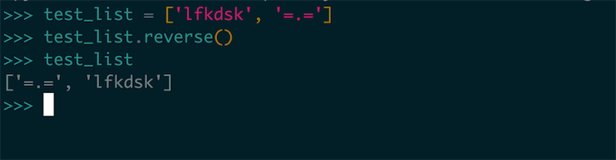

# 0x08 使用函数

在这章之中我们会学习编写和使用函数，其实在之前对 Python 学习之中我们对函数并不陌生。比如在对 `List` 的学习之中，我们会使用 `List` 的一些 build-in 函数对 `List` 进行一些操作：

那这其中的 `reverse()` 就是一个我们对函数的调用。那我们怎么来描述 Python 之中的函数呢？

我们可以简单的把 `函数` 描述成带有名字的代码块，用来完成具体的工作。而我们要满足函数所定义的特定功能，可调用这个函数。需要在程序中多次执行这个任务时，我们不需要重复编写代码来实现这个任务，只需要调用这个函数，让 Python 运行定义好的代码就行了。通过使用函数你会发现，函数会使你的代码的调试、测试、使用、功能拆分等方面更为的方便。

在本章之中，我们会学习如何编写、实现函数的相应功能，学会向函数传递数据，使用函数处理数据，返回我们产生的一个值或者一组值，最后我们会学习如何使用 **模块** 来对我们的程序根据功能进行拆分，让程序文件的安排更为有序。