# 0x08 使用函数

在这章之中我们会学习编写和使用函数，其实在之前对 Python 学习之中我们对函数并不陌生。比如在对 `List` 的学习之中，我们会使用 `List` 的一些 build-in 函数对 `List` 进行一些操作：


那这其中的 `reverse()` 就是一个我们对函数的调用。那我们怎么来描述 Python 之中的函数呢？

我们可以简单的把 `函数` 描述成带有名字的代码块，用来完成具体的工作。而我们要满足函数所定义的特定功能，可调用这个函数。需要在程序中多次执行这个任务时，我们不需要重复编写代码来实现这个任务，只需要调用这个函数，让 Python 运行定义好的代码就行了。通过使用函数你会发现，函数会使你的代码的调试、测试、使用、功能拆分等方面更为的方便。

在本章之中，我们会学习如何编写、实现函数的相应功能，学会向函数传递数据，使用函数处理数据，返回我们产生的一个值或者一组值，最后我们会学习如何使用 **模块** 来对我们的程序根据功能进行拆分，让程序文件的安排更为有序。

## 定义函数

遥想这个课程的第一课我们刚刚在 Python 写下来一行 Hello World 的时候已经过了很长一段时间呢，这里面我们学过很多相关的知识了，使用过很多的 API 了，这里面我们终于要自己开始学习如何定义和使用函数了，这里我们仍然从这个简单的例子开始：

``` python
# 函数定义
def print_hello_world():
    """ 注释 """
    print('Hello World')

# 调用
print_hello_world()
```

这个例子向我们展示了一个函数定义的基本结构，我们在这里使用 `def` 表明这是一个要定义的函数，这就是我们所进行的函数定义，之后跟着的信息表明了函数的名字，括号内还会跟着这个函数所需要的一些信息（参数）。这里我们定义的这个函数的名字是 `print_hello_world` ，它不需要传递任何参数就可以运行。函数定义中的 `:` 之后的缩进代码段是构成函数的函数体，在函数体中的第一行中的 ``""" """`` 形式的注释是 Python 之中 docstring ，Python 使用这个来生成函数文档。

函数体中的内容比较简单，这里我们只是使用了 `print()` 函数打印了一行 Hello World 的信息，使用这个函数我们需要对这个函数使用调用功能，就想我们之前调用的 API 一样是调用这个函数 `print_hello_world()` 。

## 向函数传递参数

在 **定义函数** 这节里我们举的例子，没有定义函数的参数列表，但是如果我们想要向函数传递参数就要定义参数列表。比如这里面我们需要打印用户的输入的用户名，我们要为这个函数设定一个 `username` 的参数：

``` python
def print_hello(username):
    """ 注释 """
    print('Hello ' + username)

print_hello('=。=')
```

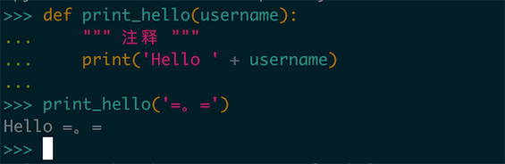

这里面的 `'=。='` 是一个 **实际参数**，而在函数之中的 `username` 是一个 **形式参数** ，所以说想函数传递参数的过程实际上就是将实际参数装换成形式参数的过程（其实是一个赋值的过程）。不过这个概念我们暂时也可以不做天多的关注，短时间内我们不会对这个话题做过多的讨论。这里我们有两种方式去传递函数的参数：

首先第一种是使用固定位置的参数 —— **位置参数**，这就是很多其他的编程语言都支持的参数传递方式：

``` python
def print_hello(first, second):
    print('Hello ' + first)
    print('Hello ' + second)

print_hello('=。=', '=、=')
```

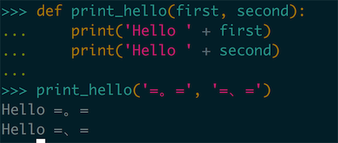

使用位置参数的时候调用参数的顺序就很重要了，比如这个 `print_hello(first, second)` 函数的两个参数，一个是 `first` 另一个是 `second` ，不同的参数在函数之中被用在函数不同的地方，因此我们要按照函数参数的位置来传递参数，如果顺序传递错了，就会引发一些程序需运行上的问题。

另一种传递参数的方式是使用名 **关键字参数**，在一些现代的编程语言之中这是一种比较流行的方式，在这里我们不需要修改函数的定义，只需要在调用的时候指定参数就可以了：

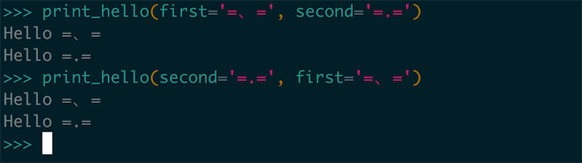

在这种使用方法之中我们使用类似 `first='=.='` 手动的指定了把某个固定的参数，绑定到某个具体的变量名上面去，因为我们指定了变量的传递名字，因此顺序就不再重要了，在这张图片之中我们使用不同的顺序去调用了同一个函数，但是结果都是相同的。

### 默认值

我们在编写函数之时，我们也可以为一些参数指定默认值。当调用函数的时候提供了实参值的时候，函数想使用传递的参数值，否则就会使用函数描述中提供的默认值。所以说当我们给定了一个形式参数的默认值的时候，就可以在函数调用中省略相应的实参值。

比如说有一个打印出名字的函数，可以定义为如下的样子：

``` python
def hello_somebody(given_name, family_name='Cooper'):
  print('Hello {} {}'.format(given_name, family_name))
```

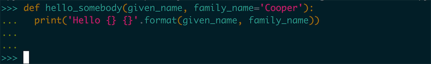

我们在调用这个函数的时候，比如都是向 `Cooper` 家的人打招呼，那么我们就可以将 `family_name` 的默认值设置为 `Copper` ，这样我们再调用这个方法的时候就可以不提供这个信息：

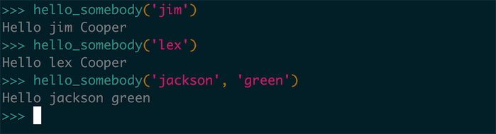

这里面我们没有没有使用关键字参数的调用方式，并且调整了一下形式参数的顺序。我们在使用默认值的时候，在形参列表中必须先列出没有默认值的形参，再列出有默认值的形参。Python 这样才能正确的解读位置的实参。

### 动态参数

除了以上使用位置进行参数调用，或者是使用关键字进行位置调用之外，我们还可以只用动态参数来接受任意数量的参数，比如说系统中有一个 sum 方法可以接受一个 list 的参数返回整个 list 求和的结果：

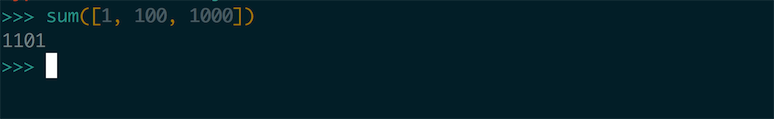

我们也可以使用动态参数完成一个 sum 的版本，在 Python 之中我们使用 `*` 参数来接受任意数量的 **位置参数**，那么 sum 我们就可以这样实现：

``` python
def sum(*rest):
  sum_num = 0
  if not rest:
    return sum_num
  for item in rest:
    sum_num += item
  return sum_num
```

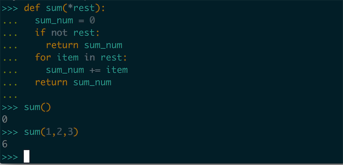

这是一个很简单的实现，这里我们没有对类型进行一些判定，只是进行了一些基础的判空。`*rest` 就是这样一个动态的参数，这个参数会被 Python 程序理解成一个元组，这里我们可以编写一个方法去测试：

``` python
def type_of_args(*args):
  print(type(args))
```

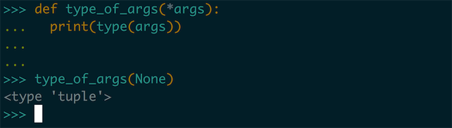

这里面我们打印出了 args 的类型我们看到这个参数的类型是一个 Tuple。

> Tips 实现可变参数的方法 avg
>
> 上面我们使用了动态参数实现了方法 `sum` ，大家可以遵循着这个思路去实现一下方法 `avg` （求多个参数的平均值）

上面我们使用 `*args` 的方式是接受多个的位置参数，我们还可以使用类似 `**kwargs` 两个 `*` 参数的方式引入一个关键字形式的动态参数，我们也可以写出这样的一个 Demo 求出一系列参数中最大的一个数值的 Key —— max_key：

``` python
def max_key(**maps):
  max_key, max_value = None, 0
  if not maps:
    return None
  
  for key, value in maps.items():
    if value > max_value:
      max_key, max_value = key, value
  
  return max_key
```

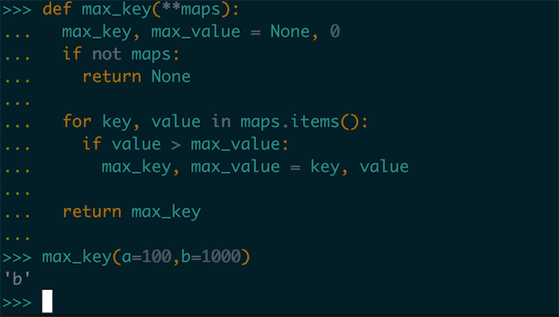

这里的一个实现非常简单，我们仅仅是使用了遍历的方式去求出其中最大的值，我们就能在调用 `max_key` 的方法中使用关键字参数的方式去调用这个方法，并且求出参数之中的最大的 key 值。

这个 `**maps` 参数会被 Python 程序识别为一个 dict 类型，我们这类也可以编写一个方法去测试一下：

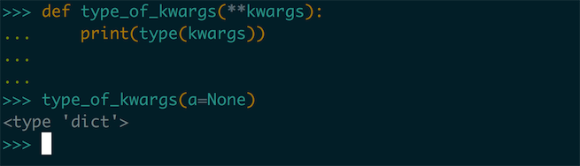

 `*args` 和 `**kwargs` 这两个动态参数方法是可以同时使用的，当我们一个方法是可以接受位置动态参数，也可以接受关键字动态参数的方式：

``` python
def anyargs(*args, **kwargs):
  print(args)
  print(kwargs)
```

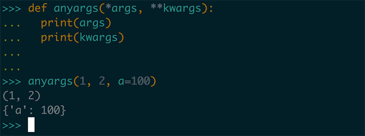

> Tips `**kwargs`:
>
> `**kwargs` 这种参数只能出现在函数参数列表之中的最后一个参数的位置，而 `*args` 这种参数之后还可以再放置参数。


##使用返回值

使用函数的目的并不是只