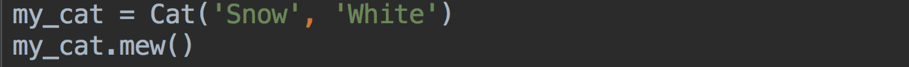
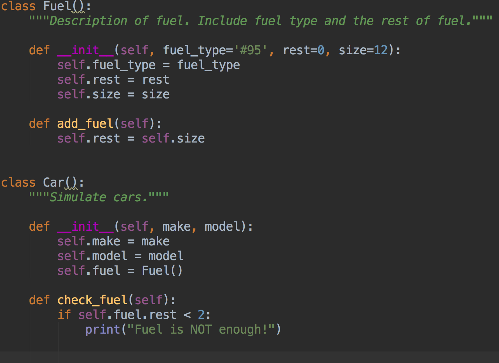

# 类

**面向对象编程(Object Oriented Programing)** 是一种非常有效的软件编写方法，在这种思想下，我们可以轻易地模拟现实世界中的事物和情景编写出 **类(Class)**。类用以描述某类别的事物所共有的 **attribute** 以及**action**。我们把类实例化就产生了以类为模板的 **实例(Instance)**，也称对象，我们可以选择让指定对象来存储信息，执行一些具体的操作。


## 创建类和实例

下面我们创建一个简单的 Cat 类，我们假设猫有姓名和毛色两个 attributes ，还有一个名为 mew 的 action：

```python
class Cat():
    """Simulate cats."""
    
    def __init__(self, name, color):
       	self.name = name
        self.color = color
        
    def mew(self):
        print(self.name.title() + ": mew~")
      
```


这样一个简单的 Cat 类就创建好了。可能大家会对类的奇怪书写格式感到不适，不过没关系，我们来一点一点分析这个结构的语法。首先根据大家的约定，Python 里首字母 **大写** 的名称指的是类，类的命名方法应该采用驼峰命名法。类定义的括号里是类所继承的父类名称，这里 Cat 并没有父类，那我们就从空白创建这个类。建议第一行要写对类的 **注解**，这样在以后自己或别人使用的时候会便利很多，格式就是三重双引号。然后通过 **方法** ``__init__`` 来构建属性。方法是对类中的函数的称呼，所以前面我们学过的有关函数的知识可以全部用于方法上。在讨论方法之前我们需要了解一下  **self **这个特别的参数。每个方法都要包含一个 self 参数，并且要写在其他形参之前，这是因为在任何一个与类关联的方法在被调用时都会 **自动传入** 实参 self ，它是一个指向调用它的实例本身的引用。所以在方法``__init__``里，``self.name = name``实际是把形参的值传给了与 self 关联的变量里，在方法``mew``里用到实例的属性时，可以方便地直接访问与self 关联的变量。

类可以视作是实例的使用说明书，下面我们就根据Cat的说明书来创建一个具体的实例并使用实例调用一个方法：

```python
my_cat = Cat('Snow', 'white')
my_cat.mew()
```



 

这里我们可以看到，实例化的过程实际上就是在调用``__init__`` ，虽然``__init__`` 并没有显示的 ``return`` 语句，但是它仍会自动返回对自身的引用 self 。方法``__init__`` 是创建了一个 name 为 Snow，color 为 white 的 Cat 实例并返回给 my_cat。通过点语法调用方法 mew 我们可以看到其中包含了对 instance 的 name属性的访问，这里我们可以看到确实如我们刚刚所说，在``__init__``里与self关联的属性在其他方法里可以直接用点语法访问到。

> Tip：
>
> 当我们创建一个类时，像``__xxx__``这样的方法会伴随类一起生成，也就是说，即使类里面什么都不写也是自带有这样的特殊方法的。例如系统自带的``__init__``就是只含 self 参数的方法。我们重写的``__init__`` 方法是把系统默认的``__init__`` 方法增加几个属性。
>
> 如果注释里会出现中文，可以在文件第一行写上 ``code=utf-8`` ，为什么要这样做呢？规范而已 =、=


## 实例管理

刚刚我们提到，OPP 编程模式能够很好地模拟现实中的事物和情景。那么为了更好实现这种模拟，我们有时候需要对类进行修改来使得它的实例能够更好的吻合实际情况。

### 设置默认值

前面我们学到过，在函数中可以通过提供默认值来提供我们调用时的选择，我们可以选择使用默认值，不必在实例化时传参；也可以选择用默认值以外的值实例化，这时候才需要在实例化时传参。假设我们现在给 Cat 类增加一个 age 属性。现实世界中，刚出生的小猫年龄为 0 ，没有名字。我们据此对 Cat 类的初始化方法作出修改：

```python
class Cat():
    --snip--
    def __init__(self, color, name = '', age = 0):
        self.name = name
        self.color = color
        self.age = age
    
    --snip--    
```


这里我们可以看到，如果我们要创建一只刚出生的小猫，只需要赋予小猫颜色就可以了：

```python
my_cat = Cat(color="white")
print("\tName: " + my_cat.name)
print("\tColor: " + my_cat.color)
print("\tAge: " + str(my_cat.age))
```


我们可以看到，实例的另外两个属性确实是被赋予了默认值，并且还能够被我们直接访问到。

### 访问限制

Python 里我们能直接访问到实例的属性，并能修改它的值：

```python
instance.attribute = description
```

例如，我们要把  my_cat 的名字改为 William :


我们可以看到，直接修改简单奏效。但是直接修改也有一个风险，比如当我们修改 Cat 的 age 属性时要考虑到，猫的年龄一定是正数，一般不超过20岁。直接修改显然不能判断筛除错误的年龄。因此，我们一般不建议直接修改这种方法。为了让代码不被直接修改所破坏，我们需要对属性加一层**访问限制**，在属性前加上 ``__`` ，使类的属性只能在 class 内部被访问到：

```python
class Cat():
    
    def __init__(self, color, name='', age=0):
        self.__color = color
        self.__name = name
        self.__age = age
```

Python 里如果属性的变量名以 ``__`` 开头就会变成一个 **私有变量** ，只有在 class 内部可以访问。外部如果要访问这些属性， 只能通过我们编写的一些方法，比如``get_attribute()`` 和 ``set_attribute()``：

```python
class Cat():
    --snip--
    def get_age(self):
        """Allow to get age attribute."""
        return self.__age
    
    def set_age(self, age):
        """Allow to modify age attribute."""
        if age > 0 and age <= 20:
            self.__age = age
            
        else:
            print("Wrong age!")
```

这里我们可以看到，这样做的好处是能够在内部判断处理好一些不合理的动作。这样外部不能随意对内部属性方法做出更改和访问，而是通过内部的方法限制访问。我们此时如果不小心像这样在调用这个方法的时候输错年龄：


 这时候方法会像我们设定的那样，执行判断后对应结果的动作，这里的结果是直接打印一行提示：


> Tips:
>
> 看起来我们名称前加了 ``__`` 的 attribute 只是换了个名字，但是实际上 Python 解释器会把这种形式的变量换成另外一种格式，不同版本的解释器会换成不同的格式，这就很大程度地防止了误操作。虽然有办法知道私有属性的具体格式来强行直接修改，但不建议直接这么做。
>
> Python 中名称前后都加了`__` 的是特殊变量，例如 ``__name__`` ，外部是能够访问到的，命名的时候需要注意。

### 实例属性

有时候，简单的数据类型已经不能满足模拟现实事物的需求，例如，汽车都有燃料，燃料都有对应的型号，并且汽车能够即时查看油量是否充足。这个时候，我们有一个更好的选择，将燃料单独抽象成一个类，然后在汽车类里面将燃料的一个实例作为汽车属性：

```python
class Fuel():
    --snip--
    
class Car():
    --snip--
    def __init__(self, make, model):
        --snip--
        self.fuel = Fuel()
     
    --snip--
```



这样的做法不仅更贴合实际，而且像这样将关联属性提取出来单独写成一个类能让代码看上去较为清晰整洁。


## 继承和多态

### 继承

编写类的时候并不总是从空白开始创建，如果我们要编写的类是某个现成类的一个划分，我们可以让这个划分**继承**写好的那个类，被继承的类称作父类，继承的类称为子类。子类将拥有父类的所有属性和方法，并还能拥有一些其他属性和方法。Python中我们把父类写在子类声明的括号里。例如，汽车继承了交通工具，我们定义两个类，并让机车类继承交通工具类：

```python
class Vehicle():
    --snip--
    
class Car(Vehicle):
    --snip--
```

子类实例化时，Python 首先做的事是初始化子类中来自父类的属性。所以我们在子类的``__init__``方法里首先要把父类的属性继承过来。

```python
class Vehicle():
    def __init__(self, speed, price, color):
        --snip--
    
class Car(Vehicle):
    def __init__(self, speed, price, color):
        super().__init__(speed, price, color)
    
    --snip--
```


我们可以看到，子类 Car 不仅拥有父类的属性和方法，还对自己的属性和方法作了扩充。

> **Tips：**``__init__``继承语句``super().__init__(attributes)``是Python3里的写法，如果是Python2.7，那就需要写成``super(子类名称, self).__init__(attributes)``这样的形式。

我们可以尝试实例化子类，并用这个 instance 调用子类和父类里的方法：


我们可以看到，父类、子类中的方法都可以被成功调用到，不管是继承的属性还是新增加的属性，都能够被打印出来：


### 多态

有时候类之间的关系不仅仅是单链式地继承：父类生成子类、子类生成子类的子类……继承在横向上的扩展对我们代码的扩展性也是非常有用的。多个子类继承父类，并对继承的方法进行不同的**覆写**，这样同一个方法在父类和多个子类里的 action 都不同，这种特征就是我们所说的**多态**。下面我们以 Animal 为父类，创造几个子类：

```python
Animal():
    def eat(self):
        print("An animal eats food.")
  

Cat(Animal):
    def eat(self):
        print("A cat eats fish.")
        
  
Dog(Animal):
    def eat(self):
        print("A Dog eats meet.")
```


这里我们可以看到，如同我们的预期一样，子类与父类调用了同样的方法，但进行的操作都各不相同。


## 实例信息

在某些时候我们并不能简单直观地获取我们想得到的实例信息，例如，当我们拿到一个实例时，我们想要知道它对应的类是什么，有没有父类，属性方法有哪些。如果能方便地获取这些信息，就能立即对实例作出正确的操作，避免调用了不存在的方法。

### 判断实例类型

我们拿到一个基本数据类型、指向函数的变量或对象时，可以用``type``函数来判断，``type``函数会返回它对应的类型或类：

```python
type(example)
```


我们还可以导入``types``模块后，使用 `types` 模块里定义的一些常量来帮助我们判断对象的所属类或者一些类型：

```python
import types

type(example) == types.example_type
```


 ``type``语句虽然对一些基本类型的判断比较方便，但是对于继承关系却很难有恰当的判断。我们如果需要判断实例属于哪个类，可以使用另外一种语句：``instance``：

```python
isinstance(obj, class_or_tuple)
```

isinstance 语句的返回值是一个布尔类型。下面，我们需要用到之前的几个具有继承关系的类和实例：父类 Animal，子类 Cat ，还有各自的实例 animal，cat。我们用 isinstance 语句来判断实例的类:


这里我们可以看到，实例 cat 不仅仅属于 Cat 类，还属于 Cat 的父类 Animal。isinstance 语句告诉我们，实例的类型可以是它本身的类，还可以是它的父类，但是反之则不行。

> Tip：
>
> instance 语句也能判断基本数据类型。

### 获取实例属性方法

除了获取实例对应的类以外，我们还希望获得实例的所有属性方法。这时候我们可以借助 ``dir`` 语句：

```python
dir([obj])
```


这里我们可以看到，book 拥有的一系列属性和方法，包括许多系统默认的特殊方法。中间前后均带有 ``__`` 的为 class 自带的特殊方法，前面以 ``_Book``  开头的是我们自己写的类属性，前面提到过，因为我们对属性的定位为私有变量，笔者的 Python 解释器就把它改成这样子了。因为直接使用 ``dir`` 语句，结果会将默认方法也打印出来，如果我们只想查看非默认的方法，我们可以使用 `hasattr` 语句来确定类的方法：

```python
hasattr(obj, name)
```


 这个方法不仅能确定类中是否存在某个方法，还可以确定是否存在某个属性，但是私有属性由于名称的不确定很难直接访问。如果是非私有属性，我们不仅可以方便地使用 ``hasattr`` ，还能用 ``setattr`` 和 `getattr` 来设置或是获得某个属性：

```python
setattr(obj, name, value)
getattr(obj, name)
```

但为了代码的健壮和安全，我们不建议这么做。


## 类的管理

随着类的功能和数量的增加，文件会变得越来越长。为了有效管理工程里繁多的类，并使代码看起来干净整洁，Python 允许我们把类存储在模块里，然后在主程序里导入多个模块。

### 从模块导入类

我们可以将类分散在单独的模块里，例如，我们创建一个名为 `car.py` 的文件用以保存 `Car` 类的代码，这个文件被称作是 car **模块**。在需要使用的时候再将这个模块里的类导入到其他的模块里，这样我们就能使文件变的干净整洁，并愉快地使用各种类了:

```python
from module import class_1
```

例如，我们要在 `main.py` 从 ``car.py`` 里导入 `Car` 类，我们可以在 `main.py` 中这么写：


 如果我们要在导入某个模块里的多个类，我们只需在 `from - import` 语句里将类逗号隔开就行: 

```python
from module import class_1, class_2, class_3
```

例如，我们在 `fitting.py` 里写了 ``Screw `` 类和 ``Tyre`` 类，我们可能要在 ``car.py`` 里用到这两个类，我们可以在``car.py`` 里这么写：


> Tip：
>
> 在模块里存储多个类时，最好考虑类之间的逻辑关系，如果他们是并列关系，就可以将它们放进一个模块。例如上面的 螺丝类 和 轮胎类 就是 配件模块里 两个并列关系的类别。

### 导入模块的所有类

有时候我们需要用到模块里的所有类，如果模块里恰好类特别多，一个一个 import 显得很麻烦，我们可以通过导入整个模块来避免导入时的麻烦：

```python
import module
```

 例如，我们在 main.py 里导入整个 fitting 模块：


我们可以看到，此时用 **点语法** 可以使用 fitting 里的各种类，效果和逐个导入模块里的类都一样能使用模块里的类。

如果此时仍然觉得使用时候要加上点语法很麻烦，我们可以使用以下语句导入模块里的所有类：

```python
from module import *
```

还是以 fitting 模块为例：


 这样的话就连点语法也能省略，但是我们不建议这种过度省略的做法。即使你有惊人的记忆力，能够记清楚你写的代码的每个模块里包含的类，这种做法仍然会给其他程序员带来不便。


## Python标准库

到这里，我们对类的机制已经有了一个比较基本的了解，除了我们自己编写的类，我们还可以使用 **Python标准库** 里面的任何类以及函数。Python标准库是一组模块，安装的 Python 都带有标准库。Python 标准库功能非常广泛，为日常编程中出现的许多问题提供了标准化解决方案，如果我们能稍微花时间了解一下Python标准库里的常用模块的API，我们的编程能力和解决问题的能力都能获益。下面我们简单介绍几个常用模块里的一部分类的用法。

### collections

正如它的名字，**collections** 模块向我们提供了许多有用的集合类，这些类在某些数据类型的基础上作出了更多扩展。使用 collections 里的集合类时，需要先导入目标类：

```python
from collections import xxx
```

- **deque**

  我们知道 list 可包含很多类型的数据作为列表元素，我们可以通过索引来快速访问列表中的元素，但由于list 的存储是线性的，当 list 里含有比较多的元素时，插入和删除操作的效率会很低。**deque** 是一种双向列表，可在两端进行插入和删除操作来提高列表操作的效率，deque 提供了额外的 `appendleft` 方法和 `popleft` 方法：

  ```python
  from collections import deque

  d.appendleft(item)
  d.popleft(item)
  ```

  

  这里我们可以看到，我们可双向操作列表，而不必每次计算出列表的长度然后才能对于位于列表前面的列表元素进行增删。这种特性还适用于栈和队列这样的特殊数据结构。

- **namedtuple**

  我们知道 tuple 是一种不可变的数据类型，我们可以将不同类型的数据作为同一元组的元素，但是即使这样我们也不能很清楚的知道某个元组究竟在表示什么样的数据组合，有什么明确的含义。**namedtuple** 向我们提供了一种新的机制来定制我们想要的tuple：

  ```python
  from collections import namedtuple

  my_tuple = namedtuple(typename, field_names)
  ```

  我们只需要提供 my_tuple 的名称和 tuple 元素名称就能够得到一个可通过元素名称来引用元素的 tuple 类型了。

   

  这里我们可以看到，我们创建了一个称为 `Circle` 的元组类型，元组里只能有一个表示半径的元素以及一个表示圆心坐标的元素。用点语法加元素名称可以得到对应元素的引用，这样我们就可以对元组的元素了如指掌。

### datetime

这是 Python标准库中处理日期和时间的模块，它为我们提供了处理时间和日期的许多强大的方法。

- **datetime**

  这不是笔误，这个类是 datetime 模块下同名的类，功能基本能够满足日常对时间日期的操作。例如，我们想要***获取当前的日期和时间***：

  ```python
  from datetime import datetime

  time = datetime.now()
  ```

  

   嗯，看起来似乎和看手表一样简单:-D

  如果我们想***生成一个指定的时间***，我们只需要在datetime方法中赋予相关参数：

  ```python
  time = datetime(year, month, day, hour, minute, second, microsecond)
  ```

  

  这样就能很简易地构造一个指定的 datetime，即便它看上去只是把我们的输入简单转化了。

  datetime 还提供***时间和时间戳的互相转化***：

  ```python
  t.timestamp() # datetime 转化为 timestamp
  datetime.fromtimestamp(t) # timestamp 转化为本地时间
  datetime.utcfromtimestamp(t) # timestamp 转化为 UTC 时间
  ```

  我们知道当 timestamp = 0 时代表零时区1970年1月1日00：00：00这个时间点，时间戳的值与时区没有任何关系，但在转化为本地时间时会根据当前操作系统设定时区进行转化。

  

- **timedelta**

  timedelta 这个类提供了***直接对时间进行计算***的接口，可以帮我们省去一些麻烦的计算：

  ```python
  new_t = t + timedelta(args)
  ```

  

  

  这里我们可以看到，可以通过timedelta的参数设置，直接对时间的各个部分进行计算操作。

- **timezone**

  timezone 集成了对时区的操作，我们可以用这个类来进行***时区的转换***，不过时间的转换实际上还是需要用到时间计算，同样需要导入 timedelta 类：

  ```python
  utc_t = t.astimezone(timezone(timedelta(hours=xx)))
  ```

  

  

  我们可以看到，在进行时区转换的时候，只需要知道某地的正确时区就能够转换。

