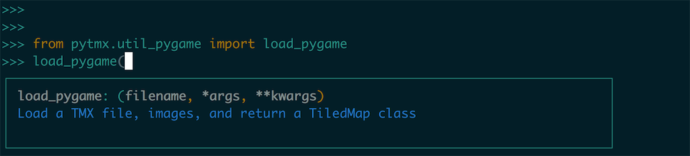
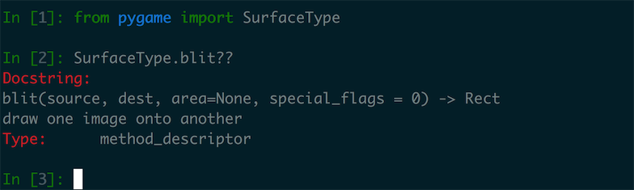

# AI Game FightTheater


### 渲染背景、抽出方法

在上一节之后我们介绍了 **瓦片地图** 相关中的知识，使用瓦片地图创造游戏的地图是一种游戏开发常有的手段，比如比较流行的 Cocos2d-X 游戏引擎也是使用自带地图解析器处理瓦片地图的数据渲染，这里说处理瓦片地图的数据的意思是指瓦片地图其实并不是一种图片格式，而本质上是一种文本格式，这里我们可以看一下刚才的 `background_x2.tsx` 和 `game.tmx` 的内容就知道了：

::: collapse background_x2.tsx

``` xml
<?xml version="1.0" encoding="UTF-8"?>
<tileset name="background_x2" tilewidth="32" tileheight="32" tilecount="240" columns="24">
 <image source="background_x2.png" width="768" height="320"/>
</tileset>
```

:::

tsx 图片资源文件格式很简单，定义了引入图片资源的路径、宽高、块的宽高。

::: collapse game.tmx

``` xml
<?xml version="1.0" encoding="UTF-8"?>
<map version="1.0" tiledversion="1.1.2" orientation="orthogonal" renderorder="left-up" width="30" height="20" tilewidth="32" tileheight="32" infinite="0" nextobjectid="1">
 <tileset firstgid="241" source="background_x2.tsx"/>
 <layer name="ground color" width="30" height="20">
  <data encoding="csv">
295,295,295,295,295,295,295,295,295,295,295,295,295,295,295,295,295,295,295,295,295,295,295,295,295,295,295,295,295,295,
295,295,295,295,295,295,295,295,295,295,295,295,295,295,295,295,295,295,295,295,295,295,295,295,295,295,295,295,295,295,
295,295,295,295,295,295,295,295,295,295,295,295,295,295,295,295,295,295,295,295,295,295,295,295,295,295,295,295,295,295,
295,295,295,295,295,295,295,295,295,295,295,295,295,295,295,295,295,295,295,295,295,295,295,295,295,295,295,295,295,295,
    ....
```

:::

tmx 瓦片文件里面的处理块的宽高和其他一些基本的信息之外，data 的信息是一个非常大的二维矩阵，里面的数字代表了瓦片的素材块的编号。

在了解了这两种地图所需文件的结构之后，我们就要试图把我们定义的图像渲染到屏幕当中去，Pygame 并没有直接提供瓦片地图的解析方式，这里我们选用了一个第三方库 pyTMX ，在预备工作里我们已经把这个内容写到了 `requirements.txt` 的依赖之中，我们可以这样来使用瓦片地图：

``` python
from pytmx.util_pygame import load_pygame
game_map = load_pygame(game_settings.MAP_DIR)
```

我们从 `pytmx.util_pygame` 之中导入一个函数 `load_pygame` 这个方法接受一个地图路径的参数：



我们返回的结果是一个 TiledMap 对象，TiledMap 的图片分为很多的层次，我们想要做的事情就是把瓦片地图每一层、每一块瓦片取出来绘制在屏幕上面：

``` python
def draw_background_with_tiled_map(game_screen, game_map):
    # draw map data on screen
    for layer in game_map.visible_layers:
        for x, y, gid, in layer:
            tile = game_map.get_tile_image_by_gid(gid)
            if not tile:
                continue

            game_screen.blit(
                tile,
                (x * game_map.tilewidth,
                 y * game_map.tileheight)
            )
```

这里我们编写了这样一个方法 `draw_background_with_tiled_map` 接受两个参数一个是游戏的屏幕 surface 对象，另一个就是我们加载的 TiledMap，这个方法之中我们看起来是很简洁明快的，两层的 `for-in` 循环：

1. 第一层处理所有的 layer 就是 Map 的分层。
2. 第二层我们遍历整个 layer 取出所有的瓦片块，`x, y, gid` 代表了每块瓦片的横纵坐标和 id 值。
3. 之后我们再通过 `get_tile_image_by_gid` 来通过 gid 获取 tile 图像。
4. 如果能获取对应瓦片对象，我们使用 `blit()` 方法把这个瓦片绘制到屏幕上面。

`blit()` 和我们之前接触 `fill()` 方法同样都是屏幕绘制的 API，不同于 `fill` 是给屏幕填充成一种颜色，blit 这个方法的用途是把一张图片绘制到屏幕的一个位置：



