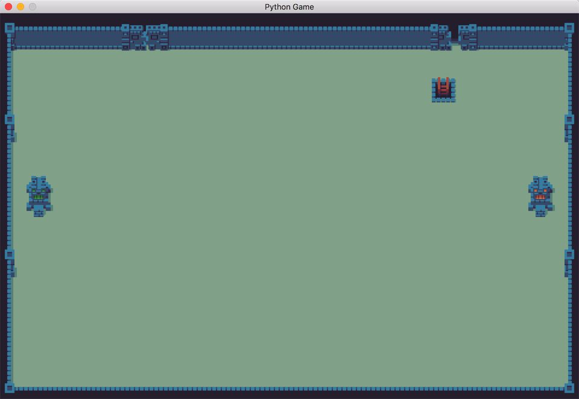
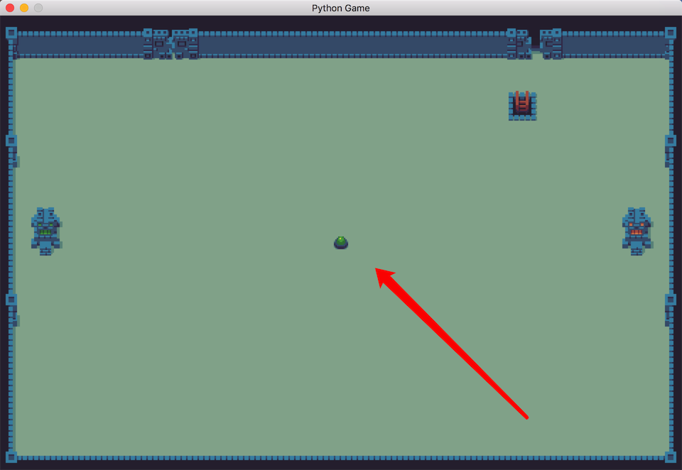
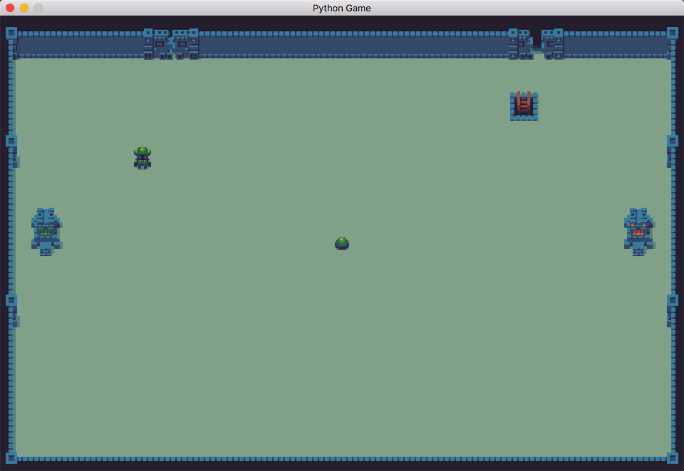

# AI Game FightTheater


### 渲染背景、抽出方法

在上一节之后我们介绍了 **瓦片地图** 相关中的知识，使用瓦片地图创造游戏的地图是一种游戏开发常有的手段，比如比较流行的 Cocos2d-X 游戏引擎也是使用自带地图解析器处理瓦片地图的数据渲染，这里说处理瓦片地图的数据的意思是指瓦片地图其实并不是一种图片格式，而本质上是一种文本格式，这里我们可以看一下刚才的 `background_x2.tsx` 和 `game.tmx` 的内容就知道了：

::: collapse background_x2.tsx

``` xml
<?xml version="1.0" encoding="UTF-8"?>
<tileset name="background_x2" tilewidth="32" tileheight="32" tilecount="240" columns="24">
 <image source="background_x2.png" width="768" height="320"/>
</tileset>
```

:::

tsx 图片资源文件格式很简单，定义了引入图片资源的路径、宽高、块的宽高。

::: collapse game.tmx

``` xml
<?xml version="1.0" encoding="UTF-8"?>
<map version="1.0" tiledversion="1.1.2" orientation="orthogonal" renderorder="left-up" width="30" height="20" tilewidth="32" tileheight="32" infinite="0" nextobjectid="1">
 <tileset firstgid="241" source="background_x2.tsx"/>
 <layer name="ground color" width="30" height="20">
  <data encoding="csv">
295,295,295,295,295,295,295,295,295,295,295,295,295,295,295,295,295,295,295,295,295,295,295,295,295,295,295,295,295,295,
295,295,295,295,295,295,295,295,295,295,295,295,295,295,295,295,295,295,295,295,295,295,295,295,295,295,295,295,295,295,
295,295,295,295,295,295,295,295,295,295,295,295,295,295,295,295,295,295,295,295,295,295,295,295,295,295,295,295,295,295,
295,295,295,295,295,295,295,295,295,295,295,295,295,295,295,295,295,295,295,295,295,295,295,295,295,295,295,295,295,295,
    ....
```

:::

tmx 瓦片文件里面的处理块的宽高和其他一些基本的信息之外，data 的信息是一个非常大的二维矩阵，里面的数字代表了瓦片的素材块的编号。

在了解了这两种地图所需文件的结构之后，我们就要试图把我们定义的图像渲染到屏幕当中去，Pygame 并没有直接提供瓦片地图的解析方式，这里我们选用了一个第三方库 pyTMX ，在预备工作里我们已经把这个内容写到了 `requirements.txt` 的依赖之中，我们可以这样来使用瓦片地图：

``` python
from pytmx.util_pygame import load_pygame
game_map = load_pygame(game_settings.MAP_DIR)
```

我们从 `pytmx.util_pygame` 之中导入一个函数 `load_pygame` 这个方法接受一个地图路径的参数：


我们返回的结果是一个 TiledMap 对象，TiledMap 的图片分为很多的层次，我们想要做的事情就是把瓦片地图每一层、每一块瓦片取出来绘制在屏幕上面：

``` python
def draw_background_with_tiled_map(game_screen, game_map):
    # draw map data on screen
    for layer in game_map.visible_layers:
        for x, y, gid, in layer:
            tile = game_map.get_tile_image_by_gid(gid)
            if not tile:
                continue

            game_screen.blit(
                tile,
                (x * game_map.tilewidth,
                 y * game_map.tileheight)
            )
```

这里我们编写了这样一个方法 `draw_background_with_tiled_map` 接受两个参数一个是游戏的屏幕 surface 对象，另一个就是我们加载的 TiledMap，这个方法之中我们看起来是很简洁明快的，两层的 `for-in` 循环：

1. 第一层处理所有的 layer 就是 Map 的分层。
2. 第二层我们遍历整个 layer 取出所有的瓦片块，`x, y, gid` 代表了每块瓦片的横纵坐标和 id 值。
3. 之后我们再通过 `get_tile_image_by_gid` 来通过 gid 获取 tile 图像。
4. 如果能获取对应瓦片对象，我们使用 `blit()` 方法把这个瓦片绘制到屏幕上面。

`blit()` 和我们之前接触 `fill()` 方法同样都是屏幕绘制的 API，不同于 `fill` 是给屏幕填充成一种颜色，blit 这个方法的用途是把一张图片绘制到屏幕的一个位置：


从注释我们能看出接受的最小参数有两个：

1. source 是我们绘制的图像
2. dest 是一个矩阵，代表我们想要绘制的目标位置：

``` 
(x * game_map.tilewidth, y * game_map.tileheight)
```

另外就是我们要调用这段代码，还要确定瓦片地图的位置，比如这里我们就把瓦片地图放在 `img/` 文件夹下面，我们的路径配置在 `Settings` 文件中：

``` python
import os

class Settings(object):

    def __init__(self):
        """initialize the settings of game."""
        # ...
        self.BASE_DIR = os.path.dirname(os.path.dirname(os.path.abspath(__file__)))
        self.MAP_DIR = os.path.join(self.BASE_DIR, "img/game.tmx")
```

我们使用 `os` 的 path 导入这个文件路径，我们首先创建了一个 `BASE_DIR` 这个路径，这个方法我们写的看起来有点麻烦但是解释起来也很方便：

1. `__file__` 是一个内置的 magic object 代表当前模块的文件路径。
2. `os.path.abspath(__file__)` 是获得当前代码文件的抽象路径。
3. `os.path.dirname()` 是返回当前文件所在的文件夹名字，那么两层嵌套的 `dirname` 就是两层之外的名字，在这个 Project 代表了项目的根路径。

接着我们使用了另一个文件 API `os.path.join` 用来拼接文件的路径，我们获取到了地图的路径，project 根路径下的 `img/game.tmx` 这个文件。那么我们为什么要通过这种看起来略有麻烦的方法来获取路径呢？因为这是一种比较通用的方法，无论我们的路径在哪里，主要 Settings 和 img 的相对路径不变，我们就能通过这种方式获取到路径。

``` python
game_map = load_pygame(game_settings.MAP_DIR)
draw_background_with_tiled_map(game_screen, game_map)
```

我们应用这段代码就可以绘制出我们一副静态的瓦片地图。启动程序的全部代码如下：

::: collapse starter.py 现在的代码

``` python
import pygame
from pytmx.util_pygame import load_pygame

from settings import game_settings


def draw_background_with_tiled_map(game_screen, game_map):
    # draw map data on screen
    for layer in game_map.visible_layers:
        for x, y, gid, in layer:
            tile = game_map.get_tile_image_by_gid(gid)
            if not tile:
                continue

            game_screen.blit(
                tile,
                (x * game_map.tilewidth,
                 y * game_map.tileheight)
            )

def game_loop():
    game_exit = False
    pygame.init()
    game_screen = pygame.display.set_mode(
        game_settings.SCREEN_SIZE,
    )
    game_map = load_pygame(game_settings.MAP_DIR)
    draw_background_with_tiled_map(game_screen, game_map)

    while not game_exit:
        for event in pygame.event.get():
            if event.type == pygame.QUIT:
                game_exit = True
        pygame.display.update()

```

:::

屏幕渲染出的效果是这样的，我们已经有一个背景的地图了：



那我们的代码已经可以正常的 run 了，但是我们的启动部分的代码就未免太过复杂了，虽然这里我们除了主循环函数之外仅仅加入了一个函数，但是我们会知道在接下来的开发之中我们会不断的加入游戏方法，所以我们现在就要对这些方法进行简单的解耦，我们把 `draw_background_with_tiled_map` 移动到 `game_funcs.py` 模块之中，这个模块就单纯用来处理游戏的一些逻辑，拆分之后的两个文件如下：

::: collapse 拆分出的starter.py

``` python
import pygame
from pytmx.util_pygame import load_pygame

from game.game_funcs import draw_background_with_tiled_map
from settings import game_settings


def game_loop():
    game_exit = False
    pygame.init()
    pygame.display.set_caption('Python Game')
    game_screen = pygame.display.set_mode(
        game_settings.SCREEN_SIZE,
    )
    game_map = load_pygame(game_settings.MAP_DIR)
    draw_background_with_tiled_map(game_screen, game_map)

    while not game_exit:
        for event in pygame.event.get():
            if event.type == pygame.QUIT:
                game_exit = True
        pygame.display.update()
```

:::

------

::: collapse 拆分后的game_funcs.py

``` python
import os
from settings import game_settings


def draw_background_with_tiled_map(game_screen, game_map):
    # draw map data on screen
    for layer in game_map.visible_layers:
        for x, y, gid, in layer:
            tile = game_map.get_tile_image_by_gid(gid)
            if not tile:
                continue

            game_screen.blit(
                tile,
                (x * game_map.tilewidth,
                 y * game_map.tileheight)
            )

```

:::


## 添加精灵对象

在我们已经把背景的场景地图绘制在屏幕上面了，这时候我们就要试图把精灵（Sprite）或者说是游戏中出现的实体对象绘制在屏幕上面，其实这里我们绘制任何对象的方法是一致的都是使用相关基础的绘制 API 方法，比如我们使用的 `fill()` ，`blit()` 这样的方法来进行绘制，这里我们可以先定义出一个游戏对象的基类所拥有的方法：

``` python
class Entity(object):
    def __init__(self, name, image):
				pass
    def render(self, surface):
				pass
```
我们可以设定这样的一个基类对象所拥有的基础的方法，我们接受两个参数，name 代表的是 Entity 的类型名，而 image 是绘制对象的 image 图像。另外我们还需要一个通用的 `render()` 方法，接受的 surface 参数代表了 screen ，也就是我们之前生成的那个 `game_screen` ：

``` python
    game_screen = pygame.display.set_mode(
        game_settings.SCREEN_SIZE,
    )
```

我们的 `render` 函数都要接收到全局的 screen 对象然后对我们的屏幕进行绘制。

这里我们为 Entity 增加更为详细的数据设定：

``` python
from gameobjects.vector2 import Vector2

class Entity(object):
    def __init__(self, name, image):
        self.id = 0
        self.name = name
        self.image = image
        self.location = Vector2(game_settings.SCREEN_WIDTH / 2, game_settings.SCREEN_HEIGHT / 2)
        self.size = self.image.get_size()

    def render(self, surface):
        x, y = self.location
        w, h = self.size
        surface.blit(
            self.image,
            (x - w / 2, y - h / 2),
        )
```

这个实现非常的简单，包含对象的 id，对象的图片，对象的类型名，我们还用用 Vector2 （包含在我们安装的 gameobjects 库中）表示了一个坐标位置作为一个对象的 Location。另外 `render` 的函数的实现很简单我们获得对象的位置和尺寸，使用 `blit()` 把这个对象绘制在了屏幕上面，绘制的位置根据坐标和尺寸进行了计算得出。

这个 `Entity` 类只是一个抽象类型的基类，根据我们还要根据我们的需要去派生出一些更为定制化的派生类，我们之前在对游戏的介绍中提到了，我们的游戏对象包括能量石和英雄这两种对象，我们现在就先来创建一个派生类 EnergyStone：

``` python
class EnergyStone(Entity):
    def __init__(self, image, energy_type):
        super(EnergyStone, self).__init__("energy", image)
        self.energy_type = energy_type
```

`EnergyStone` 是一个 Entity 的派生类，代表游戏中的能量石，这里我们在继承的时候，复写了 name "energy"，增加了一个能量石的类型。创建出了这个实体派生类，我们试着把这个对象绘制在屏幕上面，我们先来在 `game_func.py` 之中添加一个加载图片方法：

``` python
def load_alpha_image(resource_img):
    path = os.path.join(
        game_settings.BASE_DIR,
        'img/{}'.format(resource_img),
    )

    return pygame.image.load(path)
```

这个方法非常的简单，我们的 path 还是使用 `join` 拼接出的路径，之后使用 `pygame.image.load()` 方法加载资源文件。

> Tips Sprite 图片
>
> 各个游戏对象的图片我们也在 `img/` 的路径之下进行了提供，比如这里我们使用的绿色精灵石图片为：
>
> [green_energy.png](https://github.com/lfkdsk/FighterTheater/blob/master/img/green_energy.png) 

添加这个图片加载函数之后我们就可以直接使用资源图片的名字来加载资源，我们接下来的代码就可以直接把那个绿色的精灵石对象绘制在屏幕上面：

``` python
green_energy_img = load_alpha_image('green_energy.png')
energy_stone = EnergyStone(green_energy_img, 'green-stone')

while not game_exit:
  # ... 省略
  energy_stone.runder(game_screen)
	pygame.display.update()
```

渲染出的效果是这个样子的：



这个绿色的 EnergyStone 就被成功的渲染到了屏幕上去了，位置是我们在 Entity 里面配置的默认的 location 在屏幕的中间。接下来我们可以来添加一下 Hero 的派生类实现，我们现在对 Hero 对象的要求没有什么特殊的需求，所以我们就添加一些有必要的属性配置就好了：

``` python
class Hero(Entity):
    def __init__(self, image, dead_image, hero_type):
        self.dead_image = dead_image
        self.health = 25
        self.carry_energy_store = None
        self.hero_type = hero_type
```

我们接受的输入参数又增加了一个，我们需要 Hero 的图像之外还需要死亡的图像和 Hero 的阵营类型。在属性中还包括血量值和是否在搬运能量石的状态判断。我们暂时没有对 `render()` 方法进行配置，所以本质上精灵对象暂时也只能显示出一个图像而已，我们来显示一个看看：

``` python
    green_hero_img = load_alpha_image('green_hero.png')
    graves_img = load_alpha_image('graves.png')
    green_hero = Hero(green_hero_img, graves_img, 'green-hero')
    green_hero.location = Vector2(200, 200)
```
之后这个 `green_hero` 我们也在 while 循环之中调用这个对象的 `render` 方法进行绘制，我们会看到这样的样式：



屏幕在 200*200 的位置绘制了一个绿色的 Hero 对象。

::: collapse 目前的 entites.py

``` python
class Entity(object):
    def __init__(self, name, image):
        self.id = 0
        self.name = name
        self.image = image
        self.location = Vector2(game_settings.SCREEN_WIDTH / 2, game_settings.SCREEN_HEIGHT / 2)
        self.size = self.image.get_size()

    def render(self, surface):
        x, y = self.location
        w, h = self.size
        surface.blit(
            self.image,
            (x - w / 2, y - h / 2),
        )

class EnergyStone(Entity):
    def __init__(self, image, energy_type):
        super(EnergyStone, self).__init__("energy", image)
        self.energy_type = energy_type


class Hero(Entity):
    def __init__(self, image, dead_image, hero_type):
        super(Hero, self).__init__("hero", image)
        self.dead_image = dead_image
        self.health = 25
        self.carry_energy_store = None
        self.hero_type = hero_type
```

:::

::: collapse 显示两个对象的 starter.py

``` python
import pygame
from gameobjects.vector2 import Vector2
from pytmx.util_pygame import load_pygame

from game.entities import EnergyStone, Hero
from game.game_funcs import draw_background_with_tiled_map, load_alpha_image
from settings import game_settings


def game_loop():
    game_exit = False
    pygame.init()
    pygame.display.set_caption('Python Game')
    game_screen = pygame.display.set_mode(
        game_settings.SCREEN_SIZE,
    )
    game_map = load_pygame(game_settings.MAP_DIR)
    draw_background_with_tiled_map(game_screen, game_map)
    green_energy_img = load_alpha_image('green_energy.png')
    energy_stone = EnergyStone(green_energy_img, 'green-stone')

    green_hero_img = load_alpha_image('green_hero.png')
    graves_img = load_alpha_image('graves.png')
    green_hero = Hero(green_hero_img, graves_img, 'green-hero')
    green_hero.location = Vector2(200, 200)

    while not game_exit:
        for event in pygame.event.get():
            if event.type == pygame.QUIT:
                game_exit = True

        energy_stone.render(game_screen)
        green_hero.render(game_screen)

        pygame.display.update()

```

:::

