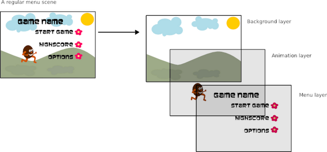
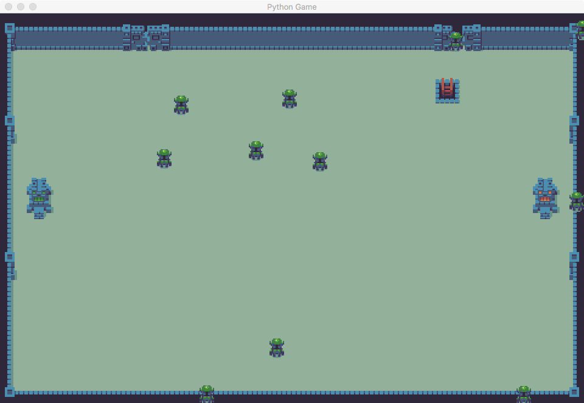

# AI Game FightTheater


## 使用 World 创建生命周期

在上面的一个章节之中我们把两个对象绘制到了屏幕上面去，我们走出了第一步，但是如果每当我们添加一个对象的时候都要在 while 循环里面调用一个 `render` 方法，我们明显不能为每个创建的对象调用这个 `render` 方法，那么我们就要有一个统筹的方法来设计游戏的生命周期。

为此我们设计了一个 `World` 类来进行生命周期的管理：

``` python
class World(object):
    def __init__(self, screen):
			# 包含世界中全部的精灵对象的处理
      # 还要包含瓦片背景的初始化
   	def render(self, surface):
      # 为每一个对象调用 render 对象
    
    # 还要包含为世界增加、消灭对象的方法
```

我们先实现 World 中的一部分初始化的代码：

``` python
class World(object):
    def __init__(self, screen):
        # 全部的精灵对象
        self.entities = {}
        # current entity id
        self.entity_id = 0
        # 加载地图
        self.game_map = load_pygame(game_settings.MAP_DIR)
        self.background_layer = Surface(game_settings.SCREEN_SIZE).convert_alpha()
        self.player_layer = Surface(game_settings.SCREEN_SIZE).convert_alpha()
        self.player_layer.fill((0, 0, 0, 0))
        # initial double-side heroes
        draw_background_with_tiled_map(self.background_layer, self.game_map)
        screen.blit(self.background_layer, game_settings.SCREEN_SIZE)
```

和刚才说的一样我们在 World 的初始化方法之中，添加了管理对象的一些属性，并且加载了我们之前使用的 **瓦片地图** 的内容。这里的绘制方法和之前看起来相比有一些复杂：



我们在 World 里面创建了两个 Layer （分层），用来处理不同的事情，一个是 `background_layer` 专门用来绘制瓦片地图的背景，由于我们对背景没有什么改变，所以不用重复在 while 循环里面反复的渲染重绘，之后我们又创建了一个 `player_layer` 这个分层单独用来绘制全部的游戏对象，这个层次的背景是透明的（`(0, 0, 0, 0)` 的不透明度是 0 因此是透明的） ，`player_layer` 只用来绘制精灵，而背景要从下面的一层之中显示，因此 `player_layer` 的背景要是透明的。

再下面我们来看 World 的 `render()` 方法：

``` python
    def render(self, surface):
        self.player_layer.fill((0, 0, 0, 0))

        # render entities
        for entity in self.entities.values():
            entity.render(self.player_layer)

        # render_score_message(self.player_layer)
        surface.blit(self.background_layer, (0, 0))
        surface.blit(self.player_layer, (0, 0))
```

`render()` 方法是用来在 `While` 循环之中进行刷新重绘的，因此在每次重绘都会把 `player_layer` 清空成透明。之后我们会对 `entities` 里面所有的对象调用绘制，这里我们会注意到我们在调用 `entity.render()` 的时候使用的 Surface 对象是 `player_layer` ，而不是传入的 surface。这也说明我们确实把对象都绘制到了对象层。

在之后的两行就体现出了我们 World 分层的实现方式：

``` python
        surface.blit(self.background_layer, (0, 0))
        surface.blit(self.player_layer, (0, 0))
```

我们在全局的 surface 上面进行绘制，先绘制的背景层次，然后再绘制的对象层次。

之后我们再添加一对方法用来向世界添加 Hero 对象和移除 Hero 对象：

``` python
    def add_entity(self, entity):
        self.entities[self.entity_id] = entity
        entity.id = self.entity_id
        self.entity_id += 1

    def remove_entity(self, entity):
        del self.entities[entity.id]
```

`add_entity` 使用 `entity_id` 这个字段来管理当前创建的对象的 id 数目，而 `remove_entity` 就是删除对应 ID 的对象。这里我们来对这个 World 类进行一下测试，我们写一个向 World 随机生成 Hero 对象的方法：

``` python
def random_create(world):
    from game.entities import Hero
    green_hero_img = load_alpha_image('green_hero.png')
    graves_img = load_alpha_image('graves.png')

    for _ in range(0, 11):
        randX, randY = randint(0, game_settings.SCREEN_WIDTH), randint(0, game_settings.SCREEN_HEIGHT)
        hero = Hero(world, green_hero_img, graves_img, 'green')
        hero.location = Vector2(randX, randY)
        hero.name = 'green-hero'
        world.add_entity(hero)
```

这里我们使用 `for-in` 循环使用 `randint` 方法创建了分布在全局的随机位置，之后这些 Hero 对象都会被通过 `add_entity` 方法添加到 World 之中，我们在 `starter.py` 的 `While` 循环之中只要调用 World 的 render 函数就可以使用了：

``` python
    game_world = World(game_screen)
    random_create(game_world)

    while not game_exit:
        for event in pygame.event.get():
            if event.type == pygame.QUIT:
                game_exit = True
                
        game_world.render(game_screen)
        pygame.display.update()
```

运行的结果：



可以看到 Hero 对象那个随机的出现在屏幕的各个位置。

::: collapse starter.py

``` python
import pygame

from game.game_funcs import random_create
from settings import game_settings
from world import World


def game_loop():
    game_exit = False

    pygame.init()
    pygame.display.set_caption('Python Game')
    game_screen = pygame.display.set_mode(
        (game_settings.SCREEN_WIDTH, game_settings.SCREEN_HEIGHT),
    )
    game_world = World(game_screen)
    random_create(game_world)

    while not game_exit:
        for event in pygame.event.get():
            if event.type == pygame.QUIT:
                game_exit = True
        game_world.render(game_screen)

        pygame.display.update()

```

:::

::: collapse world.py

``` python
class World(object):
    def __init__(self, screen):
        self.entities = {}
        self.entity_id = 0
        self.game_map = load_pygame(game_settings.MAP_DIR)
        self.background_layer = Surface(game_settings.SCREEN_SIZE).convert_alpha()
        self.player_layer = Surface(game_settings.SCREEN_SIZE).convert_alpha()
        self.player_layer.fill((0, 0, 0, 0))
        # initial double-side heroes
        draw_background_with_tiled_map(self.background_layer, self.game_map)
        screen.blit(self.background_layer, game_settings.SCREEN_SIZE)
        
    def add_entity(self, entity):
        self.entities[self.entity_id] = entity
        entity.id = self.entity_id
        self.entity_id += 1

    def remove_entity(self, entity):
        del self.entities[entity.id]

    def render(self, surface):
        self.player_layer.fill((0, 0, 0, 0))

        for entity in self.entities.values():
            entity.render(self.player_layer)

        surface.blit(self.background_layer, (0, 0))
        surface.blit(self.player_layer, (0, 0))
        
```

:::

::: collapse game_funcs.py

``` python
import os
from random import randint

import datetime
import pygame
from gameobjects.vector2 import Vector2

from settings import game_settings

def draw_background_with_tiled_map(game_screen, game_map):
    # draw map data on screen
    for layer in game_map.visible_layers:
        for x, y, gid, in layer:
            tile = game_map.get_tile_image_by_gid(gid)
            if not tile:
                continue

            game_screen.blit(
                tile,
                (x * game_map.tilewidth,
                 y * game_map.tileheight)
            )


def load_alpha_image(resource_img):
    path = os.path.join(
        game_settings.BASE_DIR,
        'img/{}'.format(resource_img),
    )

    return pygame.image.load(path)

def random_create(world):
    from game.entities import Hero
    green_hero_img = load_alpha_image('green_hero.png')
    graves_img = load_alpha_image('graves.png')

    for _ in range(0, 11):
        randX, randY = randint(0, game_settings.SCREEN_WIDTH), randint(0, game_settings.SCREEN_HEIGHT)
        hero = Hero(world, green_hero_img, graves_img, 'green')
        hero.location = Vector2(randX, randY)
        hero.name = 'green-hero'
        world.add_entity(hero)
  
```

:::


## 完善辅助方法

在让我们的游戏设计 AI 之前要完善游戏各个部分的属性和方法以便于我们创建的自动机 AI 能够对他们进行调用和处理，首先我们来实现 Entity 基类的方法实现：

``` python
class Entity(object):
    def __init__(self, world, name, image):
        self.id = 0
        self.name = name
        self.world = world
        self.image = image
        self.location = Vector2(game_settings.SCREEN_WIDTH / 2, game_settings.SCREEN_HEIGHT / 2)
        self.destination = Vector2(0, 0)
        self.speed = 0.0
        # self.brain = StateMachine()
        self.size = self.image.get_size()

    def render(self, surface):
        x, y = self.location
        w, h = self.size
        surface.blit(
            self.image,
            (x - w / 2, y - h / 2),
        )

    def process(self, time_passed):
        # self.brain.think()
        if self.speed > 0.0 and self.location != self.destination:
            vec_to_destination = self.destination - self.location
            distance_to_destination = vec_to_destination.get_length()
            heading = vec_to_destination.get_normalized()
            travel_distance = min(distance_to_destination, time_passed * self.speed)
            self.location += travel_distance * heading

```

这里我们为 Entity 的基类添加了 `speed` 速度，`destination` 目的，还有一个 `process` 的函数，其中主要进行的逻辑就是如果对象有速度，并且没有到达目的地的时候就通过三角函数计算位置，并且推进对象的当前位置。从这个方法的功能我们能看出来这个方法被调用之后对象就会改变位置。

接着我们定义 Hero 的其余 render 函数实现：

``` python
    def render(self, surface):
        if self.health > 0:
            self._draw_health_number(surface)

        Entity.render(self, surface)

        if not self.carry_energy_store:
            return

        self._draw_if_carry_energy(surface)
```

我们根据 Hero 的 health 生命值在 Hero 对象的头上绘制出一个生命值的 “血条”，之后如果我们的 Hero 携带了一个 Energy Stone ，就把那个能量石通过 `_draw_if_carry_energy` 绘制在 Hero 的身上。

我们还要为 World 方法添加一些辅助的方法，首先是 World 之中也要有对能量石的管理，我们给 World 添加一套和对 Hero 管理相同的方法：

``` python
    def get_energy_store(self, energy_id):
        if energy_id in self.energy_stores.keys():
            return self.energy_stores[energy_id]

        return None

    def add_energy_store(self, store):
        self.energy_stores[self.entity_id] = store
        store.id = self.entity_id
        self.entity_id += 1

    def remove_energy_store(self, store):
        if store in self.energy_stores.values():
            del self.energy_stores[store.id]
```

还有连个辅助方法用来计算距离某个位置最近的 Hero 或者是 EnergyStone ：

``` python
    def get_close_entity(self, name, location, search_range=100.0):
        location = Vector2(*location)
        for entity in self.entities.values():
            if entity.name == name:
                distance = location.get_distance_to(entity.location)
                if distance < search_range:
                    return entity

        return None

    def get_close_energy(self, location, search_range=100.0):
        location = Vector2(*location)
        for entity in self.energy_stores.values():
            distance = location.get_distance_to(entity.location)
            if distance < search_range:
                return entity

        return None
```

这我们根据 location 位置，对里面的 Heroes 或者是 EnergyStones 进行遍历如果有小于 Range 距离的，返回对应的搜索结果。

::: collapse world.py

``` python
from gameobjects.vector2 import Vector2
from pygame.surface import Surface
from pytmx.util_pygame import load_pygame

from game_funcs import draw_background_with_tiled_map
from settings import game_settings


class World(object):
    def __init__(self, screen):
        self.entities = {}
        self.entity_id = 0
        self.energy_stores = {}
        self.game_map = load_pygame(game_settings.MAP_DIR)
        self.hero_nums = {"green": 0, "red": 0}
        self.background_layer = Surface(game_settings.SCREEN_SIZE).convert_alpha()
        self.player_layer = Surface(game_settings.SCREEN_SIZE).convert_alpha()
        self.player_layer.fill((0, 0, 0, 0))
        # initial double-side heroes
        draw_background_with_tiled_map(self.background_layer, self.game_map)
        screen.blit(self.background_layer, game_settings.SCREEN_SIZE)

    def add_entity(self, entity):
        self.entities[self.entity_id] = entity
        entity.id = self.entity_id
        self.entity_id += 1
        self.hero_nums[entity.hero_type] += 1

    def remove_entity(self, entity):
        self.hero_nums[entity.hero_type] -= 1
        del self.entities[entity.id]

    def get(self, entity_id):
        if entity_id in self.entities:
            return self.entities[entity_id]

        return None

    def process(self, time_passed):
        time_passed_seconds = time_passed / 1000.0
        for entity in self.entities.values():
            entity.process(time_passed_seconds)

    def render(self, surface):
        surface.fill((255, 255, 255))
        self.player_layer.fill((0, 0, 0, 0))

        # render entities
        for entity in self.energy_stores.values():
            entity.render(self.player_layer)

        for entity in self.entities.values():
            entity.render(self.player_layer)

        render_score_message(self.player_layer)
        surface.blit(self.background_layer, (0, 0))
        surface.blit(self.player_layer, (0, 0))

    def get_close_entity(self, name, location, search_range=100.0):
        location = Vector2(*location)
        for entity in self.entities.values():
            if entity.name == name:
                distance = location.get_distance_to(entity.location)
                if distance < search_range:
                    return entity

        return None

    def get_close_energy(self, location, search_range=100.0):
        location = Vector2(*location)
        for entity in self.energy_stores.values():
            distance = location.get_distance_to(entity.location)
            if distance < search_range:
                return entity

        return None

    def get_energy_store(self, energy_id):
        if energy_id in self.energy_stores.keys():
            return self.energy_stores[energy_id]

        return None

    def add_energy_store(self, store):
        self.energy_stores[self.entity_id] = store
        store.id = self.entity_id
        self.entity_id += 1

    def remove_energy_store(self, store):
        if store in self.energy_stores.values():
            del self.energy_stores[store.id]

    def min_hero_type(self):
        if self.hero_nums['red'] < self.hero_nums['green']:
            return 'red'

        return 'green'
```

:::

::: collapse entities.py

``` python
from game_funcs import display_message
from states import *


class Entity(object):
    def __init__(self, world, name, image):
        self.id = 0
        self.name = name
        self.world = world
        self.image = image
        self.location = Vector2(game_settings.SCREEN_WIDTH / 2, game_settings.SCREEN_HEIGHT / 2)
        self.destination = Vector2(0, 0)
        self.speed = 0.0
        # self.brain = StateMachine()
        self.size = self.image.get_size()

    def render(self, surface):
        x, y = self.location
        w, h = self.size
        surface.blit(
            self.image,
            (x - w / 2, y - h / 2),
        )

    def process(self, time_passed):
        # self.brain.think()
        if self.speed > 0.0 and self.location != self.destination:
            vec_to_destination = self.destination - self.location
            distance_to_destination = vec_to_destination.get_length()
            heading = vec_to_destination.get_normalized()
            travel_distance = min(distance_to_destination, time_passed * self.speed)
            self.location += travel_distance * heading


class EnergyStore(Entity):
    def __init__(self, world, image, energy_type):
        super(EnergyStore, self).__init__(world, "energy", image)
        self.energy_type = energy_type


class Hero(Entity):
    def __init__(self, world, image, dead_image, hero_type):
        super(Hero, self).__init__(world, "hero", image)
        self.dead_image = dead_image
        self.health = 25
        self.carry_energy_store = None
        self.hero_type = hero_type

    def carry(self, image):
        self.carry_energy_store = image

    def drop(self, surface):
        if not self.carry_energy_store:
            return

        self._draw_if_carry_energy(surface)
        self.carry_energy_store = None

    def bitten(self):
        self.health -= 2
        self.speed = 140.

        if self.health <= 0:
            self.speed = 0.
            self.image = self.dead_image

    def dead(self):
        x, y = self.location
        w, h = self.image.get_size()
        background = self.world.background_layer
        background.blit(
            self.dead_image,
            (x - w, y - h / 2),
        )

    def get_enemy_type(self):
        return 'red-hero' if self.hero_type == 'green' else 'green-hero'

    def in_center(self):
        return game_settings.RIGHT_HOME_LOCATION[0] > self.location.x > game_settings.LEFT_HOME_LOCATION[0]

    def get_home_location(self):
        if self.hero_type == 'green':
            return game_settings.LEFT_HOME_LOCATION

        return game_settings.RIGHT_HOME_LOCATION

    def add_energy_score(self):
        if self.hero_type == 'green':
            game_settings.left_score += game_settings.DEFAULT_SCORE
        else:
            game_settings.right_score += game_settings.DEFAULT_SCORE

    def render(self, surface):
        if self.health > 0:
            self._draw_health_number(surface)

        self._draw_state_machine(surface)
        Entity.render(self, surface)

        if not self.carry_energy_store:
            return

        self._draw_if_carry_energy(surface)

    def _draw_if_carry_energy(self, surface):
        x, y = self.location
        w, h = self.carry_energy_store.get_size()
        surface.blit(self.carry_energy_store, (x - w, y - h / 2))

    def _draw_health_number(self, surface):
        x, y = self.location
        w, h = self.image.get_size()
        bar_x, bar_y = x - w / 2, y - h / 2 - 6

        surface.fill(
            game_settings.HEALTH_COLOR,
            (bar_x, bar_y, game_settings.MAX_HEALTH, 4),
        )
        surface.fill(
            game_settings.HEALTH_COVER_COLOR,
            (bar_x, bar_y, self.health, 4),
        )
```

:::

