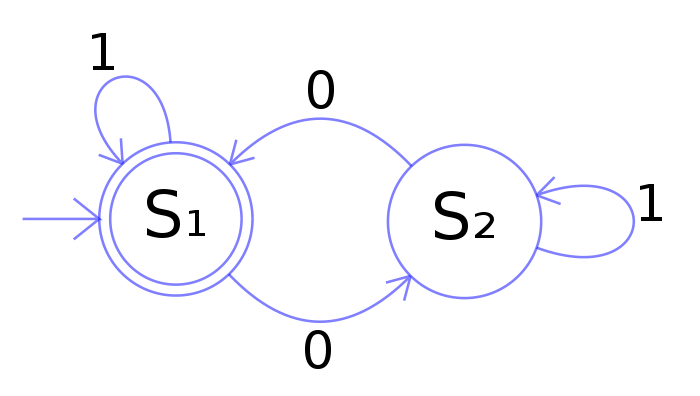

## 添加自动机

> **有限状态机编程**（**英语：FSM-based programming**）大致上等同于自动机编程，但有限状态机编程专指以有限状态机为模型的程序。
>
> 自动机编程有以下的二项特征：
>
> 1. 程序运行的时间中可以清楚划分成数个自动机的步骤（step），每一个步骤即为一个程序区块，有单一的进入点，可以是一个函数或其他程序。若有需要时，程序区块可以再依其状态的不同，划分为子区块。
> 2. 不同步骤的程序区块只能通过一组清楚标示的变量交换信息，这些变量称为状态（state），使用自动机编程的程序不能用其他不显然可见的方式标示状态，例如区域变量的数值、回传地址、目前程序指针的位置等。因此一程序在任二个不同时间下的差异，只有状态数值的不同，其余都相同。
>
> 自动机编程的运行过程是一个由自动机步骤形成的循环。



自动机就是由这样一个又一个的 State（状态） 组成的，每个状态和状态之间是由条件组成的，一个状态对条件进行判断之后，如果成功的判断之后又转入下一个状态之中。每一个状态之中还都包含一个 Action （动作），表明了每个状态都会执行不同的动作。

我们来定义一下 StateMachine 的实现和给自动机留下的接口：

``` python
class State(object):
    def __init__(self, name):
        self.name = name

    def do_actions(self):
        pass

    def check_conditions(self):
        pass

    def entry_actions(self):
        pass

    def exit_actions(self):
        pass

    def __unicode__(self):
        return self.name

    __str__ = __unicode__
```

State 的基类实现根据刚才的描述留下了如下的几个接口：

1. do_actions 处理当前状态 **做出的动作**
2. check_conditions 检查当前状态 **是否能转移到别的状态**
3. entry_actions 进入状态的时候要进行一些动作
4. exit_actions 离开状态的时候也要进行一些动作

接着我们给出 StateMachine 运行器的代码实现：

```python
class StateMachine(object):
    def __init__(self):
        self.states = {}
        self.active_state = None

    def add_state(self, state):
        self.states[state.name] = state

    def think(self):
        if self.active_state is None:
            return

        self.active_state.do_actions()
        new_state_name = self.active_state.check_conditions()

        if new_state_name is not None:
            self.set_state(new_state_name)

    def set_state(self, new_state_name):
        if self.active_state is not None:
            self.active_state.exit_actions()

        self.active_state = self.states[new_state_name]
        self.active_state.entry_actions()
```

1. 一个 StateMachine 保存有多个 states 存储多个状态
2. `add_state` 为当前状态机添加一个状态
3. `think` 之中做动作并且进行条件检查
4. `set_state` 让当前的状态机进行状态转移

## 为 Hero 定制自动机

我们为 Hero 提供四种状态的状态机：

```python
HERO_STATES = (
    'exploring',
    'seeking',
    'fighting',
    'delivering'
)
```

其中的 `exploring` 是巡逻，`seeking` 状态在查找能量石，`fighting` 是格斗状态，`delivering` 是携带自动机跑路回家的状态。

### Exploring

```python
class HeroStateExploring(State):
    def __init__(self, hero):
        State.__init__(self, HERO_STATES[0])
        self.hero = hero

    def random_destination(self):
        w, h = game_settings.SCREEN_SIZE
        self.hero.destination = Vector2(randint(60, w - 60), randint(60, h - 60))

    def do_actions(self):
        if randint(1, 20) == 1:
            self.random_destination()

    def check_conditions(self):
        location = self.hero.location
        world = self.hero.world

        enemy_type = self.hero.get_enemy_type()
        enemy = world.get_close_entity(
            enemy_type,
            location,
            game_settings.DEFAULT_SEARCH_RANGE,
        )

        # exploring --> fighting
        if enemy is not None and location.get_distance_to(enemy.location) < 100.:
            self.hero.enemy_id = enemy.id
            return HERO_STATES[2]

        energy_store = world.get_close_energy(self.hero.location)

        # exploring --> seeking
        if energy_store is not None:
            self.hero.energy_id = energy_store.id
            return HERO_STATES[1]

        return None

    def entry_actions(self):
        self.hero.speed = 120. + randint(-30, 30)
        self.random_destination()

```

Exploring 状态是最起始的初始状态，我们在巡逻状态的时候进行随机的目的地，之后我们的 Hero 就会在 process 的过程之中向目的地进行前进，在 `entry` 进入状态的时候，会随机进行目的地和速度的改变。`check_conditions` 在检测状态改变的过程之中，有两种条件分支，如果发现 100m 之内有敌人就会进入 `fighting` 状态，如果附近发现了能量石，就会进入 `seeking` 状态。

### Seeking

``` python
class HeroStateSeeking(State):
    def __init__(self, hero):
        State.__init__(self, HERO_STATES[1])
        self.hero = hero
        self.energy_id = None

    def check_conditions(self):
        world = self.hero.world
        location = self.hero.location
        energy_store = world.get_energy_store(self.hero.energy_id)

        if energy_store is None:
            return HERO_STATES[0]

        if location.get_distance_to(energy_store.location) < 5.0:
            self.hero.carry(energy_store.image)
            self.hero.world.remove_energy_store(energy_store)
            return HERO_STATES[3]

        self.hero.destination = energy_store.location
        return None

    def entry_actions(self):
        energy_store = self.hero.world.get(self.hero.energy_id)
        if energy_store is not None:
            self.hero.destination = energy_store.location
            self.hero.speed = 160. + randint(-20, 20)
```

Seeking 状态比较简单，进入状态之后会把能量石的位置设置为目的地，并进行速度的随机。`check_conditions` 的时候如果这时候找不到能量石了（比如被别人拿走了），就会返回巡逻状态，另外如果靠近能量石在 5 m 以内就会获取能量石携带在身上，从世界中删除能力石对象，Hero 进入 `delivering` 的状态。

### Fighting

``` python
class HeroStateFighting(State):
    def __init__(self, hero):
        State.__init__(self, HERO_STATES[2])
        self.hero = hero
        self.got_kill = False

    def do_actions(self):
        world = self.hero.world
        enemy = world.get(self.hero.enemy_id)
        if enemy is None:
            return

        self.hero.destination = enemy.location
        offset = self.hero.location.get_distance_to(enemy.location) < 15.
        random_seed = randint(1, 5) == 1

        if offset and random_seed:
            enemy.bitten()
            if enemy.health <= 0:
                enemy.dead()
                world.remove_entity(enemy)
                self.got_kill = True

    def check_conditions(self):
        if self.got_kill:
            return HERO_STATES[3]

        enemy = self.hero.world.get(self.hero.enemy_id)

        if enemy is None:
            return HERO_STATES[0]

        if self.hero.health < 2 / 3 * game_settings.MAX_HEALTH:
            self.hero.destination = self.hero.get_home_location()
            return HERO_STATES[0]

        return None

    def entry_actions(self):
        self.speed = 160. + randint(0, 50)

    def exit_actions(self):
        self.got_kill = False
```

Fighting 状态在进入状态时会进行随机加速向前冲，`do_actions` 会对敌人的进行随机的扣血，如果将对方杀死就要对对象进行处理，把对象从世界上删除然后将死亡图像绘制到 `background_layer` 层上。`check_conditions` 如果敌人消失了就返回 exploring 状态，如果自己的血量小于 2/3 ，就将目的地设置为己方神社，状态返回 exploring 。

### Delivering 

``` python
class HeroStateDelivering(State):
    def __init__(self, hero):
        State.__init__(self, HERO_STATES[3])
        self.hero = hero

    def check_conditions(self):
        location = self.hero.location
        world = self.hero.world
        home_location = Vector2(*self.hero.get_home_location())
        distance_to_home = home_location.get_distance_to(location)

        if distance_to_home < game_settings.DROP_RANGE or not self.hero.in_center():
            if randint(1, 10) == 1:
                self.hero.drop(world.background_layer)
                self.hero.add_energy_score()
                return HERO_STATES[0]

        return None

    def entry_actions(self):
        home_location = Vector2(*self.hero.get_home_location())
        self.hero.speed = 60.0
        random_offset = Vector2(randint(-20, 20), randint(-20, 20))
        self.hero.destination = home_location + random_offset
```

Delivering 状态在进入状态的时候会将己方神社随机出一个随机的偏移量设置为目的地。 `check_conditions` 的情况之下会在应该放下能量石的位置，将能量石放在神社附近状态返回 exploring。

## 使用状态机

``` python
class Hero(Entity):
    def __init__(self, world, image, dead_image, hero_type):
        super(Hero, self).__init__(world, "hero", image)
        exploring_state = HeroStateExploring(self)
        seeking_state = HeroStateSeeking(self)
        delivering_state = HeroStateDelivering(self)
        fighting = HeroStateFighting(self)
        self.brain.add_state(exploring_state)
        self.brain.add_state(seeking_state)
        self.brain.add_state(delivering_state)
        self.brain.add_state(hunting_state)
        self.dead_image = dead_image
        self.health = 25
        self.carry_energy_store = None
        self.hero_type = hero_type
# ...
```

在 Hero 的初始化函数之中添加我们刚才定义好的 `exploring`， `seeking`，`delivering`，`fighting` 四种状态，加载到 Hero 的 StateMachine 之中。

::: collapse entities.py

``` python
from game_funcs import display_message
from states import *


class Entity(object):
    def __init__(self, world, name, image):
        self.id = 0
        self.name = name
        self.world = world
        self.image = image
        self.location = Vector2(game_settings.SCREEN_WIDTH / 2, game_settings.SCREEN_HEIGHT / 2)
        self.destination = Vector2(0, 0)
        self.speed = 0.0
        self.brain = StateMachine()
        self.size = self.image.get_size()

    def render(self, surface):
        x, y = self.location
        w, h = self.size
        surface.blit(
            self.image,
            (x - w / 2, y - h / 2),
        )

    def process(self, time_passed):
        self.brain.think()
        if self.speed > 0.0 and self.location != self.destination:
            vec_to_destination = self.destination - self.location
            distance_to_destination = vec_to_destination.get_length()
            heading = vec_to_destination.get_normalized()
            travel_distance = min(distance_to_destination, time_passed * self.speed)
            self.location += travel_distance * heading


class EnergyStore(Entity):
    def __init__(self, world, image, energy_type):
        super(EnergyStore, self).__init__(world, "energy", image)
        self.energy_type = energy_type


class Hero(Entity):
    def __init__(self, world, image, dead_image, hero_type):
        super(Hero, self).__init__(world, "hero", image)
        exploring_state = HeroStateExploring(self)
        seeking_state = HeroStateSeeking(self)
        delivering_state = HeroStateDelivering(self)
        fighting = HeroStateFighting(self)
        self.brain.add_state(exploring_state)
        self.brain.add_state(seeking_state)
        self.brain.add_state(delivering_state)
        self.brain.add_state(fighting)
        self.dead_image = dead_image
        self.health = 25
        self.carry_energy_store = None
        self.hero_type = hero_type

    def carry(self, image):
        self.carry_energy_store = image

    def drop(self, surface):
        if not self.carry_energy_store:
            return

        self._draw_if_carry_energy(surface)
        self.carry_energy_store = None

    def bitten(self):
        self.health -= 2
        self.speed = 140.

        if self.health <= 0:
            self.speed = 0.
            self.image = self.dead_image

    def dead(self):
        x, y = self.location
        w, h = self.image.get_size()
        background = self.world.background_layer
        background.blit(
            self.dead_image,
            (x - w, y - h / 2),
        )

    def get_enemy_type(self):
        return 'red-hero' if self.hero_type == 'green' else 'green-hero'

    def in_center(self):
        return game_settings.RIGHT_HOME_LOCATION[0] > self.location.x > game_settings.LEFT_HOME_LOCATION[0]

    def get_home_location(self):
        if self.hero_type == 'green':
            return game_settings.LEFT_HOME_LOCATION

        return game_settings.RIGHT_HOME_LOCATION

    def add_energy_score(self):
        if self.hero_type == 'green':
            game_settings.left_score += game_settings.DEFAULT_SCORE
        else:
            game_settings.right_score += game_settings.DEFAULT_SCORE

    def render(self, surface):
        if self.health > 0:
            self._draw_health_number(surface)

        self._draw_state_machine(surface)
        Entity.render(self, surface)

        if not self.carry_energy_store:
            return

        self._draw_if_carry_energy(surface)

    def _draw_if_carry_energy(self, surface):
        x, y = self.location
        w, h = self.carry_energy_store.get_size()
        surface.blit(self.carry_energy_store, (x - w, y - h / 2))

    def _draw_health_number(self, surface):
        x, y = self.location
        w, h = self.image.get_size()
        bar_x, bar_y = x - w / 2, y - h / 2 - 6

        surface.fill(
            game_settings.HEALTH_COLOR,
            (bar_x, bar_y, game_settings.MAX_HEALTH, 4),
        )
        surface.fill(
            game_settings.HEALTH_COVER_COLOR,
            (bar_x, bar_y, self.health, 4),
        )

    def _draw_state_machine(self, surface):
        x, y = self.location
        w, h = self.image.get_size()
        center = (x - w, y - h / 2 - 22)

        display_message(
            text=str(self.brain.active_state),
            color=(0, 0, 0),
            screen=surface,
            rect=center,
            size=22
        )

```

:::

::: collapse states.py

``` python
from random import randint

from gameobjects.vector2 import Vector2

from settings import game_settings


class State(object):
    def __init__(self, name):
        self.name = name

    def do_actions(self):
        pass

    def check_conditions(self):
        pass

    def entry_actions(self):
        pass

    def exit_actions(self):
        pass

    def __unicode__(self):
        return self.name

    __str__ = __unicode__


class StateMachine(object):
    def __init__(self):
        self.states = {}
        self.active_state = None

    def add_state(self, state):
        self.states[state.name] = state

    def think(self):
        if self.active_state is None:
            return

        self.active_state.do_actions()
        new_state_name = self.active_state.check_conditions()

        if new_state_name is not None:
            self.set_state(new_state_name)

    def set_state(self, new_state_name):
        if self.active_state is not None:
            self.active_state.exit_actions()

        self.active_state = self.states[new_state_name]
        self.active_state.entry_actions()


HERO_STATES = (
    'exploring',
    'seeking',
    'fighting',
    'delivering'
)


class HeroStateExploring(State):
    def __init__(self, hero):
        State.__init__(self, HERO_STATES[0])
        self.hero = hero

    def random_destination(self):
        w, h = game_settings.SCREEN_SIZE
        self.hero.destination = Vector2(randint(60, w - 60), randint(60, h - 60))

    def do_actions(self):
        if randint(1, 20) == 1:
            self.random_destination()

    def check_conditions(self):
        location = self.hero.location
        world = self.hero.world

        enemy_type = self.hero.get_enemy_type()
        enemy = world.get_close_entity(
            enemy_type,
            location,
            game_settings.DEFAULT_SEARCH_RANGE,
        )

        # exploring --> fighting
        if enemy is not None and location.get_distance_to(enemy.location) < 100.:
            self.hero.enemy_id = enemy.id
            return HERO_STATES[2]

        energy_store = world.get_close_energy(self.hero.location)

        # exploring --> seeking
        if energy_store is not None:
            self.hero.energy_id = energy_store.id
            return HERO_STATES[1]

        return None

    def entry_actions(self):
        self.hero.speed = 120. + randint(-30, 30)
        self.random_destination()


class HeroStateSeeking(State):
    def __init__(self, hero):
        State.__init__(self, HERO_STATES[1])
        self.hero = hero
        self.energy_id = None

    def check_conditions(self):
        world = self.hero.world
        location = self.hero.location
        energy_store = world.get_energy_store(self.hero.energy_id)

        if energy_store is None:
            return HERO_STATES[0]

        if location.get_distance_to(energy_store.location) < 5.0:
            self.hero.carry(energy_store.image)
            self.hero.world.remove_energy_store(energy_store)
            return HERO_STATES[3]

        self.hero.destination = energy_store.location
        return None

    def entry_actions(self):
        energy_store = self.hero.world.get(self.hero.energy_id)
        if energy_store is not None:
            self.hero.destination = energy_store.location
            self.hero.speed = 160. + randint(-20, 20)


class HeroStateDelivering(State):
    def __init__(self, hero):
        State.__init__(self, HERO_STATES[3])
        self.hero = hero

    def check_conditions(self):
        location = self.hero.location
        world = self.hero.world
        home_location = Vector2(*self.hero.get_home_location())
        distance_to_home = home_location.get_distance_to(location)

        if distance_to_home < game_settings.DROP_RANGE or not self.hero.in_center():
            if randint(1, 10) == 1:
                self.hero.drop(world.background_layer)
                self.hero.add_energy_score()
                return HERO_STATES[0]

        return None

    def entry_actions(self):
        home_location = Vector2(*self.hero.get_home_location())
        self.hero.speed = 60.0
        random_offset = Vector2(randint(-20, 20), randint(-20, 20))
        self.hero.destination = home_location + random_offset


class HeroStateFighting(State):
    def __init__(self, hero):
        State.__init__(self, HERO_STATES[2])
        self.hero = hero
        self.got_kill = False

    def do_actions(self):
        world = self.hero.world
        enemy = world.get(self.hero.enemy_id)
        if enemy is None:
            return

        self.hero.destination = enemy.location
        offset = self.hero.location.get_distance_to(enemy.location) < 15.
        random_seed = randint(1, 5) == 1

        if offset and random_seed:
            enemy.bitten()
            if enemy.health <= 0:
                enemy.dead()
                world.remove_entity(enemy)
                self.got_kill = True

    def check_conditions(self):
        if self.got_kill:
            return HERO_STATES[3]

        enemy = self.hero.world.get(self.hero.enemy_id)

        if enemy is None:
            return HERO_STATES[0]

        if self.hero.health < 2 / 3 * game_settings.MAX_HEALTH:
            self.hero.destination = self.hero.get_home_location()
            return HERO_STATES[0]

        return None

    def entry_actions(self):
        self.speed = 160. + randint(0, 50)

    def exit_actions(self):
        self.got_kill = False
```

:::

