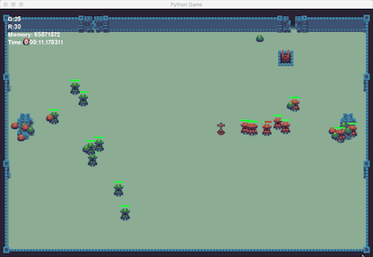
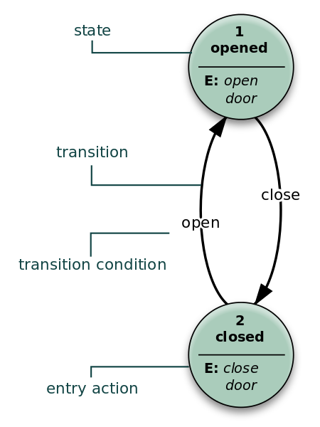
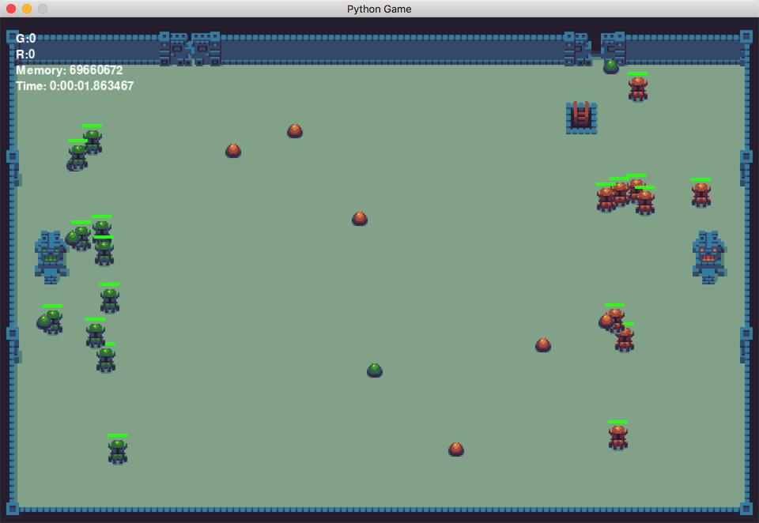

# AI Game FightTheater


## 获取实例代码

1. 创建虚拟环境 & 安装依赖包：


``` shell
# 启动虚拟环境
virtualenv env
source env/bin/activate
# 安装依赖包
pip install -r requirements.txt
# 安装 gameobjects 包
cd gameobjects-0.0.3
python ./setup.py install
```

2. 启动游戏：

``` shell
python game
```





## Fighter Theater

恭喜你！当你读到这个章节的时候你对 Python 的基础知识已经有了一定的了解了，在前面的几个章节之中我们由浅入深的涉及到了 Python 使用的各个方面，我们从 HelloWorld 入手直到涉及到了更有深度的内容，让我们能怎么写出来更具有 Pythonic 风格的代码。

现在我们就来开发一些有趣的 Python 应用程序，本门课程是做人工智能、机器学习的基础课程和理论基础，这里我们就来开发一款名叫 **Fighter Theater** 的 AI 游戏，这款游戏相较于我们平常接触的能够玩的游戏来讲，更像是一种能够自动运行的程序，游戏中出现的 Hero（Sprite 精灵）都包含一种被称作 自动机（State Machine），自动机中包含多个状态（State）当条件发生变化的时候，就会产生一些动作（Action），之后换转入到一个新的 State。



在游戏中我们将英雄（Hero）氛围绿、红两方，两侧各有一个代表当前方的神社，游戏场景之中会随机刷新出能量石（Energy Store），双方的英雄会在一定的区域进行游荡，当发现了新的能量石之后就会根据距离进行前往能量石的位置去捡起能量石并且送往神社，神社就会获得加分。如果路上遇到敌方的英雄就会进行互相攻击，而血量减少的时候就会试图逃跑。随着时间的流逝，双方的英雄也会随机的增加在界面之上，这让我们的游戏能 `Live Long and Prosper` 。



在这个项目之中我们会接触一个 Python 的第三方模块 —— Pygame，Pygame 是一个非常简洁明快的游戏开发模块，这里没有太多框架性质的复杂要求，我们可以轻松地使用模块中提供的一些工具就能方便的创建图形、显示动画、播放声音等等的功能，这里我们要去用这个模块来制作一些复杂的游戏。


## 规划项目

