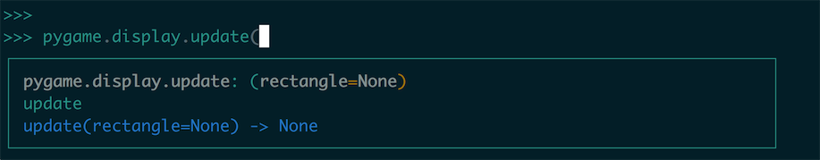

# AI Game FightTheater


## 获取实例代码

1. 创建虚拟环境 & 安装依赖包：


``` shell
# 启动虚拟环境
virtualenv env
source env/bin/activate
# 安装依赖包
pip install -r requirements.txt
# 安装 gameobjects 包
cd gameobjects-0.0.3
python ./setup.py install
```

2. 启动游戏：

``` shell
python game
```


## Fighter Theater

恭喜你！当你读到这个章节的时候你对 Python 的基础知识已经有了一定的了解了，在前面的几个章节之中我们由浅入深的涉及到了 Python 使用的各个方面，我们从 HelloWorld 入手直到涉及到了更有深度的内容，让我们能怎么写出来更具有 Pythonic 风格的代码。

现在我们就来开发一些有趣的 Python 应用程序，本门课程是做人工智能、机器学习的基础课程和理论基础，这里我们就来开发一款名叫 **Fighter Theater** 的 AI 游戏，这款游戏相较于我们平常接触的能够玩的游戏来讲，更像是一种能够自动运行的程序，游戏中出现的 Hero（Sprite 精灵）都包含一种被称作 自动机（State Machine），自动机中包含多个状态（State）当条件发生变化的时候，就会产生一些动作（Action），之后换转入到一个新的 State。


在游戏中我们将英雄（Hero）氛围绿、红两方，两侧各有一个代表当前方的神社，游戏场景之中会随机刷新出能量石（Energy Store），双方的英雄会在一定的区域进行游荡，当发现了新的能量石之后就会根据距离进行前往能量石的位置去捡起能量石并且送往神社，神社就会获得加分。如果路上遇到敌方的英雄就会进行互相攻击，而血量减少的时候就会试图逃跑。随着时间的流逝，双方的英雄也会随机的增加在界面之上，这让我们的游戏能 `Live Long and Prosper` 。


在这个项目之中我们会接触一个 Python 的第三方模块 —— Pygame，Pygame 是一个非常简洁明快的游戏开发模块，这里没有太多框架性质的复杂要求，我们可以轻松地使用模块中提供的一些工具就能方便的创建图形、显示动画、播放声音等等的功能，这里我们要去用这个模块来制作一些复杂的游戏。


## 规划项目

相比于我们之前的 Python 的学习都是在使用代码段进行学习开发，而这时我们是在开发一个大型的复杂程序，提前规划好项目的结构并且对程序进行解耦是非常有必要的。有了项目的具体规划（蓝图）再去施工就能让我们开发的程序的流程更为规范，不至于偏离我们想要的轨道。

这里我们可以先来看一下项目之中的文件结构：

``` shell
$ tree .
.
├── __init__.py
├── __main__.py
├── entities.py
├── game_funcs.py
├── settings.py
├── starter.py
├── states.py
└── world.py

0 directories, 8 files
```

* `__main__.py` 是当前 game 包的启动模块，我们在这个模块之中启动游戏项目。
* `entities.py` 中我们定义游戏中出现的实体类，包含基类、Hero 和 EnergyStore
* `game_funcs.py` 中我们保存了一些游戏主循环之中的逻辑方法，用来拓展解耦。
* `settings.py` 文件之中我们保留游戏中一些全局的配置，在一个统一的地方进行统一的配置想要修改的时候就会十分方便。
* `starter.py` 中我们存放了游戏开启的主循环。
* `states.py` 中我们定义了游戏中使用的状态机定义。
* `world.py` 中设定了整个游戏世界的生命周期过程。

## 预先准备

为了将这个程序和其他程序的依赖包版本进行隔离，我们最好使用虚拟环境进行安装依赖包，这里我们可以参考 **附录D-使用虚拟环境** 配置并使用虚拟环境。

我们要使用 Pygame 进行开发，Pygame 模块并不是 Python 所自带的模块因此我们需要使用 pip 进行安装，关于使用 pip 进行安装模块可以查看 **附录C-使用 pip 包管理工具**。但在这里 Pygame 使用的依赖可能很多，这里我们就不妨赘述一下 Pygame 的安装过程。

##### Linux 下安装

在 Linux 下安装 Pygame ，尤其我们使用 2.7.x 版本的 Python 是比较好安装的，这里我们可以使用 pip 进行安装：

``` python
pip install pygame
```

也可以使用 `apt` 进行安装：

``` python
sudo apt-get install python-pygame
```

##### macOS 下安装

在 macOS 下的安装除了 pip 安装 pygame 之外，我们还有使用 HomeBrew 安装一些 Pygame 的依赖库，关于 HomeBrew 的使用我们可以去官网了解学习。

使用 HomeBrew 安装依赖库：

``` shell
brew install hg sdl sdl_image sdl_ttf
```

如果想要使用和音频相关的依赖库，我们还需要：

``` python
brew install sdl_mixer portmidi
```

##### Windows 下安装

在官方网站中直接寻找可下载的 release 版本：

``` shell
https://www.pygame.org/news
```

------

这里我们也建议在 `requirements.txt` 中记录所有的 Python 的第三方依赖包：

``` shell
pytmx==3.21.5
pygame==1.9.3
psutil==5.4.3
```

完成一个游戏我们不只是需要程序代码，资源文件图片、地图等等东西也是非常必要的东西，这里和这个游戏相关的资源文件我们都有提供可以在这个位置获取

``` shell
https://github.com/lfkdsk/FighterTheater/tree/master/img
```

这其中包含背景的雪碧图、瓦片地图文件、各个英雄和能量石的具体图片。


## 开启游戏项目

在使用 Pygame 的基础结构之中，我们把启动项目的文件设计成标准的 Python 脚本的启动文件：

``` python
def game_looper():
  # ...
  pass

if __name__ == '__main__':
  game_looper()
```

我们在脚本之中经常会见到这样的结构，我们不写出在模块之中直接编写逻辑，而是抽出脚本的主程序然后进行一个判断。这个判断 `if __name__ == '__main__'` 可能对很多人产生困惑，在 Python 之中这种带有两侧双下划线的方法被称作 Python 的 magical method ，这个 `__name__` 代表了当前的模块的名称，而当这个属性是 `'__main__'` 的时候代表这个模块是作为启动程序来启动，这时候我们才运行游戏的主循环。

解决了这个部分的逻辑结构，我们先来创建一个空的 Pygame 窗口，创建 Pygame 窗口的基础结构是这个样子的：

``` python
import pygame
import sys

def game_looper():
    pygame.init()
    game_screen = pygame.display.set_mode((960, 640))
    while True:
        # 处理事件逻辑
        for event in pygame.event.get():
            if event.type == pygame.QUIT:
                sys.exit()
        pygame.display.update()
```

这里我们给处理一个非常基础的创建 Pygame 窗口的模板代码，首先我们使用 `pygame.init()` 来初始化 Pygame 的设置。在 L6 我们使用 `pygame.display.set_mode(tuple)` 来创建一个窗口：


`set_mode` 的基础参数接受一个元组设定了这个 Pygame 窗口的长宽值这里我们创建了一个 `(960, 640)` 窗口。之后我们开启了一个无限循环渲染的游戏窗口，这里我们也可以不直接使用 `True` 这样的方式来开启循环，我们也可以使用一个 Flag 来跳出 `while` 循环。

在 L9 开始我们使用 `for-in` 循环处理所有的 `pygame.event.get()` 到的事件，这个事件包含鼠标的点击、键盘的点按等等。这里我们只是处理 `pygame.QUIT` 这种情况，就是我们点击窗口按钮的关闭的时候关闭这个程序。在 L12 我们调用 

``` python
pygame.display.update()
```

来刷新屏幕的界面，当我们 update 之后才让我们在界面绘制之后成功的更新到界面上面：


这里我们看到 `update` 这个方法除了使用 None 作为默认参数之外，我们还可以使用一个 `rectangle` 作为参数，只更新屏幕其中的一个区域，这里我们有一个专有名词的叫 `dirty rectangle` ，仅仅刷新这个位置的图形位置。当然如果我们仅仅是要刷新整个屏幕，我们也可以使用另一个方法：

``` python
 pygame.display.flip()
```


这里可以看到这个方法的描述就是更新整个显示界面渲染到屏幕上面。

我们在这里使用 `python + 文件名` 的命令行运行的时候，就会看到如下的界面：


但是一个空空的、黑黑的窗口未免单调，我们可以试着为窗口设置一个背景颜色，这个我们可以使用 `fill` api 喷涂我们窗口的背景的颜色：

``` python
game_screen.fill(<color>)
```


`fill` 这个参数也可以提供多个参数，这里我们只提供 Color 这个参数去进行绘制，这里我们在 Pygame 中定义一个 Color 直接使用一个元组就好了，三个数目的元组代表一个 RGB 的颜色，四个数目的元组代表一个 ARGB 的颜色。这里我们设定一个颜色：

``` python
background_color = (30, 100, 30)
# ...
game_screen.fill(background_color)
```


## 使用设置类进行管理

在创建整个游戏的过程之中，我们就会接触到很多对游戏进行配置的静态数据，比如我们刚才在 `创建窗口` 这一章这样简单的内容，我们就接触到了两种项目自定义的静态数据：

1. 屏幕的长宽的像素值的人：960、640
2. 屏幕的背景颜色：(30, 100, 30)

这还只是我们刚刚的开始开发这个程序所使用到的静态数据，那在我们之后对这个程序的开发之中我们必然会看到更多的常量数据，那我们就有必要使用一个设置类（Settings.py）来管理这些数据。比如我们可以看到最后我们在完成整个游戏之中会用到的设置数据就有很多：

::: collapse 所有的设置内容

``` python
import os


class Settings(object):

    def __init__(self):
        """initialize the settings of game."""

        # screen settings
        self.SCREEN_WIDTH = 960
        self.SCREEN_HEIGHT = 640
        self.SCREEN_SIZE = (self.SCREEN_WIDTH, self.SCREEN_HEIGHT)
        self.BG_COLOR = (100, 100, 100)
        self.BASE_DIR = os.path.dirname(os.path.dirname(os.path.abspath(__file__)))
        self.MAP_DIR = os.path.join(self.BASE_DIR, "img/game.tmx")
        self.MAX_HEALTH = 25
        self.HEALTH_COLOR = (255, 0, 0)
        self.HEALTH_COVER_COLOR = (0, 255, 0)
        self.LEFT_HOME_LOCATION = (65, self.SCREEN_HEIGHT / 2)
        self.RIGHT_HOME_LOCATION = (self.SCREEN_WIDTH - 65, self.SCREEN_HEIGHT / 2)
        self.DEFAULT_HERO_NUM = 10
        self.DEFAULT_STORE_NUM = 10
        self.DEFAULT_SCORE = 5
        self.DEFAULT_SEARCH_RANGE = 100.0
        self.DROP_RANGE = 30.0
        self.MAX_ENTITIES = 20
        self.left_score = 0
        self.right_score = 0


game_settings = Settings()
```

:::

但是，暂时我们还没有用到这么多的数据，那这里我们就先创建我们所需要的数据条目：

``` python
class Settings(object):

    def __init__(self):
        """initialize the settings of game."""
        # screen settings
        self.SCREEN_WIDTH = 960
        self.SCREEN_HEIGHT = 640
        self.SCREEN_SIZE = (self.SCREEN_WIDTH, self.SCREEN_HEIGHT)
        self.BG_COLOR = (100, 100, 100)
```

我们再在游戏之中使用这些定义的信息的时候，就可以使用 settings 进行导入，而不是把我们的配置信息零散的放在代码的各处：

``` python
def game_loop():
    game_exit = False

    pygame.init()
    pygame.display.set_caption('Python Game')
    game_screen = pygame.display.set_mode(
        game_settings.SCREEN_SIZE,
    )

    while not game_exit:
        for event in pygame.event.get():
            if event.type == pygame.QUIT:
                game_exit = True
        game_screen.fill(game_settings.BG_COLOR)
        pygame.display.update()
```

这样我们以后在添加其他的游戏的配置信息的时候，也要记得先来 Settings 对数据进行配置，之后再 import settings 来复用这些配置数据。


## 使用瓦片地图

> 如果对自制瓦片地图不感兴趣，本节可以跳过，
>
> 直接使用示例程序中包含的已经编辑好的瓦片地图文件就可以了。
>
> img 之中的 [background_x2.tsx](https://github.com/lfkdsk/FighterTheater/blob/master/img/background_x2.tsx) 是 sprite img 的配置文件
>
> img 之中的 [game.tmx](https://github.com/lfkdsk/FighterTheater/blob/master/img/game.tmx) 是整个瓦片地图的配置文件

我们在之前的一节之中已经向大家演示了如何创建一个 Pygame 窗口，并且使用一种颜色去渲染到整个屏幕上面。但是我们的游戏只有一个单一的纯色背景未免单调，我们通常的 2D 游戏多半都是有一个具体的场景的，那我们自制游戏如何来解决问题呢？我们可以使用瓦片地图 Tiled Map 来解决这个问题，瓦片地图 —— 顾名思义，整张地图是由多个小图片（瓦片）来组成的，这也就是意味着我们可以通过一些很少的素材图片，通过各种排列组合来创建很复杂的地形。

> Tips 瓦片地图
>
> 当然瓦片地图的功能不止于此，瓦片地图包含创建对象，创建地形等多种复杂功能，这里面我们就仅仅使用了瓦片地图来制作游戏场景的简单功能而已。另外我们生活中常见的地图导航应用就是瓦片地图的一种应用场景。

这里我们给出这个游戏的配套素材，[地址](https://github.com/lfkdsk/FighterTheater/blob/master/img/background_x2.png) （当然也包含在给出的 img 包里）：


大家可以看到为什么说是游戏素材，我们能在游戏中所使用的图块素材都被放在一张图片上面，我们通常把这种图片称作 “雪碧图”（Sprite Image），这样我们再导入游戏资源的时候就可以只加载这一张图片，使用具体图块的时候只要按照图中的位置取出来就好了。

之后我们就可以导入资源文件到编辑器了，这里我们使用的编辑器是 [Tiled Map Editor](http://www.mapeditor.org/) ，点击链接进行下载安装就可以了，之后我们打开编辑器，按照我们刚才设定的分辨率创建一个空地图：


这里我们的块大小选择 **32px** 地图大小设定为宽 30 块、高 20 块，这样地图的总大小就是正好的 `960 * 640 ` 像素的。

刚刚创建好的空地图是这个样子的：


这时候我们使用上面 “创建新图块” 菜单引入我们的资源文件：


这里我们要选择相同的块宽度对图片进行分割，导入之后的资源文件如下图所示：


可以看到这张图片已经被按照 `32*32` 拆分成一个一个的图块了，这时候在地图的窗口之后我们就可以点击图块，然后再点击地图来拼出地图的样式：


我们可以选择单个图块，也可以选择一个区域的图块，这里我们选择的就是一个区域的图块。


最后我制作了一个比较简单的游戏背景图片，包括外围的围墙，两侧的神社，装饰用的天井，和为了自然做出的城墙裂痕，如果大家感兴趣可以按照上面的方法自己定制出自己的瓦片地图。

> Tips 瓦片地图的使用
>
> 这里面我们对瓦片地图的使用和定制都是比较简单的，瓦片地图有很多的复杂的应用，这些内容可以从文档中获取和学习：
>
> [Tiled Map Editor Document](http://doc.mapeditor.org/en/latest/)


