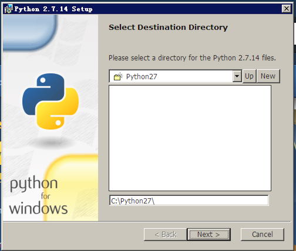
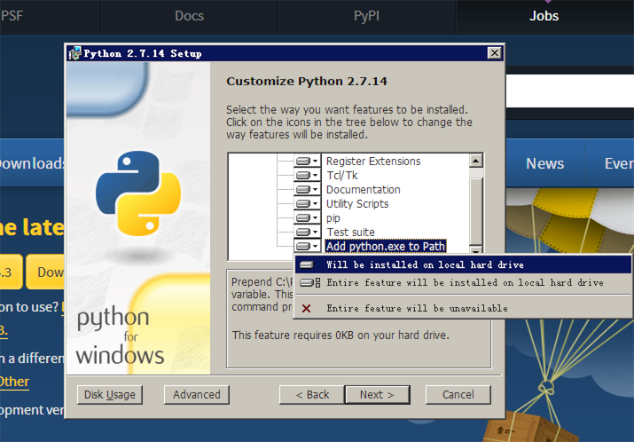

## 附录：配置 Python 开发环境


Python 有很多的版本，主流的大版本选择就有 Python 2 和 Python 3 的区别，在这门微课之中我们主要使用的是 Python 2 的版本，如果对 Python 的环境配置还有疑虑或者还想配置别的版本的 Python ，你可以在这篇附录中找到答案。

### 在 macOS 平台配置 

在 macOS 的系统中就默认包含 Python 的程序和环境了，这里我们可以使用 version 命令来查看是否包含这个命令：

``` python
python --version
```


这里我们能看到我这里的安装的默认版本是 python 2.7.11 的 Python。但是如果检查默认版本发现没有安装、或者是想安装其他版本的 Python（比如 Python 3），这里我们极力推荐通过 [HomeBrew](https://docs.brew.sh/Installation.html) 进行安装，HomeBrew 是一个 macOS 下出色的包管理工具，首先我们要安装 macOS 下的 Command Line Tools ：

``` shell
xcode-select --install
```

在这其中会有一些弹出框，我们只需要选择 ok 按钮就可以了，在这之后我们直接运行这个命令：

``` shell
mkdir homebrew && curl -L https://github.com/Homebrew/brew/tarball/master | tar xz --strip 1 -C homebrew
```

这个命令在 HomeBrew 的主页可以找到，这里只需要把这些代码复制进去就可以了，执行完之后我们可以通过：

``` shell
brew doctor
```

来检查 HomeBrew 是否已经完全好，如果检查完好我们就可以使用 HomeBrew 的命令来安装了：

``` shell
brew install python
```

执行这个命令就会在系统中默认的安装好 Python 2.x 的程序并且配置好了相应的环境变量。而如果我们要安装 Python 的 3.x 版本的话我们可以：

``` shell
brew install python3
```

就可以默认安装好 Python3 ，我们直接在命令行中使用 `python3` 就可以正常的使用 3.x 版本的 python 了，不会引起冲突的问题。

我们平时在开发过程中使用的大多数软件包都可以通过 HomeBrew 来管理安装，我们可以在 http://formulae.brew.sh/ 里面搜索 HomeBrew 所支持的软件包。

### 在 Windows 平台配置 

Windows 平台上的 Python 安装主要是以软件包的形式进行安装，打开 [Python Download](https://www.python.org/downloads/) ：


在这里我们可以直接通过想安装 Python 的版本进行点选下载安装包，之后就和在 Windows 平台上安装其他的软件一样选择路径就可以了：



有一个比较重要的选项：



我们设置了这个选项就可以直接的把 Python.exe 放入到系统的 Path 中意味着帮我们自动配好了 Python 的环境变量，这个安装程序运行完毕之后我们可以在 Cmd 中使用 `python --version` 去检查我们的 Python 能否正确使用了（部分的 Windows 版本可能需要在安装后重启才能正确的使用 Python）。

### 在 Linux 平台配置

绝大多数的 Linux 系统都默认提供了 Python ，我们可以通过 `python --version` 来检查 Python 的使用，如果我们需要安装、或者是安装多个版本的 Python 程序我们可以使用 deadsnacks 去管理多个版本：

``` shell
$ sudo add-apt-repository ppa:fkrull/deadsnakes 
$ sudo apt-get update
$ sudo apt-get install python2.7
```

这样之后我们就可以正常使用 `python` 命令去启动 Python 的解释器了：

``` shell
$ python2.7
>>> 
```

出现 `>>>` 符号提示输入的时候我们就可以正常的使用了！


