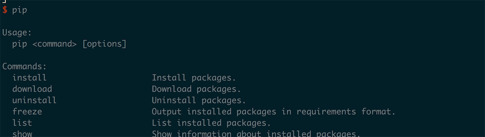
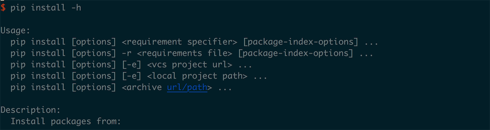
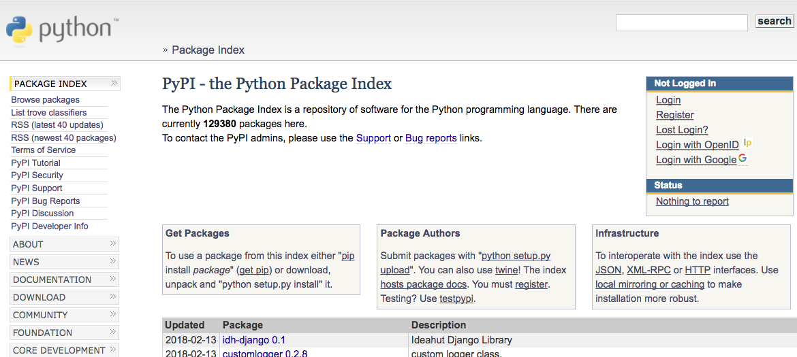

## 附录C：使用包管理工具

在 Python 之中我们通常会使用包管理工具 pip 对需要安装的第三方的包进行管理。在 Mac 或者 Linux 之中使用 `apt-get` 安装的 Python 都会自动在环境之中增加 `pip` 工具，如果使用 Windows 的同学，只要在使用 Python 的安装工具安装的过程之中选择了 `Add python.exe to Path` ，Python 也会被置入环境变量：



如果我们想要安装一个第三方库的话，我们可以使用 `pip install` 方式安装对应的包：



我们安装的包的都是被公开上传到 **[PyPI - the Python Package Index](https://pypi.python.org/pypi)** 中的包：



比如这里我们要安装 `m3-PIL` 一个图片的处理库，并且保存到用户库的目录中去：


另外我们的一个项目会有很多的依赖的第三方的项目，这时候为了搜集方便我们会把这些依赖写在 `requirement.txt` 类似这样：


项目名 + `==` + 版本号的格式逐行的添加依赖。

然后我们使用 `-r` 命令去安装定义在依赖文件的全部依赖：

``` shell
pip install -r requirement.txt
```


>  关于 `pip` 的使用更多的内容我们可以在官方文档中找到 [PyPi](https://pip.pypa.io/en/stable/)。


