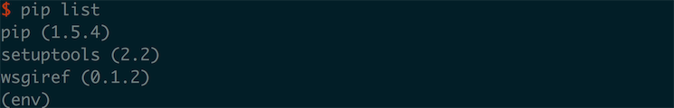

## 附录D：使用虚拟环境

创建一个 Python 项目的时候，我们最好开启一个虚拟环境来安装程序所需要的第三方包。虚拟环境是相当于在系统中生成了一份 python 的备份，你可以在这个备份之中安装依赖包，并将其与其他的 Python 包隔离。在开发多个使用相同 Python 库的项目时，虚拟环境就十分有益，能够将项目的库和其他项目分离。

比如说我们有两个 Web 后台程序都是用 Django 框架开发的，但是 project1 需要用 Django 1.8 版本开发的，但是 project2 需要使用 Django 2.x 版本进行开发。这两个项目使用了不同的 Django 版本，如果我们把 Django 安装到系统目录的话，就会产生版本的冲突，因此这时候使用不同的 `虚拟环境` 就很重要了。

在 Python 2.X 版本之中使用虚拟环境需要使用 `virtualenv` 程序，我们用 **pip** 安装一下：

``` shell
pip install --user virtualenv
```

> 在 Linux 之中也可以使用 apt-get 去安装

我们可以在一个空的 project 文件夹中进行测试：

``` shell
mkdir myproject
virtualenv env
```


在运行这条命令的运行输出如图所示，我们在安装了一个名为 env 的虚拟环境，在这个虚拟环境之中生成了一个 python 的备份，并且在这之中安装了 setuptools 、pip 等工具，在使用虚拟环境之前我们要激活这个虚拟环境：

``` shell
source env/bin/activate
```


我们使用 source 运行 env/bin 之下的 activate 程序，之后我们看到了 Terminal 中存在了 `(env)` 这样的标识，不同的 Terminal 之中存在不同的特殊样式，但是都能看出当前处于虚拟环境之中。而当我们想要关闭虚拟环境的时候就使用：

``` shell
deactivate
```

这个命令就好了。

我们在虚拟环境之下看一下 pip 里面都安装了什么：



默认的虚拟环境只安装了 pip、setuptools 和 wsgiref ，这也能看出这里和系统的 python 环境不同了，在这里我们需要安装一个第三方包就可以不用使用 `--user` 指定系统目录了，比如安装 Django 就可以直接这么写：

``` shell
pip install django
```

这样我们不会被要求 root 权限以安装到系统目录，而是会将这个包直接安装到虚拟环境之中去。

> Tips 在 Python3 中使用虚拟环境
>
> 在 Python 3 之中我们可以直接使用虚拟环境：`python3 -m venv project_env`.


